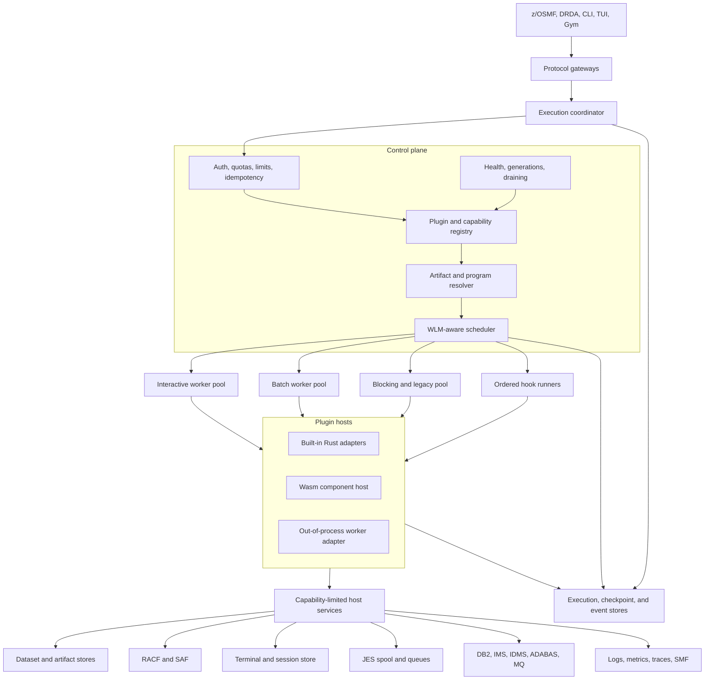
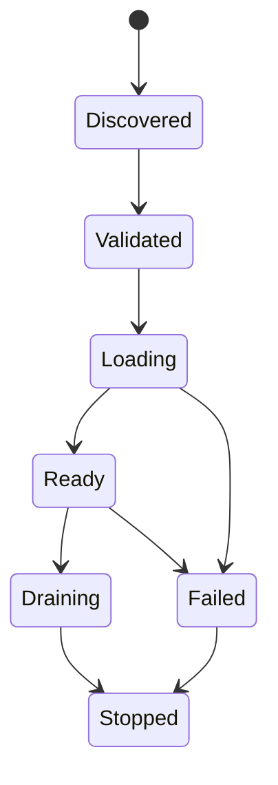
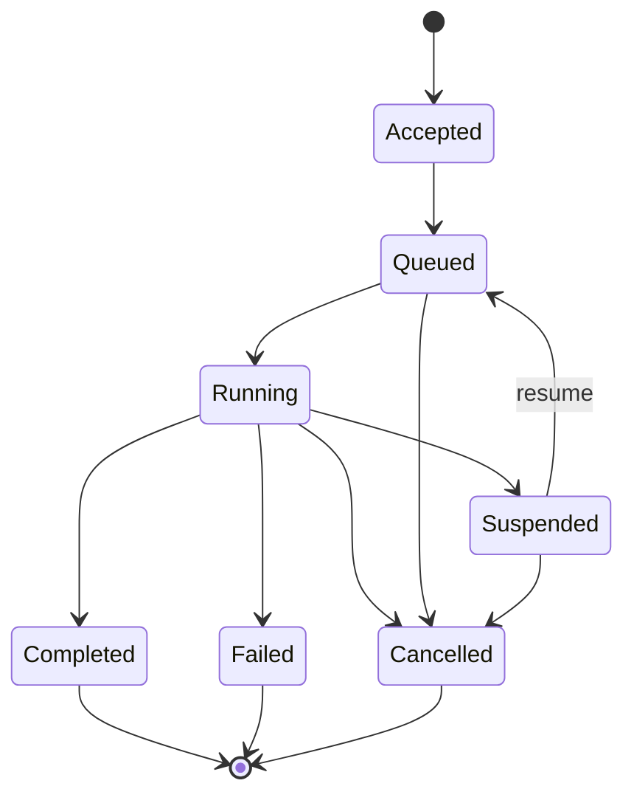

# Scalable Execution Backend

Status: **Proposed**
Date: **2026-08-26**

## Decision Summary

OpenMainframe should replace its independent execution loops and registries with
a shared execution platform composed of:

1. A small, dependency-light execution API containing versioned requests,
   outcomes, events, limits, identities, and plugin descriptors.
2. A control plane for plugin discovery, capability resolution, admission,
   scheduling, lifecycle, and health.
3. A data plane of bounded worker pools and scoped plugin instances.
4. Capability-limited host services for datasets, security, terminal I/O,
   spool, queues, databases, clocks, and observability.
5. Adapters that let existing Rust crates migrate without rewriting their
   business logic.
6. Three isolation tiers: built-in Rust, WebAssembly Component Model, and
   out-of-process workers.

The platform does **not** define one giant `execute()` implementation containing
every subsystem semantic. It defines a common lifecycle and invocation envelope,
then exposes focused capability contracts for different workload shapes.

The first implementation remains entirely in-process. Durable queues,
out-of-process workers, and WebAssembly are extension points, not prerequisites
for migrating the existing server.

Portfolio composition, product-profile closure, protocol/configuration
authority, all-crate disposition, and retirement are governed by
[Workspace Convergence and Sustainable Architecture](workspace-convergence.md).
This execution design supplies contracts to that program; it does not make
every existing crate a permanent runtime plugin.

## Scope and Terminology

In this design, a **plugin** is any independently registered implementation that
provides one or more capabilities to OpenMainframe. This includes more than the
plugin descriptors returned by `/zosmf/info`:

- Language compilers and executors: COBOL, PL/I, REXX, CLIST, Easytrieve,
  Natural, FOCUS, and future LLVM or WebAssembly backends.
- Coordinators: JCL, JES2, CICS, TSO, workflows, and provisioning.
- Host services: datasets, RACF/SAF, DB2, IMS, IDMS, ADABAS, MQ, terminal I/O,
  spool, clock, and queues.
- Programs and commands: IEBCOPY, IEBGENER, SORT, console commands, and subsystem
  utilities.
- Hooks: JES2 exits, SMF exits, crypto exits, and other ordered event handlers.
- API surfaces: z/OSMF route families and protocol adapters such as DRDA.

A plugin may be compiled into the server, loaded as a sandboxed component, or
hosted in a separate process. A **capability** describes what it does; an
**adapter** describes how it is hosted.

DRDA therefore adapts a typed DB2/security capability and cannot own a mock SQL
authority. TN3270 transport and UI frontends adapt one protocol-neutral terminal
state machine. User-facing configuration formats adapt one versioned product
schema. These are separate focused capabilities, not fields added to a universal
plugin or gateway-state object.

## Current-State Findings

The repository already contains useful plugin patterns, but each has a private
contract and registry:

| Area | Current mechanism | Scaling limitation |
|---|---|---|
| COBOL | `SimpleProgram` plus tree-walking interpreter | IR is owned by the runtime; execution is synchronous and coupled to a mutable `Environment` |
| CICS | `CicsCommandHandler`, `CicsBridge`, and a session thread | One OS thread per session; `Rc<RefCell<_>>` state is not movable or recoverable |
| CICS program control | Separate CICS `ProgramRegistry` | Does not share the COBOL program registry; `LINK` currently executes in mock mode |
| JCL | `JobExecutor` with direct utility/process/stub branching | Does not resolve programs through the COBOL executor or a common scheduler |
| Utilities | `UtilityProgram: Send + Sync` plus `UtilityRegistry` | Good local extension point, but no common lifecycle, limits, identity, or events |
| JES2 and SMF exits | Ordered trait-object registries | No shared dependency, isolation, timeout, or failure policy |
| z/OSMF | Static Axum route merges and a large `AppState` | Route families are compile-time wired and receive broad shared-state access |
| `/zosmf/info` | Nine hard-coded descriptors | Does not reflect installed implementation health or capability versions |
| Gym | In-process Tower `oneshot` requests | Useful deterministic client, but not an execution backend or isolation boundary |
| LLVM | Optional codegen module | Procedure code generation is incomplete and not connected to CLI or z/OSMF |

Relevant current implementations include:

- [`compile_program`](../../crates/open-mainframe/src/lib.rs) and the lossy
  lowering pass in [`lower.rs`](../../crates/open-mainframe/src/lower.rs).
- The interpreter-owned `SimpleProgram`, `Environment`, and registries in
  [`interpreter.rs`](../../crates/open-mainframe-runtime/src/interpreter.rs).
- The CICS bridge and deferred control actions in
  [`bridge.rs`](../../crates/open-mainframe/src/bridge.rs).
- The per-session runner in
  [`cics_runner.rs`](../../crates/open-mainframe-zosmf/src/cics_runner.rs).
- JCL program routing in
  [`executor/mod.rs`](../../crates/open-mainframe-jcl/src/executor/mod.rs).
- The reusable utility contract in
  [`open-mainframe-utilities/src/lib.rs`](../../crates/open-mainframe-utilities/src/lib.rs).
- Static route assembly in
  [`handlers/mod.rs`](../../crates/open-mainframe-zosmf/src/handlers/mod.rs).

The architectural problem is therefore not a lack of execution code. It is a
lack of a common boundary around that code.

## Goals

The backend must:

- Support request/response, batch, interactive, long-running, provider, and
  event-hook plugins without treating them as the same semantic operation.
- Bound queues, concurrency, memory, CPU time, output, nesting, and wall time.
- Apply backpressure instead of creating unbounded tasks or one thread per idle
  session.
- Preserve CICS pseudo-conversational state and support `CALL`, `LINK`, `XCTL`,
  `RETURN`, `ABEND`, suspend, and resume as explicit outcomes.
- Let JCL dispatch all `EXEC PGM=` targets through one program resolver.
- Keep source edits immediately visible while permitting a correct
  content-addressed compilation cache.
- Carry RACF identity, authorization, cancellation, trace context, service
  class, and resource limits through nested calls.
- Support deterministic Gym execution with controlled time, randomness, I/O,
  and scheduling.
- Allow plugin upgrades to drain safely without terminating unrelated work.
- Scale from an in-memory single-node server to lease-based distributed workers
  without changing plugin semantics.
- Keep trusted in-tree Rust plugins fast while offering stronger isolation for
  third-party plugins.

## Non-Goals

- Replacing the semantics already implemented in subsystem crates.
- Requiring distributed infrastructure for local development.
- Guaranteeing exactly-once execution across process or node failure. The
  platform provides at-least-once dispatch plus idempotency and transactional
  host services where needed.
- Using Rust dynamic libraries as a stable third-party plugin ABI.
- Making every existing interpreter asynchronous internally in the first phase.

## Design Principles

### One kernel, multiple capability contracts

Compilation, execution, host service calls, event hooks, and API routes have
different semantics. They share identity, limits, lifecycle, scheduling,
telemetry, and error handling, but not necessarily an input type.

### Control flow is data

`XCTL`, `RETURN`, input wait, timer wait, cancellation, and ABEND are outcomes,
not generic errors. The scheduler, rather than a CICS-specific outer loop,
interprets these outcomes.

### State belongs to a scope

Every plugin declares whether an instance is stateless, invocation-scoped,
run-unit-scoped, session-scoped, region-scoped, or singleton. Mutable state is
never assumed to be safe for concurrent use merely because it is behind a lock.

### Host access is capability based

Plugins do not receive `Arc<AppState>`. They receive handles only for the host
services granted by their manifest and authorized for the current principal.

### Bounded by default

Every queue, worker pool, output stream, recursion depth, resource allocation,
and execution deadline has a configured bound. Overload produces a structured
retryable result rather than memory growth.

### Adapters before rewrites

Existing synchronous engines are wrapped in adapters first. Internal redesigns
can happen later behind stable contracts.

## Target Architecture



The coordinator and protocol gateways are stateless apart from bounded local
caches. Durable execution records and checkpoints are accessed through store
traits with in-memory defaults.

## Workload Shapes

The execution API recognizes five shapes:

| Shape | Examples | Completion model | Instance scope |
|---|---|---|---|
| Request/response | Dataset API, WLM query, console command | One bounded response | Stateless or singleton |
| Batch | JCL jobs, utilities, compilers, reports | Accepted, event stream, terminal result | Invocation or run unit |
| Interactive | CICS, TSO, ISPF, Natural maps | Execute until suspended, then resume | Session or run unit |
| Provider | Dataset store, SQL, queues, clock, terminal | Host calls from another plugin | Region or singleton |
| Event hook | JES2 exits, SMF exits, audit interceptors | Ordered pass/modify/stop policy | Stateless or singleton |

This classification prevents a REST handler, a COBOL program, and an SMF exit
from being forced into an untyped all-purpose callback.

## Plugin Descriptor and Capability Model

Each plugin exposes a versioned descriptor. A representative manifest is:

```toml
id = "org.openmainframe.cobol-interpreter"
name = "COBOL Interpreter"
version = "1.0.0"
contract_version = "1"
adapter = "builtin"
instance_scope = "run-unit"
concurrency = "serial-per-instance"
requires = [
  "host.dataset.read",
  "host.dataset.write",
  "host.program.invoke",
  "host.terminal",
  "host.clock",
  "host.telemetry",
]

[[capabilities]]
kind = "program.compiler"
id = "cobol.compile"
input_schema = "openmainframe:cobol/compile-request@1"
output_schema = "openmainframe:execution/artifact@1"

[[capabilities]]
kind = "program.executor"
id = "cobol.execute"
selectors = ["language:cobol", "media:application/x-openmainframe-simple-program"]

[limits]
max_concurrency = 64
default_wall_time_ms = 30000
max_output_bytes = 1048576
```

Descriptors are immutable after a plugin generation becomes ready. Registry
updates publish a new snapshot atomically.

### Capability kinds

The initial contract defines:

- `program.compiler`
- `program.executor`
- `program.resolver`
- `subsystem.command`
- `service.provider`
- `event.hook`
- `api.surface`
- `protocol.listener`

New kinds require a versioned contract; they are not free-form strings whose
meaning is known only to one caller.

## Core Execution Model

The dependency-light API crate should define identifiers and envelopes similar
to the following. Exact Rust syntax can change during implementation, but the
semantic fields are required.

```rust
pub struct Invocation {
    pub execution_id: ExecutionId,
    pub run_unit_id: RunUnitId,
    pub parent_id: Option<ExecutionId>,
    pub operation: OperationId,
    pub input: Payload,
    pub context: ExecutionContext,
}

pub struct ExecutionContext {
    pub principal: Principal,
    pub service_class: ServiceClass,
    pub deadline: Option<SystemTime>,
    pub limits: ResourceLimits,
    pub bindings: ResourceBindings,
    pub trace: TraceContext,
    pub idempotency_key: Option<String>,
    pub attempt: u32,
}

pub struct Payload {
    pub schema: SchemaId,
    pub content_type: String,
    pub bytes: bytes::Bytes,
}

pub enum InvocationOutcome {
    Completed(Completion),
    Suspended(Suspension),
    Invoke(ChildInvocation),
    Transfer(Transfer),
    Failed(ExecutionProblem),
    Cancelled(Cancellation),
}
```

`Payload` is an internal transport envelope, not permission for arbitrary JSON.
Capability adapters must validate the declared schema before invoking a typed
implementation.

### Plugin factory boundary

Trusted Rust plugins implement a small object-safe factory. The host converts
instances into Tower services so common middleware can be applied consistently.

```rust
pub trait ExecutionPlugin: Send + Sync {
    fn descriptor(&self) -> &PluginDescriptor;

    fn instantiate<'a>(
        &'a self,
        key: InstanceKey,
        host: HostServices,
    ) -> PluginFuture<'a, Result<Box<dyn ExecutionInstance>, PluginError>>;
}

pub trait ExecutionInstance: Send {
    fn invoke<'a>(
        &'a mut self,
        request: Invocation,
    ) -> PluginFuture<'a, Result<InvocationOutcome, PluginError>>;

    fn checkpoint<'a>(&'a mut self)
        -> PluginFuture<'a, Result<Option<Checkpoint>, PluginError>>;

    fn shutdown<'a>(&'a mut self, reason: ShutdownReason)
        -> PluginFuture<'a, Result<(), PluginError>>;
}
```

An instance is not required to be `Sync`. The instance manager serializes calls
for `serial-per-instance` plugins. This makes current interpreter state usable
without spreading `Arc<Mutex<_>>` across the codebase.

## Explicit Program Control

Nested program operations are handled by the coordinator with a run-unit frame
stack:

| Operation | Coordinator behavior |
|---|---|
| COBOL `CALL` | Push child frame; copy parameters according to passing mode; resume parent after return |
| CICS `LINK` | Push CICS child frame with COMMAREA/channel; resume caller after `RETURN` |
| CICS `XCTL` | Replace the current frame; do not retain a return continuation |
| CICS `RETURN` | Pop frame or suspend/end the transaction; optionally schedule the next TRANSID |
| `ABEND` | Mark the run unit failed, run recovery hooks, and apply rollback policy |
| Input wait | Store a checkpoint and return a resumable token to the terminal gateway |
| Timer/external wait | Store a checkpoint and register a wake-up condition |

This replaces the current use of `InterpreterError` to escape the interpreter
for normal CICS control flow.

## Lifecycle State Machines

### Plugin generation



New invocations use only `Ready` generations. During upgrade, the old generation
enters `Draining`; its scoped instances remain available to existing run units
until their deadline or migration checkpoint.

### Execution



State transitions are append-only events with a materialized current-state
view. Clients may poll, subscribe, or wait synchronously up to a gateway
deadline.

## Scheduling and Backpressure

### Admission

Admission occurs before expensive resolution or instantiation and checks:

- Authentication and SAF authorization.
- Plugin generation health and requested capability.
- Global, principal, service-class, plugin, and run-unit quotas.
- Queue capacity and maximum payload size.
- Declared resource requirements and available worker capacity.
- Idempotency key and prior terminal result.

Rejected work returns a structured overload, unavailable, unauthorized, or
invalid result. Protocol gateways translate these to HTTP, DRDA, terminal, or
mainframe condition codes.

### Service classes

The scheduler maps WLM policy to a small set of execution classes:

- **Interactive**: low latency, short quantum, resumable, high priority.
- **Batch**: throughput oriented, longer deadline, spool-backed output.
- **System**: tightly authorized subsystem and recovery work.
- **Background**: compilation, assessment, indexing, and maintenance.

Weighted fair queuing prevents batch floods from starving interactive work.
Each class and plugin has a semaphore and a bounded queue.

### Worker lanes

- Async-safe host-service calls run on the main Tokio runtime.
- CPU-heavy trusted interpreters run in bounded CPU workers.
- Blocking filesystem or legacy adapters run in a bounded blocking lane.
- Non-`Send` legacy instances temporarily run in a small affine actor pool,
  keyed by instance ID—not one thread per session.
- Sandboxed components use an instance pool with memory and CPU limits.
- External processes use a supervised process pool with health and restart
  policies.

The scheduler tracks load until the execution reaches a terminal state or a
durable suspension, not merely until an initial HTTP response is produced.

### Cancellation and preemption

Every invocation receives a cancellation token and deadline. Cooperative Rust
plugins check at statement, record, or command boundaries. Sandboxed plugins use
fuel or epoch interruption. External workers receive cancellation and are
terminated after a grace period if they do not respond.

## State, Checkpointing, and Durability

The platform defines storage interfaces with in-memory implementations first:

```text
ExecutionStore   execution state, attempts, leases, terminal results
CheckpointStore  resumable plugin snapshots and frame stacks
ArtifactStore    source, expanded source, IR, object code, reports
EventStore       ordered execution events and audit records
SessionStore     terminal/session metadata and resume tokens
```

### Run units

A run unit is the consistency and nesting boundary for a job step, CICS task,
TSO command, utility, or standalone program. It owns:

- Frame stack and current plugin generation.
- Principal and immutable execution policy.
- DD, environment, terminal, COMMAREA, and channel bindings.
- Host-service transaction or unit-of-work handle.
- Output/event sequence numbers.
- Cancellation and deadline state.

Plugin-private memory remains private. Checkpoints contain an opaque,
versioned plugin snapshot plus host-owned frame metadata.

### Distributed mode

The single-node scheduler uses in-memory queues. A later durable implementation
adds:

- Lease-based work claims with expiry and heartbeat.
- At-least-once retry with monotonically increasing attempt numbers.
- Idempotent host calls keyed by execution ID and operation sequence.
- Checkpoint ownership transfer only at suspension or declared safe points.
- Artifact and event stores accessible from every worker node.

No plugin contract changes are required when the queue/store implementations
change.

## Artifact Resolution and Compilation

Program lookup is centralized in `ProgramResolver`:

```text
Program name + caller + search order + language
    -> SourceArtifact
    -> Compiler capability
    -> ExecutableArtifact
    -> Executor capability
```

Artifacts are content addressed by source bytes, dependency/copybook hashes,
compiler plugin generation, options, target, and contract version. This permits
caching without stale source behavior: editing a `.cbl` or copybook changes the
hash and immediately selects a new artifact.

`ExecutableArtifact` is backend specific and declares its media type, schema
version, entry points, and required executor. `SimpleProgram`, LLVM objects, and
future WebAssembly components can coexist without pretending to share an IR.

JCL, COBOL `CALL`, CICS `LINK`/`XCTL`, TSO `CALL`, and program management all use
this resolver instead of maintaining separate registries.

## Host Services

Host services are cloneable handles that enforce identity, capability grants,
limits, tracing, and idempotency before reaching subsystem state.

Initial interfaces are:

- `DatasetService`: catalog, sequential/PDS/VSAM records, DD bindings.
- `ProgramService`: resolve, compile, invoke, transfer, cancel.
- `TerminalService`: screen output, input suspension, AID fields.
- `SecurityService`: SAF authorization and audit decisions.
- `SpoolService`: job messages, SYSOUT, SYSPRINT, structured events.
- `DatabaseService`: DB2/IMS/IDMS/ADABAS operations and transaction scopes.
- `QueueService`: CICS TS/TD and MQ operations.
- `ClockService` and `RandomService`: real or deterministic implementations.
- `TelemetryService`: tracing, metrics, logs, SMF emission.
- `StateService`: plugin-scoped durable key/value and checkpoint blobs.

Existing subsystem structs remain behind these facades during migration.

## Isolation Tiers

### Tier 1: built-in Rust

Trusted workspace crates implement adapters compiled into the server. This has
the lowest overhead and is the migration target for all existing engines.
Panics are caught at the worker boundary, but a memory-safety bug can still
affect the process.

### Tier 2: WebAssembly Component Model

Portable or third-party plugins implement versioned WIT worlds. Imports are the
plugin's granted host capabilities; exports are its declared execution
capabilities. The host configures:

- No ambient filesystem, network, environment, clock, or randomness.
- Explicit WASI interfaces only when granted.
- Memory/table/instance limits.
- Fuel for deterministic Gym runs or epoch interruption for lower-overhead
  production timeslicing.
- Precompiled components and a pooling allocator for fast instantiation.
- Trap-to-`ExecutionProblem` conversion and bounded stdout/stderr.

The Component Model is preferred over native Rust dynamic libraries because it
has a language-neutral typed interface and defined component ABI.

### Tier 3: process or remote worker

Plugins that need native libraries, JVMs, proprietary runtimes, or stronger
fault isolation use a supervised process protocol. The protocol carries the
same invocation, event, checkpoint, cancellation, and health semantics over a
versioned transport. Workers receive short-lived capability tokens rather than
direct database credentials.

Native Rust `.so`/`.dylib` plugins are deliberately excluded from the stable
contract because Rust's native ABI is not stable.

## API and Protocol Integration

Protocol gateways translate external calls to typed operations:

- Axum handlers authenticate and translate HTTP, then call the coordinator.
- DRDA translates protocol units to DB2 service operations.
- TN3270 and the JSON terminal API translate AID/input and screen events.
- CLI and TUI use the same coordinator directly.
- Gym supplies deterministic host services and invokes the same gateways or
  coordinator without opening sockets.

z/OSMF route families register `api.surface` descriptors. In the first phase,
existing Axum routers remain statically merged, but their handlers call the
coordinator. A later gateway can build routes from the ready registry snapshot.
`/zosmf/info` is generated from plugin generations instead of a hard-coded list.

## Security Model

- `Principal` is immutable and propagated to every child invocation and host
  call.
- Authorization is checked at admission and again at sensitive host-service
  boundaries.
- Plugin manifests declare requested capabilities; deployment policy grants a
  subset.
- Plugin code never receives the global `AppState` or raw subsystem locks.
- Secrets are represented by references and resolved only inside authorized
  host services.
- Every program transfer, dataset mutation, security decision, external call,
  plugin generation change, and administrative cancellation emits an audit
  event.
- WASM and external plugins default to no ambient authority.

## Observability

The coordinator emits a consistent span and metric set:

- Execution/run-unit/plugin/generation IDs.
- Queue delay, run time, suspension time, and total elapsed time.
- Active, queued, suspended, completed, failed, cancelled, and retried counts.
- Fuel/CPU, memory, bytes read/written, and output bytes.
- Host-service latency and authorization decisions.
- Parent/child frame relationships.
- Checkpoint size, restore latency, and worker lease changes.

Events are structured and bounded. Logs are a view over events, not the only
record of lifecycle state.

## Mapping Existing Components

| Existing component | Target capability | Initial adapter behavior |
|---|---|---|
| COBOL parser/lowerer | `program.compiler` | Return content-addressed `SimpleProgram` artifact |
| COBOL interpreter | `program.executor` | Run synchronously in bounded CPU lane; emit explicit outcomes |
| CICS bridge/runtime | `service.provider` plus transaction coordinator | Replace outer loop and error-based control actions incrementally |
| JCL `JobExecutor` | batch coordinator | Resolve every `EXEC PGM=` through `ProgramService`; preserve DD/COND logic |
| `UtilityProgram` registry | `program.executor` | One thin adapter per registered program or a selector-based utility adapter |
| REXX, CLIST, PL/I, 4GL interpreters | `program.executor` | Wrap existing parse/run entry points and normalize outputs/errors |
| Dataset catalog/files | `service.provider` | Implement `DatasetService`; move callers off direct paths and locks |
| DB2/IMS/IDMS/ADABAS/MQ | `service.provider` and `subsystem.command` | Expose scoped transactional handles |
| JES2/SMF exits | `event.hook` | Preserve ordering; add deadlines, failure policy, and plugin identity |
| z/OSMF route modules | `api.surface` | Keep routes, replace direct subsystem execution with coordinator calls |
| DRDA/TN3270 | `protocol.listener` | Translate protocol messages into service operations/events |
| Gym | execution client/test host | Inject deterministic clock, random, stores, quotas, and scheduler |

## Proposed Crate Boundaries

```text
open-mainframe-exec-api
    IDs, descriptors, schemas, requests, outcomes, events, limits, errors

open-mainframe-exec-host
    registry, coordinator, scheduler, instance manager, middleware, stores

open-mainframe-plugin-sdk
    typed adapters, manifest validation, test kit, WIT bindings

open-mainframe-exec-wasm          optional
    Wasmtime component host and capability linker

open-mainframe-exec-process       optional
    supervised external-worker protocol

open-mainframe-*-adapter          only where needed
    migration wrappers around existing crates
```

`open-mainframe-exec-api` must not depend on COBOL, CICS, JCL, z/OSMF, or any
other subsystem crate. This prevents the execution kernel from becoming another
integration crate with circular dependencies.

## Migration Plan

### Phase 0: contracts and characterization

- Add execution API types, manifest validation, and adapter test kit.
- Characterize current COBOL/CICS/JCL/Gym behavior with golden tests.
- Classify all current route families, interpreters, utilities, providers, and
  exits by capability and instance scope.
- Keep every existing public entry point working.

### Phase 1: single-node kernel

- Implement registry snapshots, coordinator, bounded scheduler, in-memory
  stores, cancellation, events, and Tower middleware.
- Adapt `UtilityProgram` and one stateless z/OSMF service first.
- Generate `/zosmf/info` from registry state while preserving IBM-compatible
  fields.

### Phase 2: programs and batch

- Add `ArtifactStore`, `ProgramResolver`, compiler and executor capabilities.
- Adapt COBOL `SimpleProgram`, REXX, CLIST, and PL/I.
- Route JCL utilities, external executables, and COBOL batch programs through
  `ProgramService`; remove generic-success stubs from production mode.

### Phase 3: CICS and interactive execution

- Model CICS control flow as `InvocationOutcome` values.
- Implement run-unit frame stacks and real COBOL execution for `LINK`, `XCTL`,
  and `RETURN`.
- Externalize session/checkpoint state.
- Replace one-thread-per-session with session actors and bounded worker lanes.
- Retain a legacy affine adapter until all `Rc<RefCell<_>>` state is removed.

### Phase 4: host-service convergence

- Move dataset, terminal, spool, security, database, and queue access behind
  capability-limited host services.
- Adapt JES2/SMF exits and remaining z/OSMF route families.
- Remove duplicate program and utility registries.

### Phase 5: isolated and distributed plugins

- Add WIT packages and Wasmtime host for third-party plugins.
- Add process-worker protocol for native external runtimes.
- Introduce durable lease queue and shared stores when multi-node deployment is
  required.
- Add generation draining, checkpoint compatibility checks, and worker
  placement policy.

Each phase is independently deployable and guarded by compatibility tests.

## Validation and Acceptance Criteria

The architecture is considered successfully adopted when:

- All executable programs and utilities resolve through `ProgramService`.
- All installed z/OSMF plugin descriptors come from the registry.
- Existing API and conformance tests pass through adapters.
- No idle CICS or TSO session owns a dedicated OS thread.
- Every queue and concurrency point has a configured bound and overload test.
- Cancellation and deadlines terminate or suspend work without leaking an
  instance lease.
- `LINK`, `XCTL`, `RETURN`, ABEND, nested CALL, and resume have explicit contract
  tests and do not use generic errors as normal control flow.
- Editing source or a copybook invalidates the artifact key immediately.
- A plugin panic, trap, timeout, or process crash fails only its invocation or
  declared run unit.
- Plugin upgrades route new work to the new generation while old work drains.
- Gym can run the same task twice with deterministic host services and obtain
  byte-identical lifecycle events and results.
- Metrics demonstrate bounded memory as rejected load increases.

## Alternatives Rejected

### Continue adding subsystem-specific registries

This is locally simple but preserves duplicate lifecycle, limits, identity,
error, and observability behavior. Cross-subsystem calls remain hard-coded.

### One giant `ExecutionBackend` enum

A central enum creates a dependency on every plugin and requires core changes
for each new capability. It also conflates providers, event hooks, sessions, and
program executors.

### Native Rust dynamic-library plugins

They offer low call overhead but no stable Rust ABI, weak isolation, and unsafe
unloading semantics. Built-in Rust adapters cover trusted low-overhead use cases.

### Make every plugin a process immediately

This provides isolation but adds serialization, deployment, debugging, and
latency costs before the contracts and lifecycle are stable. The process adapter
should use the same kernel after in-process migration proves the API.

### Use only HTTP as the plugin contract

HTTP is appropriate at protocol boundaries but does not model ordered hooks,
resource handles, nested program control, checkpointing, or low-overhead host
calls well.

## External Design References

- [WebAssembly Component Model motivation](https://component-model.bytecodealliance.org/design/why-component-model.html)
- [WIT interfaces, worlds, resources, and versioned packages](https://component-model.bytecodealliance.org/design/wit.html)
- [Wasmtime async execution and resource controls](https://docs.wasmtime.dev/api/wasmtime/)
- [Wasmtime interruption mechanisms](https://docs.wasmtime.dev/examples-interrupting-wasm.html)
- [Wasmtime fast instantiation and pooling](https://docs.wasmtime.dev/examples-fast-instantiation.html)
- [Tower service middleware and limits](https://docs.rs/tower/latest/tower/struct.ServiceBuilder.html)
- [Tokio bounded-channel backpressure](https://tokio.rs/tokio/tutorial/channels)
- [Rust ABI stability note](https://doc.rust-lang.org/reference/items/external-blocks.html#abi)
