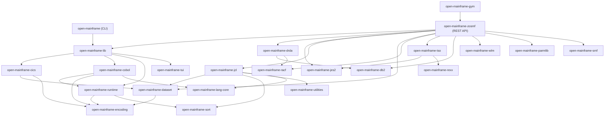
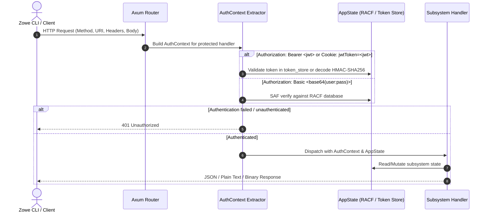
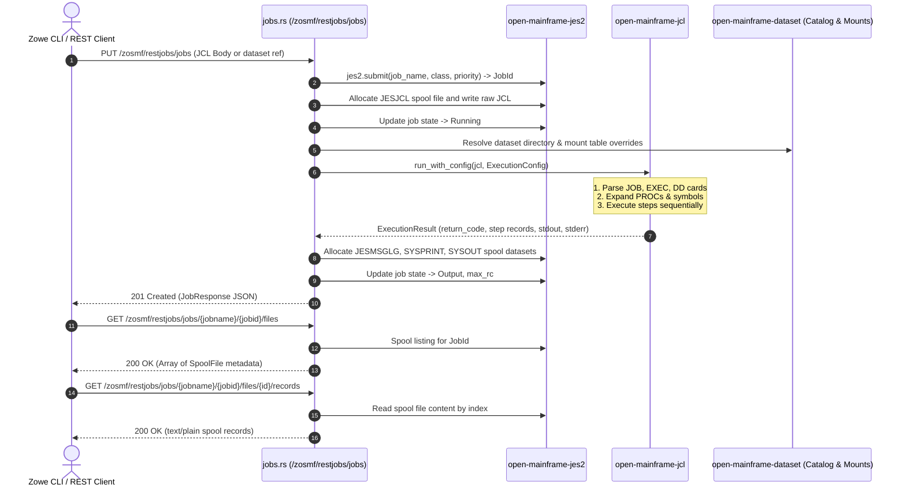
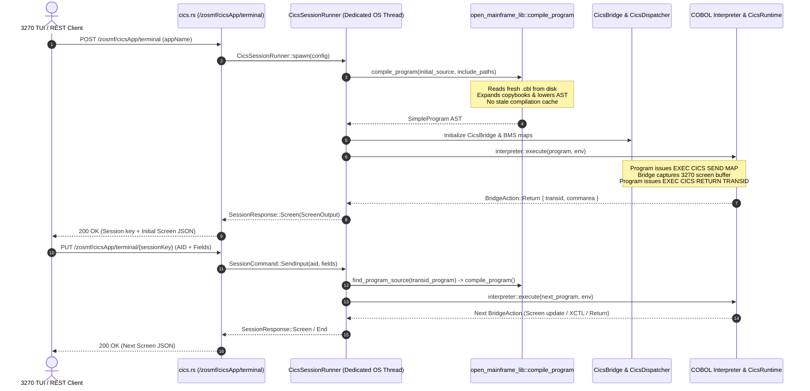
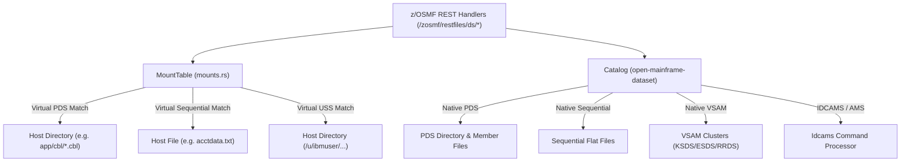
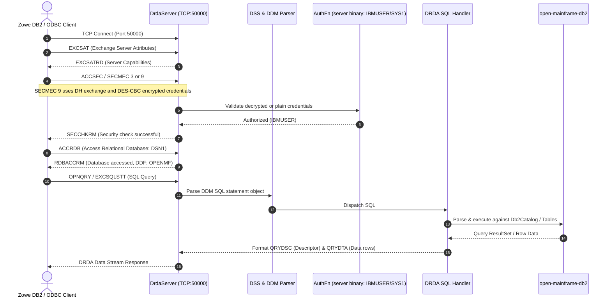

# Architecture Overview

OpenMainframe is a Rust workspace implementing core IBM z/OS subsystems and a
z/OSMF-compatible REST server. It enables standard mainframe tooling—including
Zowe CLI, Zowe Explorer, and automation pipelines—to interact with an emulated
mainframe environment locally or in containerized workflows.

## System Boundary and Dependency Layers

The workspace is organized into six functional layers. Dependencies flow
downward from API servers and user interfaces toward the foundational runtimes
and encodings.

### Layer Hierarchy

1. **Operations, API, & Evaluation Layer**
   - [`open-mainframe-zosmf`](../../crates/open-mainframe-zosmf/README.md): Axum-based REST server implementing z/OSMF endpoint families for files, jobs, TSO, consoles, workflows, and CICS.
   - [`open-mainframe-drda`](../../crates/open-mainframe-drda/README.md): DRDA wire protocol server implementing DB2 network connectivity over TCP (port 50000).
   - [`open-mainframe`](../../crates/open-mainframe/README.md): Primary CLI binary (`open-mainframe`) and shared integration library (`open_mainframe_lib`).
   - [`open-mainframe-gym`](../../crates/open-mainframe-gym/README.md): In-process evaluation harness for reinforcement learning and SWE-bench agents against z/OSMF interfaces.
   - [`open-mainframe-tui`](../../crates/open-mainframe-tui/README.md): 3270 full-screen terminal user interface powered by `ratatui` and `crossterm`.
   - [`open-mainframe-assess`](../../crates/open-mainframe-assess/README.md): Code complexity metrics and migration assessment engine.
   - [`open-mainframe-wiki`](../../crates/open-mainframe-wiki/README.md): Mainframe application portfolio documentation and diagram generator.

2. **Subsystems & System Services Layer**
   - [`open-mainframe-jes2`](../../crates/open-mainframe-jes2/README.md): Batch job lifecycle, priority queues, and spool dataset management.
   - [`open-mainframe-racf`](../../crates/open-mainframe-racf/README.md): Security database, SAF routing, authentication, and resource authorization.
   - [`open-mainframe-cics`](../../crates/open-mainframe-cics/README.md): Online transaction processing, BMS mapping, EXEC CICS API, and queues.
   - [`open-mainframe-tso`](../../crates/open-mainframe-tso/README.md): Interactive command processor, session management, and dataset allocation.
   - [`open-mainframe-ispf`](../../crates/open-mainframe-ispf/README.md): Panel-driven dialog management, tables, and editor services.
   - [`open-mainframe-mq`](../../crates/open-mainframe-mq/README.md): Enterprise message queue manager and MQI call implementation.
   - [`open-mainframe-mvs`](../../crates/open-mainframe-mvs/README.md): Supervisor services, dynamic allocation (SVC 99), WTO/WTOR, ENQ/DEQ, ESTAE.
   - [`open-mainframe-wlm`](../../crates/open-mainframe-wlm/README.md): Goal-oriented Workload Manager, service policies, and classification.
   - [`open-mainframe-smf`](../../crates/open-mainframe-smf/README.md): System Management Facilities binary recording and accounting.
   - [`open-mainframe-uss`](../../crates/open-mainframe-uss/README.md): UNIX System Services POSIX-compliant hierarchical file system (zFS) and process model.
   - [`open-mainframe-utilities`](../../crates/open-mainframe-utilities/README.md): Standard utilities (IEBCOPY, IEBGENER, IEBUPDTE, IEBCOMPR, IEBDG).
   - [`open-mainframe-syscmd`](../../crates/open-mainframe-syscmd/README.md): MVS system operator commands and SDSF status monitoring.
   - [`open-mainframe-pgmmgmt`](../../crates/open-mainframe-pgmmgmt/README.md): Program binder, OBJ/LMOD parsers, and program loader.
   - [`open-mainframe-networking`](../../crates/open-mainframe-networking/README.md): VTAM, SNA, TCP/IP, AT-TLS, and FTP/TN3270 services.
   - [`open-mainframe-crypto`](../../crates/open-mainframe-crypto/README.md): ICSF cryptographic services (AES/DES, RSA/ECC, SHA).
   - [`open-mainframe-parmlib`](../../crates/open-mainframe-parmlib/README.md): System initialization configuration and system symbol substitution (`&SYSNAME`).

3. **Data, Storage, & Database Layer**
   - [`open-mainframe-dataset`](../../crates/open-mainframe-dataset/README.md): ICF Catalog, QSAM, BSAM, PDS/PDSE, VSAM (KSDS, ESDS, RRDS), and IDCAMS.
   - [`open-mainframe-sort`](../../crates/open-mainframe-sort/README.md): DFSORT sort/merge engine, record filtering (INCLUDE/OMIT), and field transformations.
   - [`open-mainframe-db2`](../../crates/open-mainframe-db2/README.md): Relational SQL engine, DB2 catalog, DDL/DML processor, and package binder.
   - [`open-mainframe-ims`](../../crates/open-mainframe-ims/README.md): Hierarchical database (DL/I) and transaction manager (IMS/TM).
   - [`open-mainframe-idms`](../../crates/open-mainframe-idms/README.md): CODASYL network database, navigational DML, and DMCL storage.
   - [`open-mainframe-adabas`](../../crates/open-mainframe-adabas/README.md): Inverted-list database engine, FDT management, and ISN search.

4. **Compilers, Interpreters, & Precompilers Layer**
   - [`open-mainframe-cobol`](../../crates/open-mainframe-cobol/README.md): 8-stage COBOL compiler front-end with optional LLVM code generation.
   - [`open-mainframe-precompilers`](../../crates/open-mainframe-precompilers/README.md): Source precompilers for `EXEC SQL` and `EXEC CICS` statements.
   - [`open-mainframe-jcl`](../../crates/open-mainframe-jcl/README.md): JCL parser, cataloged procedure expander, and step executor.
   - [`open-mainframe-hlasm`](../../crates/open-mainframe-hlasm/README.md): High Level Assembler lexer, macro engine, and instruction encoder.
   - [`open-mainframe-pli`](../../crates/open-mainframe-pli/README.md): Enterprise PL/I parser, type system, and interpreter.
   - [`open-mainframe-rexx`](../../crates/open-mainframe-rexx/README.md): REXX language parser, compound variable store, and decimal runtime.
   - [`open-mainframe-clist`](../../crates/open-mainframe-clist/README.md): CLIST procedural language interpreter and variable evaluator.
   - [`open-mainframe-easytrieve`](../../crates/open-mainframe-easytrieve/README.md): Easytrieve Plus compiler and report generation engine.
   - [`open-mainframe-natural`](../../crates/open-mainframe-natural/README.md): Software AG Natural 4GL parser and execution engine.
   - [`open-mainframe-focus`](../../crates/open-mainframe-focus/README.md): Information Builders FOCUS 4GL reporting and TABLE/GRAPH engine.
   - [`open-mainframe-symbolic`](../../crates/open-mainframe-symbolic/README.md): Symbolic execution and Z3-backed formal verification engine for COBOL.

5. **Foundational Runtime & Language Core**
   - [`open-mainframe-runtime`](../../crates/open-mainframe-runtime/README.md): Language Environment (LE) runtime services, condition handling, and interpreter execution loop.
   - [`open-mainframe-lang-core`](../../crates/open-mainframe-lang-core/README.md): Shared AST definitions, source spans, diagnostic reporting, and preprocessor traits.

6. **Encoding & Arithmetic Primitives**
   - [`open-mainframe-encoding`](../../crates/open-mainframe-encoding/README.md): EBCDIC code pages (21 character sets), packed decimal (COMP-3), zoned decimal, and floating-point conversions.

---

## Major End-to-End Flows

### 1. z/OSMF Request Dispatch and Authentication

Incoming HTTP requests are routed to subsystem handlers. Protected handlers
declare an `AuthContext` extractor, which validates credentials before the
handler body runs.

Key aspects of the dispatch pipeline:
- **Authentication**: Handled by `AuthContext::from_request_parts` on protected handlers. It supports JWT bearer tokens, `jwtToken` cookies, and Basic authentication verified through `open_mainframe_racf::SafRouter`.
- **CSRF status**: A `csrf_middleware` implementation exists, but `handlers::build_router()` does not currently install it. The conventional `X-CSRF-ZOSMF-HEADER` is accepted but not enforced by the registered router.
- **Subsystem State**: Shared through `Arc<AppState>`, storing concurrent session tables (`dashmap::DashMap`), dataset catalogs, and subsystem instances behind `RwLock`.

---

### 2. Jobs, JCL, and JES2 Batch Execution

Batch jobs submitted through the REST API or internal reader undergo JCL
parsing, cataloged procedure expansion, execution, and spooling.

Key batch processing mechanisms:
- **JCL Parsing & Expansion**: [`open-mainframe-jcl`](../../crates/open-mainframe-jcl/README.md) expands cataloged procedures, resolves `//DD` statements, and supports conditional execution (`COND` / `IF-THEN-ELSE`).
- **JES2 Spool**: `open_mainframe_jes2::SpoolManager` manages multi-file spool queues per job, capturing `JESMSGLG` (execution summary and step return codes), `JESJCL` (original submission), `SYSOUT`, and `SYSPRINT`.
- **Target Routing**: Supports `/*ROUTE XEQ <system>` JECL statements and `X-IBM-Target-System` headers in multi-system sysplex configurations.

---

### 3. CICS Sessions and On-Demand COBOL Compilation

CICS transaction processing combines on-demand compilation from disk, a
dedicated OS thread per interactive session, and pseudo-conversational screen
cycles.

Key implementation details:
- **On-Demand Compilation**: `compile_program()` in [`crates/open-mainframe/src/lib.rs`](../../crates/open-mainframe/src/lib.rs) and `compile_and_register()` in [`crates/open-mainframe-zosmf/src/cics_runner.rs`](../../crates/open-mainframe-zosmf/src/cics_runner.rs) read `.cbl` files directly from disk whenever a program is invoked (`XCTL`, `LINK`, `RETURN TRANSID`). Modifications to COBOL source take effect on the very next transaction cycle.
- **Thread Isolation**: Because `CicsBridge` uses non-Send thread-local state (`Rc<RefCell<>>`), each CICS execution session runs in its own OS thread via `CicsSessionRunner`, communicating with Axum handlers via `tokio::sync::mpsc` and `oneshot` channels.
- **BMS Screen Mapping**: `open-mainframe-cics` parses BMS mapsets (`DFHMSD`, `DFHMDI`, `DFHMDF`) and manages 3270 attribute bytes, field flags, cursor positioning, and symbolic map buffer decomposition.

---

### 4. Dataset Management and Filesystem Mounts

The dataset subsystem provides transparent access to both simulated native
datasets and host filesystem directory mounts.

Key storage characteristics:
- **Mount Subsystem**: Defined in [`crates/open-mainframe-zosmf/src/mounts.rs`](../../crates/open-mainframe-zosmf/src/mounts.rs). Maps host paths directly into z/OS dataset names (e.g. host folder `app/cbl` as `IBMUSER.CARDDEMO.COBOL`). Supports `dataset-pds`, `dataset-seq`, and `uss` mount types with optional read-only and glob file filters.
- **ICF Catalog**: [`open_mainframe_dataset::Catalog`](../../crates/open-mainframe-dataset/README.md) provides volume and dataset lookup, dataset organization detection (`PS`, `PO`, `VS`), and record format management (`FB`, `VB`, `U`).
- **VSAM Support**: Full key-sequenced (KSDS), entry-sequenced (ESDS), and relative-record (RRDS) datasets, manageable through IDCAMS `DEFINE CLUSTER`, `REPRO`, `DELETE`, and `LISTCAT`.

---

### 5. DB2 and DRDA Wire Protocol Server

The DRDA subsystem provides standard DB2 TCP/IP database connectivity alongside
the REST-based SQL interface.

Key database features:
- **DRDA Wire Protocol**: Implemented in [`open-mainframe-drda`](../../crates/open-mainframe-drda/README.md). It supports connection negotiation (`EXCSAT`, `ACCSEC`, `SECCHK`, `ACCRDB`), plain user/password authentication with SECMEC 3, encrypted credentials with SECMEC 9, and query execution (`OPNQRY`, `EXCSQLSTT`, `CNTQRY`). The current `zosmf-server` binary supplies an `AuthFn` that accepts the built-in `IBMUSER` / `SYS1` credentials; the DRDA crate itself accepts any compatible callback.
- **Dual Access Modes**: Clients can query DB2 via DRDA network protocol on port 50000 or via REST endpoints at `/zosmf/db2/sql`.
- **Embedded SQL**: Works directly with [`open-mainframe-precompilers`](../../crates/open-mainframe-precompilers/README.md) to transform COBOL `EXEC SQL` statements into runtime calls against [`open-mainframe-db2`](../../crates/open-mainframe-db2/README.md).

---

## Related Documentation

- [Crate Map](crate-map.md) — Exhaustive map of all 44 workspace crates, their roles, and dependencies.
- [Getting Started](../guides/getting-started.md) — Building, running, and verifying the server.
- [Configuration Reference](../reference/configuration.md) — Complete TOML settings, env variables, and precedence.
- [z/OSMF API Reference](../reference/zosmf-api.md) — REST endpoint specifications and request/response semantics.
