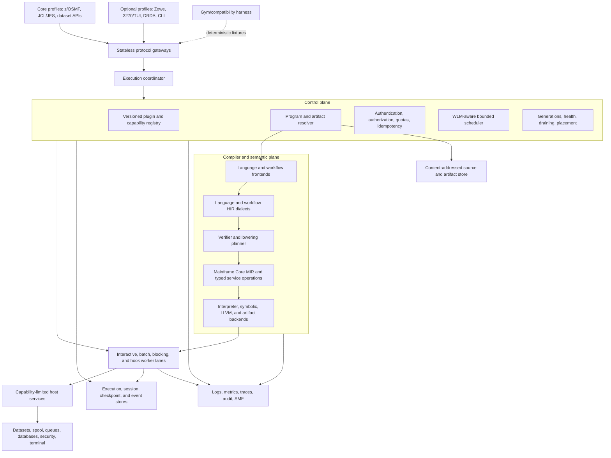
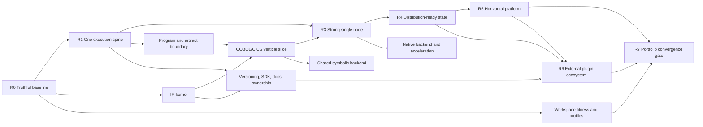

# OpenMainframe Platform Roadmap

Status: **Proposed**
Start: **2026 Q3**
Planning horizon: **18–30 months**

## Executive Summary

OpenMainframe should evolve from a large, integrated collection of mainframe
engines into a maintainable, plugin-oriented execution platform through eight
gated transformation waves:

1. Make current behavior measurable and prevent silent semantic loss.
2. Establish one program-resolution and execution path on a bounded single-node
   kernel.
3. Establish one semantic spine through a multi-level IR and a COBOL/CICS
   vertical slice.
4. Converge host services and scale up one node before attempting distribution.
5. Externalize authoritative state and prove distribution readiness.
6. Scale out across nodes with placement, recovery, and generation lifecycle.
7. Open stable isolated plugin interfaces and a maintainable extension
   ecosystem.
8. Certify that every workspace component has converged into an owned product
   profile, plugin/provider, tool/test boundary, or completed retirement.

The critical sequence is:

```text
truthful behavior
    -> stable contracts
    -> one program path
    -> one semantic spine
    -> bounded single-node execution
    -> externalized state
    -> multi-node execution
    -> external plugin ecosystem
    -> converged product portfolio
```

Native compilation, distributed scheduling, and third-party plugins are not the
first priorities. They depend on correctness, stable execution contracts, typed
host services, and artifact identity. Starting them earlier would accelerate or
distribute existing coupling rather than remove it.

The phase gates in this roadmap are authoritative. Calendar ranges are planning
estimates, not release promises. The estimates assume a stable core team of
approximately four to six engineers working across platform, language/runtime,
and quality/operations workstreams. A smaller team should preserve the sequence
and extend the dates rather than run more foundational changes concurrently.

The roadmap does not make every current workspace crate a permanent platform
component. Boundary cleanup, support-profile decisions, dependency reduction,
and legacy removal happen at named gates. Performance tuning may wait for stable
contracts; architectural cleanup may not be deferred until R7. R7 certifies
convergence work performed throughout R0–R6; it is not a delayed cleanup budget.

## North Star

OpenMainframe becomes a z/OS-compatible semantic execution fabric in which:

- Named support profiles expose z/OSMF, JCL/JES, dataset, and selected
  mainframe-compatible interfaces. Compatibility adapters such as 3270/TUI and
  DRDA are supported only when their profile, owner, and fixture obligations are
  explicitly accepted.
- Programs and workflows resolve, compile, execute, suspend, transfer, and
  resume through one versioned execution contract.
- Languages preserve their semantics in extensible dialects and progressively
  lower to a shared mainframe-aware IR where reuse is valid.
- Concrete, symbolic, assessment, and native backends share semantic
  foundations instead of independently reimplementing language behavior.
- CICS, DB2, IMS, JES2, RACF, MQ, datasets, terminals, and other subsystems are
  typed capabilities rather than ambient global state or string dispatch.
- Trusted built-in plugins remain fast, while third-party plugins can run in
  sandboxed components or supervised processes.
- A single node scales predictably through bounded concurrency and efficient
  resource use.
- Multiple nodes scale through durable work claims, content-addressed
  artifacts, externalized state, idempotent host calls, and generation-aware
  placement.
- Contracts, conformance tests, compatibility policy, ownership, and generated
  documentation keep the system maintainable as languages and subsystems grow.
- Every crate and public selector belongs to a reproducible product profile,
  governed plugin/provider, independent tool/test boundary, or completed
  retirement.

## Related Architecture Specifications

This roadmap coordinates the implementation of:

- [Architecture Overview](overview.md), which describes current system
  boundaries and flows.
- [Scalable Execution Backend](execution-backend.md), which defines execution
  contracts, scheduling, lifecycle, state, isolation, and host services.
- [Plugin-Oriented Compiler and Multi-Level IR Architecture](plugin-ir-architecture.md),
  which defines compiler phases, dialects, lowering, legality, backend, and
  runtime-import contracts.
- [Workspace Convergence and Sustainable Architecture](workspace-convergence.md),
  which defines product profiles, all-crate disposition, dependency and
  authority rules, maintainability gates, and portfolio retirement.
- [Wave Contract Index](roadmap/README.md), which turns each roadmap wave into
  an executable delivery contract with entry criteria, deliverables, evidence,
  promotion gates, rollback requirements, and handoff obligations.
- [Phase Plan Index](roadmap/phases/README.md), which decomposes wave authority
  changes into independently reviewable contract, shadow, canary, promotion,
  and rollback checkpoints.
- [Crate Map](crate-map.md), which records current workspace responsibilities.

The execution, IR, and workspace-convergence specifications remain the detailed
contract references. This document owns sequence, dependency, investment
priority, phase gates, and the combined scale and maintenance plan.

## Current Baseline

OpenMainframe already has broad language, subsystem, REST, terminal, and
deployment coverage. The main architectural constraints are cross-cutting:

- Program lookup, compilation, registration, and invocation are implemented by
  multiple private paths.
- COBOL concrete, symbolic, and LLVM paths do not share one complete semantic
  representation.
- Some lowering paths silently omit unsupported operations.
- CICS operations cross important boundaries as command strings and option
  lists.
- Interactive CICS execution uses dedicated thread-affine state based on
  `Rc<RefCell<_>>`.
- z/OSMF keeps significant authoritative session and workflow state in local
  in-memory maps.
- API routes and many subsystem dependencies are statically wired to a broad
  application state.
- Local registries such as utilities and PARMLIB demonstrate useful extension
  patterns, but contracts, lifecycle, limits, and discovery are inconsistent.
- CI runs formatting, linting, workspace build, and workspace tests, while
  architecture-level compatibility, differential, overload, determinism, and
  failure-isolation gates remain to be added.

The relevant current code includes:

- On-demand compilation and COBOL lowering in
  [`open-mainframe/src/lib.rs`](../../crates/open-mainframe/src/lib.rs) and
  [`open-mainframe/src/lower.rs`](../../crates/open-mainframe/src/lower.rs).
- Concrete execution in
  [`open-mainframe-runtime/src/interpreter.rs`](../../crates/open-mainframe-runtime/src/interpreter.rs).
- Symbolic execution in
  [`open-mainframe-symbolic`](../../crates/open-mainframe-symbolic).
- CICS bridge and thread-affine integration in
  [`open-mainframe/src/bridge.rs`](../../crates/open-mainframe/src/bridge.rs) and
  [`open-mainframe-zosmf/src/cics_runner.rs`](../../crates/open-mainframe-zosmf/src/cics_runner.rs).
- In-memory server state in
  [`open-mainframe-zosmf/src/state.rs`](../../crates/open-mainframe-zosmf/src/state.rs).
- JCL execution routing in
  [`open-mainframe-jcl/src/executor/mod.rs`](../../crates/open-mainframe-jcl/src/executor/mod.rs).
- Existing utility extension contracts in
  [`open-mainframe-utilities/src/lib.rs`](../../crates/open-mainframe-utilities/src/lib.rs).
- Existing CI gates in [`.github/workflows/ci.yml`](../../.github/workflows/ci.yml).

### Current component disposition

The following high-risk decisions constrain planning. The complete initial
44-crate disposition is in the
[workspace portfolio matrix](workspace-convergence.md#workspace-portfolio-matrix).
R0 confirms the exact supported selectors and owners; later waves execute the
transition rather than reopening the component role on every implementation
task.

| Component | Planning classification | Required transition | Removal or retention gate |
|---|---|---|---|
| `open-mainframe-drda` | Optional compatibility adapter | Make DRDA an explicit, default-off deployment feature; keep it outside the core-server gate unless a supported profile selects it | Retain only with an owner, protocol fixtures, security review, and selected-profile demand; otherwise deprecate and remove after the compatibility window |
| `open-mainframe-tui` | Mixed legacy boundary | Move protocol-neutral terminal, field, AID, screen, and session state out of the Ratatui/Crossterm frontend | The frontend may be retained as an optional client or removed after R3 session selectors use the extracted boundary and its compatibility fixtures no longer require the crate |
| `open-mainframe-assess` | Legacy analysis implementation and compatibility oracle | Freeze new standalone semantics; introduce an IR/HIR analysis consumer and compare accepted reports before migration | Remove or reduce to an adapter after R2 analysis parity for accepted report fields; assessment remains a platform capability |
| `open-mainframe-wiki` | Standalone portfolio tooling, not runtime infrastructure | Remove it from the server/runtime dependency closure and decide whether a separately owned tool profile remains valuable | Deprecate/remove the CLI surface when no owner or accepted output contract exists; it does not satisfy R6 schema-generated documentation obligations |
| `open-mainframe-gym` | Compatibility and evaluation test infrastructure | Replace uncontrolled time/environment inputs, publish deterministic fixture manifests, and depend on public test seams rather than CLI/tooling internals | Keep while it is the accepted R0/R1 harness; replacement requires equivalent deterministic fixtures and CI evidence |

No row above authorizes immediate deletion of behavior that is still a public
selector, compatibility oracle, or owner of protocol-neutral runtime state.

## Guiding Principles

### Correctness precedes optimization

No performance or scaling result is accepted when the system silently changes
program semantics. Unsupported behavior is explicit, source located, and
measurable.

### Contracts precede implementations

Stable request, artifact, outcome, IR, effect, and host-service boundaries are
defined before replacing internals. Existing engines migrate through adapters.

### Scope and boundaries precede tuning

Every current component is classified as core, compatibility adapter, tooling,
test infrastructure, or legacy implementation. Tool-only dependencies do not
remain in server/runtime build closures for convenience. A mixed component is
split before its optional frontend or legacy implementation is removed.

### One authoritative path at a time

Shadow paths compare behavior, but production has one observable authority for
each selector. Authority moves only after an exit gate and can be routed back.

### Scale up before scale out

A node must have bounded queues, explicit cancellation, no idle dedicated
threads, controlled memory, and useful profiling before distributed execution
is introduced.

### State is classified before it is externalized

Stateless, invocation, run-unit, session, region, and singleton state have
different durability and concurrency requirements. A generic key/value dump is
not an adequate state model.

### Compatibility is a product feature

Public endpoints, source behavior, condition codes, terminal screens, dataset
effects, and program-control semantics have versioned fixtures and migration
gates.

### Maintenance is continuous

Ownership, API versioning, conformance tests, documentation generation,
dependency boundaries, and deprecation policy begin in Wave 0. They are not
postponed until feature work is complete.

## Integrated Target Architecture



## Workstreams

The roadmap is executed through eight workstreams. They share phase gates but
have separate ownership and deliverables.

| Workstream | Scope | Primary long-term outcome |
|---|---|---|
| Compatibility and Quality | Semantic coverage, golden tests, diagnostics, conformance, differential testing | Behavior changes are intentional and measurable |
| Execution Platform | Registry, coordinator, scheduler, program service, outcomes, lifecycle | One bounded path for every invocation |
| Compiler and IR | Frontends, dialects, lowering, shared interpreter, symbolic and native backends | One semantic spine with explicit legality |
| Host Services and State | Dataset, terminal, spool, database, queue, security, clock, state/checkpoint contracts | Capability-limited access and movable state |
| Vertical Scale | Profiling, worker lanes, pooling, caching, memory, cancellation, native acceleration | Predictable high utilization per node |
| Horizontal Scale | Durable queues, leases, idempotency, sharding, placement, shared stores, failure recovery | Near-linear useful scale across nodes |
| Maintainability and Ecosystem | Crate boundaries, versioning, ownership, SDK, docs, release and deprecation policy | Safe extension by multiple teams and plugins |
| Workspace Fitness and Product Profiles | All-crate disposition, profile manifests, dependency direction, protocol/config authority, test maturity, retirement | A coherent product portfolio rather than unrelated workspace islands |

Maintainability and Compatibility are continuous tracks. The other workstreams
may deliver in parallel only after their shared dependency contracts are stable.

## Critical Path and Parallelism



Safe parallelism:

- IR kernel work can begin after R0 contracts are approved while the execution
  kernel is implemented.
- A COBOL/CICS IR vertical slice waits for both the IR kernel and the artifact/
  executor boundary.
- Host-service facades can begin around one stateless service in R1, but broad
  subsystem migration waits for stable execution context and identity.
- Symbolic migration can run after shared MIR covers its selected operation set.
- LLVM can prototype earlier, but cannot become an authoritative production
  path before shared interpreter parity.
- Multi-node work waits for externalized authoritative state, leases,
  idempotency, and single-node overload tests.
- Workspace fitness starts with the R0 portfolio manifest, constrains every
  intermediate wave, and is independently certified only at R7.

## Roadmap Overview

| Wave | Indicative horizon | Outcome | Primary scaling result |
|---|---:|---|---|
| R0 — Truthful System | 0–6 weeks | Measured behavior, explicit support profiles, no silent semantic loss | Reliable baseline |
| R1 — One Execution Spine | 6–16 weeks | Common registry/program path plus clean runtime/tool/adapter boundaries | Controlled concurrency |
| R2 — One Semantic Spine | 3–7 months | Shared IR proven through execution, assessment, and symbolic consumers | Semantic reuse and extensibility |
| R3 — Strong Single Node | 6–11 months | Typed host services, neutral terminal/session boundary, actors, bounded resources | Vertical scale |
| R4 — Distribution-Ready State | 9–15 months | Externalized state, durable events/work, leases, idempotency | Safe node mobility |
| R5 — Horizontal Platform | 12–20 months | Multi-node scheduling, placement, recovery, generation draining | Horizontal scale |
| R6 — Long-Lived Ecosystem | 15–24 months and ongoing | Stable SDK/WIT, more languages/backends, governance and release discipline | Sustainable extension |
| R7 — Converged Product Portfolio | 18–30 months; closure gate | Every crate/profile/authority is owned, verified, retained intentionally, or retired | Sustainable whole-workspace architecture |

R6 practices and R7 portfolio cleanup begin earlier. The listed R6 horizon is
when external ecosystem support can become a product commitment; the R7 horizon
is when the full portfolio evidence can be certified.

## R0 — Truthful System

Wave contract: [R0 — Truthful System](roadmap/r0-truthful-system.md).
Phase plan: [R0 phases](roadmap/phases/r0-phase-plan.md).

Indicative duration: **0–6 weeks**

### Objective

Make the current system safe to change. Establish semantic, performance,
resource, and compatibility baselines before introducing new authorities.

### Deliverables

#### Compatibility and semantic truth

- Inventory every COBOL statement across parse, semantic, concrete, symbolic,
  and LLVM support.
- Replace selected silent `None`/`Nop` behavior with structured
  `UnsupportedOperation` diagnostics.
- Make scanner and semantic errors phase gates for executable compilation.
- Classify all generic-success stubs, unimplemented handlers, catch-all
  dispatches, and mock program-control paths.
- Record expected CICS EIBRESP/EIBRESP2, terminal, file, and program-transfer
  behavior in golden fixtures.

#### Characterization tests

- CardDemo transaction flows, including SEND/RECEIVE, READ, LINK, XCTL, RETURN,
  ABEND, and condition paths.
- JCL submission, step conditions, DD binding, utility dispatch, and spool.
- COBOL decimal, PIC, encoding, REDEFINES, OCCURS, parameter modes, and group
  layout.
- Symbolic path and bounded-result fixtures.
- z/OSMF and Zowe compatibility smoke tests.
- DRDA/3270/TUI fixtures only for optional profiles proposed as supported, plus
  explicit disabled/absent behavior for the core profile.

#### Baseline measurements

- Build and test duration by package.
- Compile, transaction, batch-step, and REST request latency distributions.
- Active and idle session thread count.
- Memory per session/run unit and total high-water mark.
- Queue depth, throughput, CPU utilization, allocations, and output bytes.
- Failure behavior under cancellation, malformed input, and overload.

#### Contract decisions

- Approve execution IDs, context, outcomes, artifacts, plugin descriptor, and
  diagnostic contracts.
- Approve IR operation, type, effect, legality, and phase contracts.
- Record decisions as architecture documents or ADRs.
- Establish stable diagnostic-code namespaces and compatibility-fixture owners.
- Freeze the support-profile and component-disposition matrix for DRDA, TUI,
  assessment, wiki tooling, and the Gym compatibility harness.

#### Workspace fitness baseline

- Generate the complete workspace portfolio manifest: crates, owners, product
  profiles, consumers/entry points, public surfaces, test maturity, dependency
  edges, state/protocol/configuration authorities, mock/stub paths, and
  retirement candidates.
- Classify every crate using the
  [workspace convergence matrix](workspace-convergence.md#workspace-portfolio-matrix),
  without equating “no incoming workspace dependency” with “safe to delete.”
- Freeze initial core, compatibility, language, subsystem, analysis/test, and
  operations profile manifests.

### Exit gate

- Every currently accepted construct in the selected CardDemo/JCL/COBOL paths
  is classified as implemented, partial, unsupported, or intentionally ignored.
- Selected executable paths cannot silently omit unsupported behavior.
- Baseline tests are deterministic enough to compare old and new paths.
- Baseline performance and resource reports are stored in CI artifacts.
- Public behavior has named owners and fixtures.
- Every named component has an accepted support profile, transition decision,
  dependency/state boundary, and removal or retention gate.
- Every workspace crate and public selector has an initial owner, support state,
  profile, target boundary, and evidence or retirement plan.

### Explicitly deferred

- New scheduler authority.
- Full IR implementation.
- Native compilation completion.
- Distributed stores or queues.
- External plugin loading.

## R1 — One Execution Spine

Wave contract: [R1 — One Execution Spine](roadmap/r1-one-execution-spine.md).
Phase plan: [R1 phases](roadmap/phases/r1-phase-plan.md).

Indicative duration: **6–16 weeks**

### Objective

Create one dependency-light execution boundary and route representative work
through it without rewriting existing language or subsystem semantics.

### Deliverables

#### Execution API and registry

- Add versioned execution API types: invocation, identity, limits, events,
  cancellation, outcomes, failures, and plugin descriptors.
- Implement immutable registry snapshots, capability resolution, generation
  identity, duplicate/version validation, and health state.
- Add adapter conformance tests and panic/failure containment.

#### Single-node kernel

- Implement coordinator, admission, bounded queues, worker lanes, deadlines,
  cancellation, event emission, and in-memory stores.
- Separate request, batch, interactive, blocking/legacy, and hook lanes.
- Apply explicit concurrency and output limits.
- Adapt one stateless z/OSMF service and `UtilityProgram` first.

#### One program path

- Introduce `ProgramResolver`, `SourceArtifact`, `ExecutableArtifact`,
  `ArtifactStore`, compiler capability, executor capability, and
  `ProgramService`.
- Wrap current COBOL `SimpleProgram`, REXX, CLIST, PL/I, and utility paths as
  backend-specific artifacts/adapters where useful.
- Route one JCL utility/program path and one COBOL batch path through
  `ProgramService`.
- Keep source resolution fresh while allowing unchanged content hashes to reuse
  immutable artifacts.
- Split CLI/tooling dependencies from the server/runtime library closure, make
  DRDA an explicit optional feature, and carry the mixed TUI/session dependency
  only as a time-bounded exception into R3.
- Verify every suspicious internal dependency edge, remove unused and
  reverse-layer edges, and make accepted product profiles reproducible build
  closures rather than informal Cargo feature combinations.
- Introduce dependency-light contract boundaries only when they enforce
  ownership, versioning, dependency direction, isolation, or release policy;
  avoid crate splitting for its own sake.

#### Control-flow contract

- Represent complete, condition, ABEND, suspend, CALL, transfer, and cancel as
  explicit outcomes rather than generic infrastructure errors.
- Add run-unit and parent/child execution identity even before full CICS
  migration.

### Exit gate

- Representative REST, utility, JCL, and COBOL work runs through the coordinator
  with existing behavior preserved by adapters.
- Every queue and worker lane is bounded and has an overload test.
- Cancellation and deadline tests do not leak an instance or queue permit.
- Program lookup and artifact selection are observable and deterministic.
- Editing source or dependencies changes the next artifact resolution.
- Legacy public entry points remain functional.
- The core-server build excludes standalone portfolio tooling; optional
  adapters and test support are explicit dependency/profile tiers.
- The accepted architecture graph has no verified-unused or prohibited
  dependency edge in promoted profiles; every temporary exception is owned and
  expires at a named gate.

### Scale result

The system gains controlled concurrency and backpressure on one node. It is not
yet horizontally scalable because authoritative session and subsystem state is
still local.

### Explicitly deferred

- Replacing `SimpleProgram`.
- Removing the CICS session thread.
- Externalizing every host service.
- Durable distributed work queues.

## R2 — One Semantic Spine

Wave contract: [R2 — One Semantic Spine](roadmap/r2-one-semantic-spine.md).
Phase plan: [R2 phases](roadmap/phases/r2-phase-plan.md).

Indicative duration: **3–7 months**

### Objective

Prove the plugin-oriented multi-level IR through a real COBOL/CICS workload,
then move one concrete execution authority to shared MIR.

### Deliverables

#### IR foundation

- Add dependency-light IR core, schema, compiler API/host, textual dump, source
  provenance, verifier, pass manager, and legality planner.
- Register minimal `om.core`, `om.cf`, `om.mem`, `om.decimal`, COBOL, and CICS
  dialects.
- Generate typed builders, wrappers, verifiers, documentation, and capability
  tables from operation schemas.

#### COBOL/CICS vertical slice

- Model storage declarations, layout, aliases, literals, MOVE, arithmetic, IF,
  PERFORM, CALL, and selected EXEC CICS operations.
- Preserve COPY and precompiler provenance.
- Introduce typed CICS SEND/RECEIVE/READ and program-control operations.
- Run shadow lowering from COBOL AST to HIR and Core MIR while the legacy path
  remains authoritative.
- Add an analysis-mode consumer that proves accepted assessment results can be
  derived from verified HIR/IR before retiring the standalone analyzer path.

#### Shared interpreter

- Implement concrete Core MIR execution for the vertical slice.
- Bind typed service operations to adapters over current CICS/runtime behavior.
- Publish an IR executable artifact and executor capability.
- Move selected CardDemo selectors to the new interpreter after differential
  parity.

#### Symbolic convergence start

- Define symbolic interfaces and effect abstractions over shared MIR.
- Migrate branches, arithmetic, storage, and selected service operations when
  shared semantics are stable.
- Mark unsupported or approximated semantics in proof results.

#### Language and analysis adoption matrix

- Record a target semantic boundary for COBOL, JCL, HLASM, PL/I, REXX, CLIST,
  Easytrieve, Natural, FOCUS, precompilers, assessment, and symbolic analysis.
- Require common diagnostics, artifacts, lifecycle, typed effects, limits, and
  plugin metadata while permitting independent semantic representations when a
  shared lowering has not proven expressive parity.
- Prevent any retained independent interpreter or analyzer from becoming an
  unlabelled second production authority for migrated selectors.

### Exit gate

- Selected CardDemo transactions pass through shared MIR with parity in screen,
  storage, file effects, conditions, and program-control outcomes.
- Full legalization rejects every unsupported executable operation.
- `--explain-pipeline` and `--emit-ir` account for the vertical slice.
- Shared interpreter results are differentially tested against the legacy
  interpreter.
- Migrated symbolic paths no longer depend on an independent COBOL control-flow
  representation.
- One accepted assessment report selector uses the verified analysis pipeline
  with explicit completeness and parity or approved differences.
- The artifact/executor selector can route back to the legacy path.
- Every language and analysis crate has an accepted adoption, plugin/tool, or
  retirement record even when its full migration is scheduled for R6.

### Scale result

Semantic duplication begins to fall, new operations become declarative and
typed, and artifact caching becomes safe. Raw throughput may not improve yet;
the primary result is correctness and development scalability.

### Explicitly deferred

- Migrating every COBOL statement or language.
- Making LLVM the default.
- Replacing all subsystem APIs with dialect operations.
- External IR plugins.

## R3 — Strong Single Node

Wave contract: [R3 — Strong Single Node](roadmap/r3-strong-single-node.md).
Phase plan: [R3 phases](roadmap/phases/r3-phase-plan.md).

Indicative duration: **6–11 months**

### Objective

Maximize predictable throughput, concurrency, and failure isolation within one
process/node while converging subsystem access behind typed host services.

### Deliverables

#### Typed host services

- Introduce capability-limited dataset, terminal, spool, security, database,
  queue, clock/random, telemetry, state, and program services.
- Move migrated compiler/runtime operations away from raw global state and
  untyped command strings.
- Enforce principal, authorization, effect, transaction, idempotency, and audit
  context at service boundaries.
- Publish the supported-profile host/provider catalog so each subsystem has an
  owned capability boundary instead of broad access through a gateway state
  container.

#### Interactive execution

- Model CICS LINK, XCTL, RETURN, ABEND, input wait, and resume as explicit
  execution outcomes.
- Introduce run-unit frame stacks and session actors.
- Move terminal wait outside CPU workers.
- Replace one-thread-per-idle-session with bounded interactive workers.
- Extract protocol-neutral terminal/session state from the TUI frontend; keep
  Ratatui/Crossterm and protocol adapters outside the session authority.
- Consolidate TN3270/TN3270E protocol state behind one neutral authority;
  networking, z/OSMF, and TUI retain only transport or presentation adapters.
- Establish one versioned product configuration schema with TOML, YAML,
  environment, and deployment-format adapters; provider-private tuning remains
  explicitly namespaced.
- Remove `Rc<RefCell<_>>` from authoritative server execution paths or confine it
  behind a temporary affine adapter with capacity limits.

#### Vertical performance

- Profile before each optimization and maintain representative flamegraphs.
- Add content-addressed compilation and preprocessed/IR artifact caches with
  bounded memory and eviction policy.
- Pool safe reusable buffers, parser/IR arenas, Wasm/native instances where
  applicable, and subsystem connections.
- Reduce cloning and string conversion on hot typed-operation paths.
- Partition worker lanes so blocking legacy work cannot starve interactive or
  request workloads.
- Add per-service concurrency limits, circuit breaking, and backpressure.
- Introduce native compilation only for a differentially verified subset where
  measurements justify it.

#### Operational hardening

- Structured execution/phase events and trace correlation.
- Queue, worker, session, artifact, host-call, and condition metrics.
- Leak, long-run, cancellation, overload, and chaos tests.
- Readiness based on registry/provider health rather than process liveness only.

### Exit gate

- No idle CICS/TSO session requires a dedicated OS thread.
- Memory remains bounded while offered load exceeds admitted capacity.
- Interactive, batch, request, and blocking lanes demonstrate isolation under
  mixed load.
- Cancellation, timeout, and plugin/provider failures release all permits and
  scoped resources.
- Headless and server terminal/session paths build without Ratatui/Crossterm;
  the optional TUI frontend has an explicit retention or deprecation decision.
- Typed host-service boundaries cover the selected CardDemo/JCL paths.
- Supported single-node profiles have one terminal/protocol/configuration and
  capability-resolution authority per accepted selector, with remaining
  subsystem migrations inventoried for R4–R6.
- Cache invalidation remains correct for source and dependency edits.
- Performance regression budgets are enforced in a stable benchmark lane.

### Scale-up targets

Targets are finalized from R0 baselines. Initial acceptance ratios are:

- At least 2x supported concurrent idle interactive sessions without a
  proportional increase in thread count.
- Throughput scales with worker-lane concurrency until a measured CPU, memory,
  or host-service saturation point.
- Under 2x offered overload, resident memory stays within the configured bound
  and excess work is rejected or queued according to policy.
- A blocking workload cannot increase interactive p95 latency beyond the agreed
  isolation budget.
- Artifact-cache hits materially reduce repeated compile latency without stale
  behavior.

### Explicitly deferred

- Cross-node session mobility.
- Durable distributed leases.
- Third-party plugin ABI commitment.

## R4 — Distribution-Ready State

Wave contract: [R4 — Distribution-Ready State](roadmap/r4-distribution-ready-state.md).
Phase plan: [R4 phases](roadmap/phases/r4-phase-plan.md).

Indicative duration: **9–15 months**

### Objective

Remove node-local authority assumptions and make every movable workload safe to
claim, retry, checkpoint, and recover before adding multiple active workers.

### Deliverables

#### State classification and stores

- Classify all state by invocation, run unit, session, region, singleton, and
  artifact scope.
- Classify authoritative state for every capability advertised by a
  distribution-ready profile, including optional protocol and subsystem packs;
  unselected capabilities are explicitly absent rather than silently local.
- Define store traits for execution records, events, artifacts, sessions,
  checkpoints, plugin generations, and durable work.
- Keep in-memory implementations for development and add one production durable
  implementation per required store category.
- Version checkpoint and session schemas with compatibility tests.

#### Durable work and ownership

- Add lease-based work claims with expiry, heartbeat, attempt number, and owner
  generation.
- Define safe points for retry, checkpoint, migration, and generation draining.
- Propagate idempotency keys to mutating host services.
- Record monotonic operation sequence for external effects where replay matters.
- Implement poison/dead-letter policy and operator-visible recovery state.

#### Stateless gateways and coordinators

- Remove authoritative execution/session data from Axum handler-local maps.
- Gateways authenticate and translate protocols, then invoke coordinator/store
  contracts.
- Coordinator caches are reconstructible from durable state and registry
  snapshots.
- Sticky routing is an optimization, not a correctness requirement, except for
  explicitly non-migratable legacy adapters.

#### Failure and recovery tests

- Kill worker during queued, running, suspended, checkpointing, and completing
  states.
- Restart coordinator and gateways without losing authoritative execution state.
- Retry idempotent and non-idempotent service sequences under defined policy.
- Upgrade plugin generations with old checkpoints and explicit compatibility
  rejection.

### Exit gate

- No workload declared movable depends on process-local authoritative state.
- Every durable work item has an owner lease, attempt, idempotency identity, and
  terminal/dead-letter path.
- Worker or coordinator restart recovers queued and suspended work within the
  target recovery window.
- Host-service mutation tests show no unaccounted duplicate effects across
  retries.
- Checkpoint compatibility and rejection are versioned and observable.
- A single-node deployment can run entirely on the durable interfaces before a
  second active worker is introduced.
- Every capability advertised as movable has accepted state ownership,
  checkpoint/restart, compatibility, and failure semantics; no profile hides
  process-local authority behind a stateless gateway claim.

### Scale result

The architecture is horizontally ready but still operated as one active worker
pool until recovery correctness passes. This phase prevents distributed
execution from turning local state races into cross-node corruption.

## R5 — Horizontal Platform

Wave contract: [R5 — Horizontal Platform](roadmap/r5-horizontal-platform.md).
Phase plan: [R5 phases](roadmap/phases/r5-phase-plan.md).

Indicative duration: **12–20 months**

### Objective

Run multiple worker nodes and stateless gateways with controlled placement,
failure recovery, and useful scaling efficiency.

### Deliverables

#### Multi-node scheduling

- Add worker registration, capability/target inventory, heartbeat, health, and
  generation availability.
- Schedule by service class, plugin capability, artifact locality, resource
  requirement, isolation tier, and session affinity.
- Preserve bounded global and per-tenant admission.
- Add fair scheduling and WLM policy translation.

#### Placement and locality

- Co-locate large artifacts and data-sensitive work when beneficial.
- Shard session/run-unit ownership while retaining lease-based takeover.
- Route non-migratable legacy affine workloads only to compatible workers and
  expose their reduced availability semantics.
- Replicate immutable artifacts rather than mutable compiler state.

#### Recovery and lifecycle

- Reclaim expired leases and resume from declared safe points.
- Drain plugin generations and workers without admitting incompatible new work.
- Roll deployments forward/back through generation selectors.
- Isolate plugin panic, Wasm trap, process crash, and node loss to the declared
  invocation/run-unit boundary.

#### Horizontal validation

- Load tests at one, two, and four worker nodes.
- Worker-loss and network-partition tests.
- Store/queue saturation and backpressure tests.
- Mixed batch, interactive, REST, and protocol workloads.
- Artifact cold-start and locality tests.
- Execute the complete manifest for each advertised horizontal profile,
  including explicit absence behavior for unselected language, subsystem, and
  compatibility packs.

### Exit gate

- Stateless/request and batch workloads achieve at least 70% scaling efficiency
  from one to four workers under a non-store-bound benchmark.
- Adding workers does not increase unbounded queueing or memory.
- One worker loss recovers leased work within the agreed service-class window.
- Session affinity and takeover behavior match declared durability levels.
- New work routes only to ready compatible plugin generations.
- Rolling worker/plugin upgrades complete without stopping unrelated work.
- A store or queue bottleneck is visible as a named saturation signal rather
  than unexplained application latency.
- Every advertised multi-node profile proves placement, recovery, upgrade, and
  dependency/package closure for all of its selected capabilities.

### Explicitly deferred

- Active-active deployment across high-latency regions unless a product use case
  and data-consistency model require it.
- Exactly-once execution claims. The platform uses at-least-once work delivery
  plus idempotent or transactional host services.

## R6 — Long-Lived Plugin Ecosystem

Wave contract: [R6 — Long-Lived Plugin Ecosystem](roadmap/r6-long-lived-ecosystem.md).
Phase plan: [R6 phases](roadmap/phases/r6-phase-plan.md).

Indicative horizon: **15–24 months and ongoing**

### Objective

Make OpenMainframe safe for multiple teams and external plugin authors to extend
without destabilizing the platform or freezing internal implementation.

### Deliverables

#### Stable plugin SDK

- Publish built-in plugin SDK, manifest schema, operation schema generator,
  conformance kit, sample frontend, sample runtime provider, and sample backend.
- Define WIT worlds for approved compiler/execution capabilities.
- Provide supervised process adapter for JVM, native-library, proprietary, or
  strongly isolated runtimes.
- Add signature, provenance, trust, permission, and compatibility policy.

#### Language and backend expansion

- Migrate additional languages based on user value and semantic reuse: PL/I,
  REXX, CLIST, Easytrieve, Natural, FOCUS, or HLASM.
- Expand typed service dialects for DB2, IMS, MQ, datasets, terminal, security,
  and job control.
- Complete symbolic and native coverage incrementally, never by silent fallback.
- Keep workflow languages such as JCL in orchestration IR when native lowering
  provides no value.

#### Maintenance governance

- Semantic versioning for host API, dialects, runtime interfaces, artifacts,
  checkpoints, and WIT packages.
- Compatibility matrices generated from registry and schema metadata.
- Deprecation windows with automated warnings and upgrade passes.
- CODEOWNERS or equivalent ownership for contracts, dialects, services, and
  compatibility fixtures.
- Architecture dependency checks in CI.
- Generated operation, capability, and support-status documentation.
- Release trains with canary generations, draining, and rollback policy.

#### Portfolio pluginization and retirement

- Move optional languages, subsystems, protocols, analysis tools, evaluation
  harnesses, and delivery tools behind governed plugin/provider, test-only, or
  independently packaged boundaries.
- Execute approved deprecations only after consumer, fixture, profile, rollback,
  and compatibility-window obligations pass.
- Require every remaining leaf product or experiment to have an owner, public
  entry point, support level, and conformance plan; otherwise archive it outside
  supported workspace profiles.

### Exit gate

- At least two independent implementations exercise each public plugin contract
  before it is declared stable.
- An external sample plugin can install, validate, run within limits, upgrade,
  drain, and uninstall without restarting unrelated workloads.
- Compatibility CI covers the currently supported host/plugin version matrix.
- Contract-breaking changes require a major version, migration path, and
  release-note entry.
- Generated documentation accurately reflects installed capabilities and
  semantic coverage.
- Ownership and deprecation policy prevent orphaned public contracts.
- All components are either on an accepted profile/plugin/tool boundary or have
  an executable retirement plan; remaining convergence exceptions are finite,
  owned, and handed to R7 certification.

## R7 — Converged Product Portfolio

Wave contract: [R7 — Converged Product Portfolio](roadmap/r7-converged-product-portfolio.md).
Phase plan: [R7 phases](roadmap/phases/r7-phase-plan.md).

Indicative horizon: **18–30 months; closure gate**

### Objective

Certify that convergence work performed throughout R0–R6 covers the complete
workspace and every advertised product profile. Close finite exceptions and
retire superseded authorities without inventing another architecture or hiding
broad implementation work inside a final cleanup wave.

### Deliverables

- Regenerated portfolio manifest for every current and newly added crate,
  including owner, support state, profile, public surface, boundary, evidence,
  and retirement rule.
- Mechanically verified dependency graphs and reproducible build/test/package/
  documentation manifests for each advertised profile.
- One observable authority per protocol, configuration family, capability
  registry, program selector, and durable state class.
- Completed language/subsystem adoption records and supported-profile
  conformance matrices.
- Removal or explicit long-term acceptance of every migration adapter,
  duplicate authority, deprecated selector, mock/stub production path, unused
  dependency, unowned leaf, and expired exception.
- Sustainable CI, ownership, compatibility, maintainability-review, and
  portfolio-review governance.

### Exit gate

- Every workspace crate is an owned supported component, optional plugin/
  provider, independently packaged tool, deterministic test component, or
  completed retirement/archive.
- Supported profiles contain no excluded UI/tool/test/adapter implementation,
  no prohibited dependency edge, and no mock or generic-success production path.
- Protocol, configuration, capability resolution, program execution, and state
  authorities are unique and independently conformance tested.
- All public surfaces and long-term compatibility boundaries have explicit
  support/version/deprecation policy.
- The final evidence pack is reproducible and independently accepted. A failed
  criterion returns to its owning earlier wave; it is not waived in R7.

## Scale-Up Strategy

Vertical scaling is primarily an execution-discipline problem, not a native
code-generation problem.

### Order of optimization

1. Measure representative workloads.
2. Bound admission, queues, output, memory, and recursion.
3. Separate workload lanes and remove idle thread ownership.
4. Remove unnecessary cloning, serialization, and string dispatch on hot paths.
5. Pool safe reusable resources.
6. Add content-addressed caches with correct invalidation.
7. Optimize host-service access and storage layouts.
8. Add JIT/native compilation only for measured CPU-bound semantic kernels.

### Required resource budgets

Each execution profile defines:

- maximum queued and active invocations;
- maximum per-plugin and per-principal concurrency;
- wall, CPU/fuel, memory, output, call-depth, and dataset/queue budgets;
- maximum suspended session state;
- artifact and compilation-cache limits;
- service-specific transaction and connection limits.

Overload returns a structured retryable or rejected outcome. It never creates
unbounded tasks, threads, channels, output buffers, or state entries.

### Performance governance

- Maintain microbenchmarks only for stable semantic kernels.
- Maintain scenario benchmarks for CardDemo, JCL batch, z/OSMF, and mixed load.
- Compare p50/p95/p99, throughput, CPU, memory, allocations, queue delay, and
  cache behavior.
- Require a profile or benchmark before accepting complex optimization code.
- Record performance budgets by release; do not use a single aggregate score.

## Scale-Out Strategy

Horizontal scaling depends on explicit ownership and repeatable effects.

### Stateless components

- Protocol gateways.
- Admission and translation layers.
- Registry readers and coordinators with reconstructible caches.
- Compiler workers operating on immutable source/artifact inputs.

### Stateful components

- Durable execution/work queue.
- Session and checkpoint store.
- Artifact/source store.
- Event/audit store.
- Subsystem data stores and transactional host services.
- Plugin generation and compatibility metadata.

### Distribution contract

Every movable execution has:

- stable execution and run-unit IDs;
- owner lease and heartbeat;
- attempt number;
- immutable input/artifact references;
- plugin generation and target requirements;
- checkpoint or restart policy;
- idempotency and effect sequence;
- terminal/dead-letter state;
- cancellation and deadline propagation.

Work that cannot satisfy this contract remains explicitly node-affine and is
capacity limited until migrated.

### Data consistency policy

- At-least-once work delivery is the default.
- Immutable artifacts use content addressing and replication.
- Mutating host services provide idempotency, transactions, or explicit
  non-retryable semantics.
- Session migration occurs only at declared safe points.
- Control-plane caches are never authoritative.
- Cross-region consistency is not assumed by the initial platform.

## Maintainability Strategy

### Stable contract hierarchy

Contracts are versioned independently:

```text
host/execution API
plugin descriptor and capability schema
compiler phase and diagnostic API
IR dialect and bytecode versions
runtime service interfaces
artifact formats and loader requirements
session/checkpoint schemas
external WIT/process protocols
```

A change to one layer does not imply a global version bump unless its observable
contract changes.

### Crate dependency rules

- Foundation API/IR crates do not depend on language, subsystem, server, or
  backend crates.
- Frontends depend on compiler/IR APIs, not concrete backends.
- Backends consume IR, not frontend AST internals.
- Host-service interfaces are separated from mutable subsystem implementations.
- z/OSMF handlers depend on coordinator/service contracts rather than broad
  internal state.
- Migration adapters live in identifiable adapter modules/crates and have
  removal criteria.

CI should enforce dependency direction and detect cycles or forbidden edges.

### Compatibility policy

- Public contracts use semantic versioning.
- Dialect operation meaning, effect, ABI, or condition changes require a major
  version or explicit upgrade pass.
- Deprecations remain supported for a documented release window.
- Compatibility fixtures are owned like production code.
- Artifact and checkpoint compatibility is tested across supported release
  pairs.
- Unknown compatible data is preserved where forwarding is promised; otherwise
  it fails explicitly.

### Testing pyramid

1. Schema, parser, verifier, and unit tests.
2. Plugin and host-service contract tests.
3. Differential semantic tests.
4. Subsystem integration tests.
5. CardDemo/JCL/z/OSMF end-to-end tests plus DRDA/3270 tests for each accepted
   optional compatibility profile.
6. Determinism, security, malformed-input, overload, and chaos tests.
7. Single-node and multi-node performance tests.

Not every test runs on every pull request. CI tiers should provide:

- Fast required checks for formatting, lint, unit, schema, and focused
  contracts.
- Workspace and compatibility suites on merge.
- End-to-end, differential, security, and performance suites on scheduled or
  release lanes.

### Ownership model

Recommended ownership domains:

- Platform kernel and execution contracts.
- Compiler API, IR core, and schema tooling.
- Language frontends and dialects.
- Runtime/host-service contracts and subsystem implementations.
- Protocol gateways and compatibility surfaces.
- Reliability, performance, security, and release engineering.

Every public contract has a primary owner, backup owner, compatibility fixtures,
and deprecation authority.

### Documentation as generated evidence

Generate where possible:

- plugin and capability inventories;
- dialect operation/type references;
- lowering/native/symbolic support matrices;
- runtime interface and permission tables;
- artifact and checkpoint compatibility matrices;
- registered z/OSMF/API descriptors;
- benchmark and scale trend reports.

Handwritten architecture documents explain decisions and relationships; schemas,
source, tests, and generated references remain authoritative for exact support.

## First 90 Days

The first 90 days should produce a safer system and a usable execution seam,
not a broad rewrite.

### Days 0–30: establish truth

- Build COBOL statement and subsystem capability inventories.
- Stop silent semantic dropping in selected executable paths.
- Add CardDemo, JCL, decimal/storage, and symbolic characterization fixtures.
- Capture latency, throughput, memory, thread, queue, and failure baselines.
- Approve minimal execution, artifact, outcome, diagnostic, and plugin contracts.
- Classify DRDA, TUI, assessment, wiki tooling, and Gym by support profile,
  ownership, fixture obligations, and removal/retention gate.
- Generate the all-crate portfolio, profile, dependency, authority, mock/stub,
  test-maturity, and ownership manifests.

**Demonstration:** An unsupported selected COBOL construct fails with a stable,
source-located diagnostic; baseline reports are reproducible.

### Days 31–60: establish the kernel seam

- Add execution API and immutable registry snapshot prototypes.
- Implement bounded in-memory coordinator and worker lanes.
- Adapt `UtilityProgram` and one stateless z/OSMF service.
- Add structured events, deadlines, cancellation, and overload tests.
- Scaffold `ProgramResolver`, artifact metadata, and executor adapter contracts.
- Remove standalone wiki/assessment dependencies from the server/runtime build
  closure without deleting any still-supported tool selector.
- Verify suspicious dependency edges and produce a reproducible core-server
  profile build that excludes optional adapters, UI, tools, and test harnesses.

**Demonstration:** A utility and REST operation run through the bounded
coordinator with traceable identity, limits, and existing output parity.

### Days 61–90: establish one program path

- Wrap current `SimpleProgram` compilation/execution as compiler/executor
  capabilities.
- Route one JCL program/utility and one COBOL batch path through
  `ProgramService`.
- Prove fresh source edits change artifact resolution.
- Scaffold dependency-light IR core and schema registry in analysis-only mode.
- Produce the COBOL/CICS vertical-slice operation list and shadow-lowering plan.

**Demonstration:** The same program selector resolves source, produces an
artifact, invokes an executor, and emits explicit outcomes through one path;
legacy APIs remain functional.

## Prioritized Backlog After 90 Days

### Must do next

1. COBOL HIR/Core MIR shadow lowering.
2. Typed CICS operations for one complete CardDemo transaction.
3. Shared MIR interpreter and differential parity.
4. Run-unit frames and explicit CICS program control.
5. Dataset/terminal/program host-service facades.
6. Session actor and bounded interactive workers.
7. State/checkpoint classification and durable store interfaces.
8. Protocol/configuration authority convergence and the remaining all-crate
   adoption/retirement ledger.

### Do after the single-node gate

1. Broad symbolic convergence.
2. Content-addressed distributed artifact store.
3. Durable lease queue and worker protocol.
4. LLVM/native backend for measured hot subsets.
5. Multi-node placement and recovery.

### Do only after contract stability

1. Public WIT packages.
2. Third-party plugin marketplace or discovery service.
3. Broad external plugin compatibility promise.
4. Cross-region active-active execution.

## Program Metrics and Decision Gates

### Correctness

- Count of silent unsupported-operation paths: target **zero** in migrated
  production paths.
- Semantic coverage by language operation and backend.
- Differential mismatch count by release.
- Compatibility fixture pass rate.
- Source-provenance completeness.

### Delivery and maintenance

- Lead time to add a typed operation or plugin.
- Number of central crates/matches modified per new capability.
- Contract test and generated documentation coverage.
- Deprecated contract inventory and age.
- Adapter inventory and removal progress.
- Build/test duration and flaky-test rate.
- Classified/owned crate and public-selector coverage.
- Verified-unused, reverse-layer, and expired-exception edge count.
- Profile closure purity: excluded components present in build/package output.
- Duplicate protocol/configuration/capability authorities and mock-success paths.
- Unowned leaf components and overdue retirement items.

### Vertical scale

- Throughput and p95/p99 by workload class.
- Queue delay and rejection rate.
- CPU utilization and blocking time.
- Memory per active/suspended run unit.
- Thread/task count per active/suspended session.
- Compilation and artifact-cache hit rate.
- Host-service latency and saturation.

### Horizontal scale

- Scaling efficiency from one to two/four workers.
- Lease recovery time and duplicate-effect count.
- Session/checkpoint recovery success and duration.
- Store/queue saturation and retry rate.
- Artifact transfer and cold-start cost.
- Rolling generation drain duration.

### Promotion rule

A wave is promoted only when:

- its functional exit gate passes;
- compatibility fixtures pass;
- overload and failure behavior is bounded;
- rollback has been exercised;
- observability explains both success and failure;
- the next wave's required contracts are versioned and owned.
- its workspace-convergence obligations and profile manifests are current, with
  no expired exception hidden outside the promoted selector.

Calendar pressure alone is not a promotion criterion.

## Release and Rollout Strategy

- Use feature/configuration selectors for shadow paths and executor authority.
- Publish new plugin/compiler generations without replacing active generations
  in place.
- Route canary selectors first, compare behavior, then increase coverage.
- Drain old generations after checkpoints and artifacts are compatible.
- Keep rollback routing until at least one release after authority transfer.
- Never require a data migration and semantic authority switch in the same
  irreversible deployment step.
- Record artifact, plugin, dialect, host-interface, and checkpoint versions in
  every execution.

## Principal Risks

| Risk | Consequence | Mitigation |
|---|---|---|
| Big-bang rewrite | Long branch divergence and lost compatibility | Adapters, vertical slices, one authority, reversible selectors |
| Universal IR overreach | Giant core enum and language semantic loss | Multi-dialect IR and progressive lowering |
| Premature distribution | Duplicate effects and unrecoverable local state | R4 distribution-readiness gate before active multi-node work |
| Runtime fallback hides gaps | “Compiled” artifacts remain opaque interpretation | Explicit executable/native-only modes and fallback reports |
| Plugin API freezes too early | Permanent weak contracts | Built-in implementations first; public WIT only after two implementations |
| Performance optimization without baseline | Complexity without user value | R0/R3 measurements and regression budgets |
| Parallel foundational changes | Integration churn and unclear authority | Critical-path sequencing and contract ownership |
| Permanent migration adapters | Duplicate paths become architecture | Adapter inventory, removal criteria, and release-level burn-down |
| Broad global state access | Security and concurrency coupling | Capability-limited host services and principal propagation |
| Insufficient maintenance ownership | Orphaned dialects and interfaces | Named owners, compatibility fixtures, and deprecation authority |
| Delayed portfolio cleanup | R7 becomes another rewrite and R0–R6 leave islands behind | Wave-specific convergence deliverables and an R7 certification-only gate |
| Forced internal uniformity | Valid language/subsystem semantics are distorted | Share lifecycle, effects, artifacts, and contracts; require shared IR only after expressive parity |

## Things Not to Optimize First

- Completing direct COBOL AST-to-LLVM code generation.
- Implementing a native Rust dynamic-library plugin ABI.
- Building a distributed scheduler before externalizing state.
- Designing dialects for every language and subsystem simultaneously.
- Introducing a compilation cache without complete dependency/artifact identity.
- Replacing every `AppState` field in one migration.
- Converting every synchronous implementation to async before it crosses a
  stable bounded adapter.
- Creating one giant `Plugin` or `ExecutionBackend` interface for unrelated
  workload shapes.
- Claiming exactly-once distributed execution.

## Final Success Definition

The roadmap is complete when OpenMainframe can demonstrate all of the following:

- A standard mainframe client can invoke compatible APIs and programs without
  knowing which backend or worker executes them.
- Every program and utility resolves through `ProgramService`.
- Every production compiler path has explicit phases and full legality checks.
- Concrete, symbolic, and native paths share Core MIR for migrated semantics.
- Typed service operations connect programs to capability-limited subsystem
  providers.
- No idle interactive session owns a dedicated OS thread.
- Single-node overload produces bounded rejection/queueing rather than resource
  growth.
- Multiple workers scale useful request/batch throughput and recover leased work
  without unaccounted duplicate effects.
- Plugin generations upgrade and drain without stopping unrelated work.
- External plugins run through versioned isolated interfaces with explicit
  permissions and resource limits.
- Contract versioning, compatibility tests, ownership, generated documentation,
  and deprecation policy allow the platform to evolve without another
  architectural rewrite.
- Every workspace crate and public selector belongs to an owned supported
  profile, optional plugin/provider, independent tool/test boundary, or completed
  retirement; no unverified dependency, duplicate authority, mock-success path,
  or expired migration exception remains.
