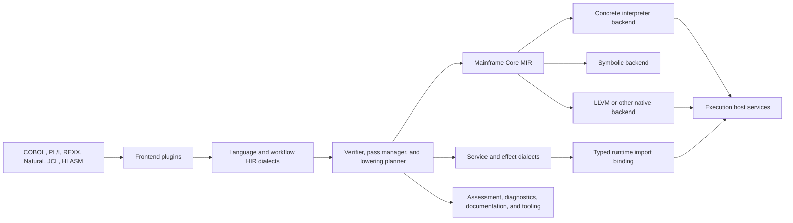

# Plugin-Oriented Compiler and Multi-Level IR Architecture

Status: **Proposed**
Date: **2026-08-26**

## Decision Summary

OpenMainframe should introduce a plugin-oriented compiler platform built around
a common, multi-level intermediate representation framework. The platform will
use one generic IR object model and multiple versioned dialects rather than one
closed enum containing every language and subsystem operation.

The architecture has five central decisions:

1. Language frontends preserve source semantics in language-specific high-level
   IR dialects.
2. Progressive lowering converts high-level operations into a shared
   mainframe-aware core IR plus typed service operations.
3. Every compiler backend declares its legal operation and type set. A build
   succeeds only after full legalization or after explicitly permitted runtime
   imports have been bound.
4. Compiler, dialect, lowering, backend, runtime-provider, workflow, and API
   plugins use separate capability contracts under one versioned plugin
   descriptor model.
5. Built-in Rust plugins are the first implementation target. Sandboxed
   WebAssembly components are the stable external-plugin boundary; native Rust
   dynamic libraries are not a public ABI.

This design can guarantee that a declared operation is executable when it has
either:

- a complete lowering path to operations supported by the selected backend; or
- an executable runtime handler that the selected compilation mode permits the
  compiler to bind as a typed host import.

Declaring only an AST shape is not sufficient. An operation must also declare
its types, validation rules, effects, error/condition behavior, and at least one
execution route.

## Relationship to the Execution Backend

This document specifies the compiler, IR, and compilation-plugin layer. It is a
companion to the proposed [Scalable Execution Backend](execution-backend.md),
which defines admission, scheduling, program resolution, runtime lifecycle,
host services, isolation, and checkpointing.

Portfolio-wide language adoption, independent semantic-model exceptions,
product profiles, dependency direction, and retirement are governed by
[Workspace Convergence and Sustainable Architecture](workspace-convergence.md).
Not every language must lower to shared MIR immediately, but every retained
language must have an explicit adoption record and use common diagnostics,
artifacts, lifecycle, typed effects, limits, and support metadata.

The two designs meet at two stable boundaries:

```text
SourceArtifact
    -> compiler and IR pipeline described in this document
    -> ExecutableArtifact
    -> ProgramService and execution platform

Service operation in IR
    -> typed runtime import
    -> capability-limited host service in the execution platform
```

`ExecutableArtifact` remains backend-specific. `SimpleProgram` adapters, native
objects, WebAssembly components, and other formats may coexist during migration.
The common IR is a compiler interchange and semantic foundation, not a
requirement that every legacy executor immediately store or consume the same
artifact format.

## Current-State Findings

The repository contains the foundations of the proposed architecture, but they
are not yet connected by a common semantic contract.

| Area | Current behavior | Architectural consequence |
|---|---|---|
| Language core | `AstNode`, `Lexer`, and `Parse` provide minimal shared contracts | Semantic analysis, lowering, backend legality, and runtime imports are not standardized |
| CICS COBOL compilation | Source is preprocessed and parsed directly into `SimpleProgram` | Scan diagnostics and semantic analysis are not phase gates |
| Concrete execution | COBOL AST is lowered into interpreter-owned `SimpleStatement` values | The runtime owns a COBOL-specific IR |
| Symbolic execution | COBOL AST is lowered again into `FlatStatement` | Concrete and symbolic semantics can diverge |
| LLVM | Data layout scaffolding exists, but procedure generation is incomplete | Native compilation is not a complete execution path |
| Unsupported statements | Several lowering arms return `None`; symbolic lowering may emit `Nop` | A program can parse while losing behavior silently |
| CICS operations | Command names and options cross layers as strings | Validation and capability discovery occur late |
| Utilities and PARMLIB | Trait-based registries already exist | These are useful models for typed plugin registration |
| z/OSMF routes | Route modules are merged statically | API capability discovery and lifecycle are compile-time wired |

Relevant implementations include:

- Shared language traits in
  [`open-mainframe-lang-core/src/traits.rs`](../../crates/open-mainframe-lang-core/src/traits.rs).
- On-demand COBOL compilation in
  [`open-mainframe/src/lib.rs`](../../crates/open-mainframe/src/lib.rs).
- COBOL-to-`SimpleProgram` lowering in
  [`open-mainframe/src/lower.rs`](../../crates/open-mainframe/src/lower.rs).
- The concrete interpreter representation in
  [`open-mainframe-runtime/src/interpreter.rs`](../../crates/open-mainframe-runtime/src/interpreter.rs).
- Independent symbolic lowering in
  [`open-mainframe-symbolic/src/lowering.rs`](../../crates/open-mainframe-symbolic/src/lowering.rs).
- LLVM scaffolding in
  [`open-mainframe-cobol/src/codegen/context.rs`](../../crates/open-mainframe-cobol/src/codegen/context.rs).
- CICS bridge and dispatcher routing in
  [`open-mainframe/src/bridge.rs`](../../crates/open-mainframe/src/bridge.rs) and
  [`open-mainframe-cics/src/runtime/dispatcher.rs`](../../crates/open-mainframe-cics/src/runtime/dispatcher.rs).
- Reusable registry patterns in
  [`open-mainframe-utilities/src/lib.rs`](../../crates/open-mainframe-utilities/src/lib.rs) and
  [`open-mainframe-parmlib/src/subsystem.rs`](../../crates/open-mainframe-parmlib/src/subsystem.rs).

## Goals

The architecture must:

- Provide one extensible IR framework for all compiler-like pipelines without
  erasing language-specific semantics too early.
- Make parsing, semantic validation, lowering, interpretation, symbolic
  execution, and native compilation explicit phases with typed contracts.
- Guarantee that unsupported semantics fail compilation with source-located
  diagnostics instead of disappearing.
- Reuse one semantic representation across concrete, symbolic, assessment, and
  native backends where their requirements overlap.
- Model mainframe storage, decimal arithmetic, encoding, aliasing, conditions,
  and subsystem effects directly.
- Let a new language or subsystem operation be added by registering schemas and
  focused behavior rather than editing central enums and dispatch matches.
- Preserve source provenance through COPY expansion, precompilers, macros, and
  lowering.
- Preserve current on-demand compilation: source and dependencies are resolved
  fresh for each program load even when content-addressed artifacts are used.
- Support deterministic pipeline planning, reproducible artifacts, and
  capability introspection.
- Allow static built-in plugins and future isolated external plugins to expose
  the same logical contracts.

## Non-Goals

- Forcing every language to use the same source AST.
- Lowering JCL, REST routing, or subsystem state machines into CPU instructions.
- Replacing all existing interpreters in one change.
- Embedding MLIR and its C++ toolchain as a prerequisite for the first
  implementation.
- Making arbitrary source text compilable when required semantics are absent.
- Treating a parser declaration as an implementation of runtime behavior.
- Establishing a stable ABI for native Rust trait objects across dynamic-library
  boundaries.

## Fundamental Design Decisions

### One IR framework, multiple dialects

The unification boundary is the IR data model, verifier protocol, pass manager,
conversion planner, diagnostics, serialization, and capability registry. It is
not one universal operation vocabulary.

Examples of coexisting dialects are:

- `cobol.*`, `pli.*`, `rexx.*`, `natural.*`: source-language semantics.
- `jcl.*`, `jes.*`: workflow and batch orchestration semantics.
- `om.core.*`, `om.cf.*`, `om.mem.*`, `om.decimal.*`: shared executable
  semantics.
- `cics.*`, `db2.*`, `ims.*`, `mq.*`, `dataset.*`, `terminal.*`: typed service
  and effect operations.
- `om.abi.*`, `llvm.*`, `wasm.*`: backend-facing representations.

Multiple dialects may coexist in one module during progressive lowering.

### AST and IR have different responsibilities

An AST represents source syntax and recovery. It may contain incomplete nodes,
surface sugar, ambiguous names, and parser recovery markers. IR represents
verified semantic operations with resolved identities, explicit types, effects,
control flow, and source provenance.

A frontend owns its AST. Other plugins depend on the dialect IR contract, not
the frontend's internal Rust enum layout.

### Full legalization is the compilation gate

Each backend publishes a `LegalityProfile` containing:

- legal operation versions;
- legal types and data layouts;
- permitted runtime imports;
- target ABI and calling-convention constraints;
- required normalization properties.

The pass planner builds a lowering route. Compilation succeeds only when every
operation and type is legal for the target or bound to an allowed runtime
import. There is no production catch-all that drops an operation.

### Mainframe effects are first-class

Dataset access, terminal I/O, SQL, queue mutation, authorization, transaction
control, clock access, and job submission are not opaque strings. They are
typed operations with declared effects and condition behavior.

This enables:

- legal reordering and optimization;
- symbolic substitution or mocking;
- capability-based security;
- audit and observability;
- deterministic Gym execution;
- correct suspension and transaction boundaries.

### Static composition comes before dynamic loading

Initial plugins are ordinary workspace crates registered into an immutable
registry snapshot. This keeps the implementation type-safe and minimizes ABI
work while the semantic contracts stabilize.

External plugins later implement versioned WebAssembly Component Model
interfaces or the process-worker protocol from the execution architecture.

## Target Architecture



The pass planner may leave high-level operations intact when a backend declares
them legal. For example, a symbolic backend may prefer `om.decimal.add` over a
byte-level implementation, while LLVM requires it to lower to arithmetic and
runtime calls.

## Core IR Object Model

The in-memory representation should be arena-based and ID-oriented. Generic
operations provide extensibility; generated typed wrappers provide ergonomic
and checked access for built-in code.

The following is representative, not a final Rust API:

```rust
pub struct Module {
    pub dialect_requirements: Vec<DialectRequirement>,
    pub operations: OperationArena,
    pub regions: RegionArena,
    pub blocks: BlockArena,
    pub values: ValueArena,
    pub types: TypeInterner,
    pub locations: LocationTable,
}

pub struct Operation {
    pub name: OperationName,
    pub operands: Vec<ValueId>,
    pub results: Vec<ValueId>,
    pub attributes: AttributeMap,
    pub regions: Vec<RegionId>,
    pub successors: Vec<BlockId>,
    pub location: LocationId,
}
```

The generic record deliberately resembles a compiler data model rather than a
Rust trait object per operation. This provides:

- stable serialization independent of Rust enum layout;
- efficient arena traversal and compact identifiers;
- unknown-operation preservation for inspection and compatible forwarding;
- generated typed wrappers such as `CobolMoveOp<'_>`;
- plugin registration without modifying the core crate.

### Operation identity

Every operation name is namespaced and versioned through its dialect:

```text
cobol.move                 dialect cobol@1
om.decimal.add             dialect om.decimal@1
cics.file.read             dialect cics@1
```

Operation names are stable within a dialect major version. Removing an
operation, changing operand meaning, or changing observable condition behavior
requires a dialect major-version change or an explicit upgrade pass.

### Values and types

The core type system must include or be able to register:

- signed and unsigned integers with explicit widths;
- binary, packed, zoned, display, fixed, and floating decimal forms;
- character and byte sequences with length, encoding, and collation;
- records, unions, tables, variable-length tables, and layouts;
- storage references containing region, offset, extent, and alias-set identity;
- pointers with address spaces and nullability;
- condition values and status codes;
- subsystem handles and transaction/session tokens;
- effect and continuation tokens where ordering must be explicit.

Language-specific types may remain in HIR until a registered `TypeConverter`
can materialize a legal target type.

### Storage and aliasing

Mainframe languages cannot be modeled correctly as a flat map of independent
variables. The IR must model:

- storage regions such as WORKING-STORAGE, LOCAL-STORAGE, LINKAGE, FILE, and
  dynamically allocated storage;
- byte offsets, lengths, alignment, and encoding;
- `REDEFINES` and other overlapping alias sets;
- group composition and decomposition;
- `OCCURS`, indexes, subscripts, and `DEPENDING ON` bounds;
- call parameter modes and shared storage identity;
- BMS input/output map overlays.

Optimizations may only reorder or eliminate memory operations when alias and
effect analysis proves the transformation valid.

### Source locations and provenance

Each operation must have a location. Locations may be:

- a source span;
- a fused set of source spans;
- a generated location referring to the producing pass;
- a call/macro/COPY expansion chain;
- a precompiler mapping from generated COBOL back to EXEC CICS or EXEC SQL.

Diagnostics report the original user-facing source location whenever the
provenance chain permits it.

### Regions and control flow

Regions and basic blocks represent structured and unstructured control flow.
The model must support:

- branches, switches, calls, returns, and fall-through;
- COBOL paragraphs, sections, `PERFORM THRU`, and computed `GO TO`;
- condition handlers and exceptional edges;
- program transfer such as CICS `XCTL`;
- suspension and resume points for terminal input, timers, or asynchronous host
  services;
- nested programs and run-unit frames.

Source constructs may remain structured in HIR and lower to explicit CFG only
when required by the target.

### Effects

Every operation schema declares an effect summary. Initial effects include:

```text
memory.read(alias-set)
memory.write(alias-set)
dataset.read(resource)
dataset.write(resource)
terminal.read
terminal.write
database.read(scope)
database.write(scope)
queue.read(resource)
queue.write(resource)
security.authorize(resource)
transaction.begin | commit | rollback
clock.read
random.read
program.invoke | transfer
job.submit
may_suspend
may_raise(condition-set)
```

An unknown or unregistered operation has `unknown` effects and acts as an
optimization barrier. It is never legal for production execution unless a
runtime binding explicitly handles it.

## IR Levels and Dialect Responsibilities

| Level | Primary owner | Required properties | Typical consumers |
|---|---|---|---|
| Source and AST | Frontend plugin | Recoverable syntax, complete source spans | Parser diagnostics, formatters, source tools |
| Language HIR | Language dialect plugin | Resolved semantic operations, language types, explicit source behavior | Semantic checks, assessment, canonicalization |
| Workflow HIR | JCL/JES/workflow plugins | Steps, dependencies, DD bindings, conditions, scheduling intent | Batch coordinator and planners |
| Mainframe Core MIR | Core dialects | Typed CFG/regions, explicit storage, decimal and string semantics | Concrete, symbolic, and native backends |
| Service/effect IR | Subsystem dialects | Typed operands/results, effects, conditions, capability requirements | Runtime binders and host services |
| Backend LIR | Backend plugin | Target-legal types, ABI, calling conventions, no unsupported high-level operations | Code emission and linking |
| Executable artifact | Backend and artifact store | Immutable metadata, compatibility requirements, integrity hash | Program resolver and executor |

There is no requirement that every input pass through every level. HLASM may
lower almost directly to a target-specific representation. JCL normally ends
as workflow IR executed by a coordinator. A report-oriented 4GL may retain
high-level report operations handled by a runtime provider.

## Compilation Modes and Guarantees

The compiler exposes explicit modes so the word "compile" is not ambiguous.

### Analyze

- Parsing and semantic analysis may return a partial module.
- Unknown or unsupported operations are retained with diagnostics.
- No executable artifact is promised.
- Intended for assessment, IDE, documentation, and migration tooling.

### Executable

- Every operation must have either backend lowering or a permitted runtime
  import binding.
- The resulting artifact may call runtime providers.
- This is the default compatibility mode for incremental adoption.

### Native-only

- Every operation and type must lower to the backend's native legal set.
- Runtime calls are permitted only for ABI-level library services explicitly
  allowed by the target profile.
- Interpreter fallback and generic operation dispatch are forbidden.

### Symbolic

- Every reachable operation must have symbolic semantics, a sound abstraction,
  or an explicit path-termination policy.
- Unsupported effects cannot silently become `Nop`.
- Approximation is recorded in the result and affects proof status.

## Common Compiler Phase Contract

Every phase runs through a common envelope:

```rust
pub struct PhaseRequest<I> {
    pub input: I,
    pub compilation: CompilationId,
    pub options: CanonicalOptions,
    pub target: TargetProfile,
    pub registry: RegistrySnapshotId,
    pub cancellation: CancellationToken,
}

pub struct PhaseResult<O> {
    pub output: Option<O>,
    pub diagnostics: Vec<Diagnostic>,
    pub dependencies: Vec<ArtifactDependency>,
    pub metrics: PhaseMetrics,
    pub reproducibility: ReproducibilityRecord,
}
```

All phases obey these invariants:

- Inputs are immutable for the duration of a phase.
- The phase uses one immutable plugin-registry snapshot.
- Diagnostics contain a stable code, severity, location, plugin identity, and
  phase identity.
- A phase never reports success after discarding observable behavior.
- Cancellation returns a cancelled result and does not publish an artifact.
- Panics or plugin traps are converted to structured internal failures at the
  plugin host boundary.
- Phase outputs include enough dependency identity for reproducible cache keys.
- Production compilation does not continue past an error unless the phase
  contract explicitly defines a recovery artifact for analyze mode.

## Compiler Pipeline Phase Contracts

### C0: Source acquisition and dependency resolution

**Provider:** `ProgramResolver`, source-provider plugins, and the compiler host.

**Input:** Program selector, caller identity, language hint, search order,
configuration, and compilation mode.

**Output:** Immutable `SourceBundle` containing primary source bytes, media type,
encoding, canonical source identity, and initial dependency records.

**Required postconditions:**

- The source bytes used by the build are captured exactly.
- Access is authorized through host services.
- File, dataset, member, and mount identities are normalized without erasing the
  original display name.
- Source encoding is explicit; it is never inferred differently by later phases.
- The bundle records the registry snapshot and source-provider generation.

**Failure contract:** Missing, ambiguous, inaccessible, unauthorized, or
unsupported source returns a source-resolution diagnostic. No parser is invoked.

**Cache contract:** Resolution itself may use metadata caches, but the source
content hash is computed from freshly resolved bytes. This preserves current
on-demand COBOL behavior.

### C1: Preprocessing and source transformation

**Provider:** Frontend preprocessors and precompiler plugins.

**Input:** `SourceBundle`, preprocessing options, include/search paths, and
granted dependency capabilities.

**Output:** `PreprocessedBundle` containing transformed source units,
source-mapping tables, ordered dependency hashes, and transformation metadata.

**Required postconditions:**

- COPY/include/macro expansion is deterministic for the same inputs.
- Every generated range maps to an original source, expansion site, or an
  explicit synthetic location.
- Dependency cycles, missing copybooks, and ambiguous members are diagnosed.
- EXEC CICS/SQL transformations preserve a typed provenance record rather than
  becoming untraceable text.
- Preprocessors declare whether ordering with other preprocessors is required.

**Failure contract:** Production modes stop on transformation errors. Analyze
mode may retain marked unexpanded regions if the frontend declares how to parse
them safely.

**Cache contract:** The key includes primary source, all dependency hashes,
preprocessor plugin generations, canonical options, and ordering.

### C2: Lexing and parsing

**Provider:** `FrontendPlugin`.

**Input:** `PreprocessedBundle` and language/version/source-format options.

**Output:** Frontend-owned AST plus lexical and parser diagnostics.

**Required postconditions:**

- Every AST node has a source or synthetic location.
- Recovery nodes are explicitly marked.
- Token and AST ownership does not escape through the stable plugin ABI; the
  frontend lowers them through its registered HIR emitter.
- Parse options and language dialect/version are recorded.

**Failure contract:** Analyze mode may return a partial AST. Executable and
native-only modes require an AST that the frontend marks semantically eligible.
Ignored scanner errors are prohibited.

**Cache contract:** AST caching is plugin-private unless the frontend publishes
a versioned serialization schema.

### C3: Name resolution, typing, and semantic analysis

**Provider:** `FrontendPlugin` and language semantic extensions.

**Input:** AST, source maps, compilation environment, declarations imported from
dependencies, and target-independent language options.

**Output:** `SemanticModel` containing resolved symbols, types, storage layouts,
call targets where statically known, condition sets, and diagnostics.

**Required postconditions:**

- No unresolved reference is represented as an ordinary resolved value.
- Type/category, decimal precision and scale, encoding, parameter mode, and
  storage-region identity are explicit where required by later lowering.
- Overlapping layouts and aliases are represented rather than copied into
  independent variables.
- Semantic extensions declare the operations and symbols they own.
- Errors that could change observable behavior block executable modes.

**Failure contract:** Analyze mode may preserve unresolved symbols as dedicated
unknown entities. Executable modes stop before HIR emission if required
semantics remain unresolved.

**Cache contract:** The key includes imported declaration interfaces and
language semantic-plugin generations, not mutable runtime data.

### C4: Language or workflow HIR emission

**Provider:** `FrontendPlugin` and its dialect plugin.

**Input:** AST plus `SemanticModel`.

**Output:** Verified module containing language/workflow HIR dialect operations,
symbol tables, types, storage declarations, and provenance.

**Required postconditions:**

- Surface syntax that affects behavior is explicit in an operation, attribute,
  type, region, or effect.
- No parser recovery node becomes an executable operation.
- Every operation schema is available in the registry snapshot.
- Dialect verification passes before the phase reports success.
- Unsupported source constructs become diagnostics, not missing operations.

**Failure contract:** An operation without a registered schema or valid
execution route blocks executable modes. Analyze mode may retain an
`om.unknown.source-op` with original text and location.

**Cache contract:** Versioned IR bytecode may be cached only when every dialect
declares a stable serialization version.

### C5: Canonicalization and semantic normalization

**Provider:** Dialect canonicalizers and ordered pass plugins.

**Input:** Verified HIR/workflow module and a target-independent pass profile.

**Output:** Semantically equivalent normalized module.

**Required postconditions:**

- Rewrites preserve types, effects, conditions, storage aliasing, and source
  provenance.
- Pass order is deterministic and recorded.
- Canonicalization reaches a declared fixed point or bounded iteration limit.
- A pass cannot mutate operations owned by another dialect except through a
  registered interface or rewrite contract.
- The verifier runs after each pass in debug/test profiles and at required
  checkpoints in production.

**Failure contract:** Invalid rewrite output is attributed to the producing pass
and aborts compilation. A non-converging rewrite set reports involved patterns.

**Cache contract:** The key includes the ordered pass pipeline and plugin
generations.

### C6: Progressive lowering and legalization

**Provider:** `LoweringPlugin`, `TypeConverter`, and the pass planner.

**Input:** Normalized module, target `LegalityProfile`, compilation mode, and
available runtime capability set.

**Output:** A module containing only target-legal operations, types, and bound
runtime imports, plus a `LegalizationReport`.

**Required postconditions:**

- Each replaced operation records its lowering provenance.
- Type conversions materialize explicit bridge operations where required.
- The planner does not choose a lowering whose capability, version, effect, or
  target constraints are unsatisfied.
- Full conversion fails if any illegal operation or type remains.
- Executable mode may replace a high-level operation with a typed runtime import
  only when the operation schema permits it and a compatible provider is bound.
- Native-only mode rejects generic interpreter dispatch.

**Failure contract:** The diagnostic names the illegal operation, location,
required capability, attempted lowering paths, and missing or conflicting
plugins.

**Cache contract:** The key includes the target profile, compilation mode,
selected lowering graph, runtime import interface versions, and plugin
generations.

### C7: Backend lowering and ABI materialization

**Provider:** `BackendPlugin`.

**Input:** Fully legalized mainframe/core module, target profile, entry-point
requirements, and runtime-import declarations.

**Output:** Backend LIR or backend-ready module with explicit calling
conventions, layouts, symbols, relocations, and imports.

**Required postconditions:**

- All target data layouts are concrete.
- ABI-visible parameter passing, decimal layout, encoding, and storage ownership
  are explicit.
- Runtime imports have stable interface IDs and compatible versions.
- Target-specific verification succeeds.
- Undefined target behavior is not introduced for source-defined conditions;
  source conditions lower to checks, condition paths, or defined runtime calls.

**Failure contract:** Target limitations report the originating high-level
operation and source location through the lowering provenance chain.

**Cache contract:** The key includes target triple, CPU/features, ABI version,
optimization profile, and backend generation.

### C8: Code emission and linking

**Provider:** `BackendPlugin`, linker adapter, binder/program-management plugin.

**Input:** Backend-ready module, resolved libraries, import bindings, link
options, and artifact metadata.

**Output:** Candidate `ExecutableArtifact` and link map.

**Required postconditions:**

- Artifact bytes are immutable after hashing.
- Exported entry points and required imports are listed in metadata.
- Import and relocation resolution is complete according to artifact type.
- Build identity excludes timestamps or other nondeterministic inputs unless
  explicitly requested.
- The artifact declares the executor capability required to load it.

**Failure contract:** Undefined symbols, ABI mismatches, duplicate exports, or
unsupported relocation models abort publication.

**Cache contract:** The artifact is content addressed by all source,
dependency, IR, backend, runtime-interface, and link inputs.

### C9: Artifact validation and publication

**Provider:** Artifact validators, backend verifier, and `ArtifactStore`.

**Input:** Candidate artifact, compilation manifest, policy, and optional
validation fixtures.

**Output:** Published `ExecutableArtifact` reference or validation failure.

**Required postconditions:**

- Artifact integrity and metadata schemas validate.
- Required executor and runtime capabilities are available or declared as
  deployment requirements.
- Policy checks for size, imports, signatures, and isolation tier pass.
- Optional smoke/differential validation is recorded.
- Publication is atomic; failed candidates are not returned by
  `ProgramResolver`.

**Failure contract:** Validation failures retain the candidate only in an
explicit diagnostic store, never as the active artifact.

**Cache contract:** A validated content hash may be reused while its target,
executor, and runtime compatibility constraints remain satisfied.

## Plugin Contract Model

### Common descriptor

Every plugin generation has one immutable descriptor:

```toml
id = "org.openmainframe.lang.cobol"
name = "OpenMainframe COBOL Frontend"
version = "1.0.0"
contract_version = "1"
adapter = "builtin"

provides = [
  "frontend:cobol@1",
  "dialect:cobol@1",
  "lowering:cobol-to-om-core@1",
]

requires = [
  "dialect:om-core@1",
  "dialect:om-decimal@1",
  "runtime:language-environment@1",
]

[compatibility]
host_api = ">=1,<2"
ir_bytecode = "1"
```

The descriptor includes:

- stable plugin ID and generation ID;
- semantic version and host-contract version;
- provided and required capabilities with version ranges;
- supported targets and compilation modes;
- requested host capabilities;
- determinism and cacheability declarations;
- isolation adapter and resource limits;
- state/serialization compatibility where applicable.

Registration rejects duplicate exclusive capabilities, unsatisfied required
capabilities, incompatible contract versions, and dependency cycles.

### Representative host-facing interfaces

The following interfaces illustrate the semantic boundary. The built-in Rust,
Wasm component, and process adapters may represent calls differently, but must
preserve the same requests, results, diagnostics, and lifecycle rules.

```rust
pub trait FrontendPlugin {
    fn descriptor(&self) -> &PluginDescriptor;
    fn recognize(&self, source: &SourceBundle) -> Recognition;
    fn preprocess(
        &self,
        request: PhaseRequest<SourceBundle>,
    ) -> PhaseResult<PreprocessedBundle>;
    fn parse(
        &self,
        request: PhaseRequest<PreprocessedBundle>,
    ) -> PhaseResult<FrontendUnit>;
    fn analyze(
        &self,
        request: PhaseRequest<FrontendUnit>,
    ) -> PhaseResult<SemanticUnit>;
    fn emit_hir(
        &self,
        request: PhaseRequest<SemanticUnit>,
    ) -> PhaseResult<Module>;
}

pub trait DialectPlugin {
    fn descriptor(&self) -> &PluginDescriptor;
    fn register(&self, registry: &mut DialectRegistryBuilder) -> Result<()>;
}

pub trait LoweringPlugin {
    fn descriptor(&self) -> &PluginDescriptor;
    fn conversions(&self) -> &[ConversionDescriptor];
    fn run(
        &self,
        conversion: ConversionId,
        request: PhaseRequest<Module>,
    ) -> PhaseResult<Module>;
}

pub trait BackendPlugin {
    fn descriptor(&self) -> &PluginDescriptor;
    fn legality(&self, target: &TargetProfile) -> Result<LegalityProfile>;
    fn lower(
        &self,
        request: PhaseRequest<Module>,
    ) -> PhaseResult<BackendModule>;
    fn emit(
        &self,
        request: PhaseRequest<BackendModule>,
    ) -> PhaseResult<CandidateArtifact>;
    fn validate(
        &self,
        request: PhaseRequest<CandidateArtifact>,
    ) -> PhaseResult<ValidatedArtifact>;
}

pub trait RuntimeProviderPlugin {
    fn descriptor(&self) -> &PluginDescriptor;
    fn interfaces(&self) -> &[RuntimeInterfaceDescriptor];
    fn invoke(
        &self,
        request: RuntimeCallRequest,
        host: &GrantedHostServices,
    ) -> RuntimeCallResult;
}
```

`FrontendUnit`, `SemanticUnit`, and `BackendModule` are adapter-scoped opaque
values. They are not persisted or passed to an unrelated plugin unless their
owner publishes a versioned serialization contract. `Module`, diagnostics,
phase envelopes, and artifacts are the cross-plugin compiler contracts.

### Frontend plugin contract

A frontend plugin provides source recognition, preprocessing coordination,
parsing, semantic analysis, and HIR emission for one or more language versions.

It must declare:

- media types, filename/member conventions, and language identifiers;
- supported source formats and encodings;
- preprocessing dependencies and ordering;
- AST recovery policy by compilation mode;
- semantic extension points;
- emitted dialect versions;
- deterministic option schema.

The stable boundary returns IR and diagnostics, not frontend-private AST types.

### Dialect plugin contract

A dialect plugin registers operations, types, attributes, interfaces, effects,
verifiers, canonicalizers, serialization, and upgrade passes.

It must provide:

- unique namespace and major version;
- operation/type schemas;
- verification functions for non-declarative invariants;
- effect and condition summaries;
- stable textual or bytecode representation when persistence is supported;
- at least one execution route for every operation advertised as executable.

Schema registration is side-effect free. Runtime subsystem instances are not
created while registering a dialect.

### Lowering plugin contract

A lowering plugin contributes conversion edges to the planner:

```text
(source operation/type set, preconditions)
    -> (target operation/type set, required capabilities, cost)
```

It must declare:

- source and target dialect versions;
- target and mode constraints;
- type converters and materializations;
- required analyses and preserved analyses;
- effect and condition preservation rules;
- priority/cost without relying on registration order;
- deterministic behavior and canonical option schema.

A lowering is invalid if it weakens observable conditions or effects without an
explicit, mode-approved approximation contract.

### Backend plugin contract

A backend plugin provides a legality profile, target lowering, code emission,
artifact validation, and executor requirements.

It must declare:

- supported targets, ABIs, object formats, and optimization profiles;
- legal operation/type/interface versions;
- permitted runtime imports;
- data-layout and calling-convention rules;
- artifact media type and schema;
- deterministic/reproducible-build properties;
- required loader or executor capability.

The backend never receives frontend AST objects.

### Runtime-provider plugin contract

A runtime provider implements service operations that remain after compiler
lowering. Examples include CICS, DB2, IMS, MQ, datasets, terminal I/O, clock,
security, and program control.

It must declare:

- implemented operation interface IDs and versions;
- operand/result ABI schemas;
- effects, transaction scope, idempotency, and suspension behavior;
- condition and status-code mapping;
- required principal permissions and host capabilities;
- instance scope and concurrency model;
- deterministic substitutes available for testing or symbolic execution.

Providers receive capability-limited host handles rather than global
`AppState` access.

### Workflow plugin contract

Workflow plugins own orchestration IR such as JCL steps, DD bindings, conditional
execution, procedures, and JES routing.

They compile workflow HIR into an execution plan rather than a native object.
Plan nodes invoke `ProgramService` and host services through typed contracts.
Workflow plugins must declare retry, condition-code, cancellation, and resource
binding semantics.

### API and protocol plugin contract

API surfaces and protocol gateways do not contribute compiler operations unless
they also implement a compiler capability. They translate external protocols
into typed execution or host-service calls.

Their lifecycle, isolation, and routing contracts are defined by the execution
backend. Keeping this contract separate prevents compiler plugins from gaining
network or global-state access implicitly.

## Operation Declaration Contract

An operation declaration is the smallest unit of extensible semantics. A
representative declaration is:

```text
operation cobol.move {
    version = 1

    operands {
        source: cobol.value
        targets: variadic<cobol.storage-ref>
    }

    attributes {
        corresponding: bool = false
    }

    effects {
        read(source.alias-set)
        write(each targets.alias-set)
        may_raise(size_error)
    }

    verify = "cobol.move.verify@1"
    canonicalize = ["cobol.move.fold-literal@1"]
    lowerings = ["cobol.move-to-om-core@1"]
    interpreter = "cobol.move.execute@1"
    symbolic = "cobol.move.symbolic@1"
}
```

Every executable operation requires:

| Facet | Requirement |
|---|---|
| Identity | Stable namespaced name and dialect version |
| Shape | Operand, result, attribute, region, and successor schema |
| Types | Type constraints and inference/materialization rules |
| Verification | Declarative constraints plus custom verifier when needed |
| Effects | Memory, subsystem, suspension, condition, and transaction effects |
| Control behavior | Terminator, branch, return, transfer, or fall-through semantics |
| Execution route | Backend lowering or runtime/interpreter implementation |
| Diagnostics | Stable error codes and source-location behavior |
| Serialization | Required when IR crosses process, cache, or plugin boundaries |
| Compatibility | Upgrade policy across dialect versions |

The declaration generator should produce:

- typed operation builders and accessors;
- visitor and pattern-matching helpers;
- declarative verifier code;
- parser/printer or bytecode scaffolding;
- effect/interface registration;
- documentation and capability tables;
- exhaustive test skeletons;
- plugin registration code.

It does not invent complex semantics. Custom verifiers, lowering algorithms,
runtime behavior, and symbolic abstractions remain explicit implementations.

## Lowering Planner and Legality

The planner treats registered lowerings as a directed capability graph. A node
is an operation/type legality set; an edge is a conversion with preconditions,
requirements, cost, and preserved properties.

Planning follows these rules:

1. Snapshot the registry and target profile.
2. Determine illegal operations and types in the input module.
3. Find conversion routes whose capability and version constraints are met.
4. Reject ambiguous equal-priority routes unless policy selects one explicitly.
5. Order analyses, type conversions, canonicalizers, and lowerings
   deterministically.
6. Apply conversions transactionally at pass boundaries.
7. Verify intermediate invariants.
8. Run full legality verification.
9. Emit a machine-readable `LegalizationReport`.

The report contains:

- initial and final dialect sets;
- selected passes and plugin generations;
- operation counts before and after each pass;
- runtime imports introduced;
- approximations or fallback paths;
- remaining illegal operations on failure;
- reproducibility and cache-key inputs.

### Runtime fallback

Executable mode may use a universal typed fallback:

```text
high-level operation
    -> om.abi.runtime-invoke(interface-id, typed operands)
    -> registered runtime provider
```

This is not permission to serialize an arbitrary operation and ask a global
interpreter to guess its meaning. The runtime interface must be declared,
versioned, type checked, effect checked, and bound during compilation or load.

Native-only mode disables this fallback except for target-profile library
imports.

## Runtime Import ABI

A runtime import has:

- stable interface and operation IDs;
- versioned operand/result schemas;
- explicit ownership and borrowing rules for storage references;
- principal and capability context supplied by the host, not by program data;
- condition/status results separated from infrastructure failures;
- transaction and idempotency metadata;
- optional suspension outcome and continuation payload;
- bounded input, output, and resource behavior.

Representative outcome:

```rust
pub enum RuntimeCallOutcome {
    Returned(Vec<TypedValue>),
    Condition {
        code: ConditionCode,
        values: Vec<TypedValue>,
    },
    Suspended {
        reason: SuspensionReason,
        continuation: ContinuationRef,
    },
    Transfer {
        target: ProgramSelector,
        payload: TransferPayload,
    },
}
```

Infrastructure failures such as provider crash, deadline, authorization denial,
or incompatible ABI use the execution-platform problem model. They are not
silently converted to a language condition unless the binding contract defines
that mapping.

## Error and Diagnostic Contract

Diagnostics contain:

- stable code and severity;
- human-readable message;
- primary and related locations;
- source expansion/provenance chain;
- compiler phase;
- plugin and generation identity;
- operation/type identity when applicable;
- suggested capability or plugin when resolution is possible.

Production compilation prohibits:

- `_ => None` lowering behavior;
- converting unsupported executable operations to `Nop`;
- ignoring scanner or verifier errors;
- treating unknown runtime commands as success;
- publishing an artifact after failed full legalization.

Analyze mode may preserve unknown constructs, but every preservation is marked
and included in the analysis completeness result.

## Artifacts, Caching, and Reproducibility

The compiler uses immutable, content-addressed artifacts:

```text
SourceArtifact
PreprocessedArtifact
HIRArtifact
LegalizedIRArtifact
BackendIRArtifact
ExecutableArtifact
CompilationReport
```

Artifact identity includes, as applicable:

- primary source bytes and encoding;
- COPY/include/precompiler dependency hashes;
- canonical compiler options;
- frontend, dialect, pass, lowering, and backend plugin generations;
- target and ABI profile;
- runtime interface versions;
- ordered pipeline identity;
- schema and contract versions.

The current requirement that COBOL source edits take effect on the next CICS
program load remains intact: source is resolved and hashed on every load. An
unchanged hash may reuse an artifact; changed source or copybooks necessarily
produce a different key.

Reproducibility records include every input needed to replay the pipeline. A
plugin that reads ambient time, environment, network, or mutable global state
must declare the phase non-reproducible and is rejected from deterministic
profiles.

## Security and Isolation

- Compiler plugins receive source and declared dependency services, not global
  filesystem or network access.
- Runtime providers receive only manifest-granted host capabilities.
- Source acquisition and dependency resolution propagate the authenticated
  principal.
- Compiler and runtime capability checks are separate; the ability to compile a
  service call does not grant permission to execute it.
- External plugins default to no ambient authority.
- IR parsers validate sizes, nesting, references, and dialect versions before
  allocating unbounded structures.
- Plugin registration, generation changes, runtime import binding, and artifact
  publication produce audit events.

## Observability and Introspection

The platform should expose:

- `--list-frontends`, `--list-dialects`, `--list-backends`, and
  `--list-capabilities`;
- `--explain-pipeline` showing selected phases and lowering paths;
- `--emit-ir=<phase>` with provenance-preserving text output;
- `--native-only` and explicit fallback reporting;
- per-phase duration, allocation, operation counts, and cache hit/miss metrics;
- runtime import and effect summaries;
- diagnostics grouped by original source and expansion chain.

Trace spans include compilation ID, artifact IDs, phase, plugin generation,
target profile, and parent program-resolution invocation.

## Proposed Crate Boundaries

```text
open-mainframe-ir-core
    generic IR arenas, IDs, regions, blocks, values, locations, attributes

open-mainframe-ir-schema
    operation/type declaration parser, generators, schema validation

open-mainframe-compiler-api
    phase envelopes, diagnostics, targets, legality, artifacts, plugin contracts

open-mainframe-compiler-host
    registry, pass manager, planner, caching, compilation coordinator

open-mainframe-plugin-sdk
    typed adapters, generated wrappers, manifest tools, conformance test kit

open-mainframe-ir-text
    textual IR parser/printer and versioned bytecode support

open-mainframe-backend-interpreter
    concrete execution of Core MIR and supported service operations

open-mainframe-backend-symbolic
    symbolic values, solver interfaces, path exploration over shared IR

open-mainframe-backend-llvm       optional
    Core MIR and ABI lowering, LLVM emission, object validation

open-mainframe-*-adapter
    temporary adapters for SimpleProgram and existing language interpreters
```

Dependency rules:

- `ir-core` and `compiler-api` do not depend on COBOL, CICS, JCL, z/OSMF, LLVM,
  or a runtime subsystem.
- Language crates may depend on IR and compiler APIs, never on a backend.
- Backends depend on IR/compiler APIs and shared semantic libraries, never on a
  frontend AST crate.
- Runtime-provider dialect definitions are separated from mutable provider
  implementations where practical.
- z/OSMF and CLI depend on compiler/execution hosts through public contracts,
  not frontend internals.

These rules prevent the unified IR crate from becoming another high-level
integration crate with circular dependencies.

## Migration Phase Contracts

The `IR-M*` numbering below is independent of the execution-backend migration
phases. Each phase is deployable and preserves existing public entry points
through adapters.

### IR-M0: Specification and behavioral baseline

**Entry conditions:** Current workspace builds and focused COBOL, CICS, JCL, and
symbolic test suites can be run in a known environment.

**Deliverables:**

- Approve IR, operation, plugin, phase, diagnostic, and legality contracts.
- Inventory all COBOL AST statement variants and their concrete, symbolic, and
  LLVM support status.
- Inventory language frontends, interpreters, precompilers, utilities, service
  calls, and string dispatch tables.
- Add golden fixtures for CardDemo transactions, decimal/storage edge cases,
  CALL/parameter modes, CICS conditions, and symbolic paths.
- Define compatibility and performance baselines.

**Exit gate:** Every currently accepted construct is classified as implemented,
partial, silently skipped, or unsupported for each execution path. No production
code path changes.

**Rollback:** Documentation and tests only.

### IR-M1: IR kernel, schema generator, and registry

**Entry conditions:** IR-M0 inventories and representative fixtures are
approved.

**Deliverables:**

- Add dependency-light IR and compiler API crates.
- Implement operation/type registry snapshots, verifier dispatch, source
  locations, textual dump, and manifest validation.
- Implement legality profiles and an analysis-only pass manager.
- Generate typed wrappers for a small `om.core`, `om.cf`, `om.mem`, and
  `om.decimal` schema.
- Add round-trip, malformed-IR, duplicate-registration, and version-conflict
  tests.

**Exit gate:** A standalone synthetic module can be built, serialized, parsed,
verified, transformed deterministically, and rejected when an illegal operation
remains.

**Compatibility contract:** Existing compilers and interpreters are unchanged.
No runtime behavior routes through the new IR.

**Rollback:** Remove new crates and workspace registrations without data
migration.

### IR-M2: COBOL vertical slice and shadow lowering

**Entry conditions:** IR-M1 verifier and registry are stable under tests.

**Deliverables:**

- Define initial COBOL HIR for storage declarations, literals, MOVE, arithmetic,
  IF, PERFORM, CALL, and EXEC CICS.
- Lower selected COBOL fixtures to HIR and Core MIR in shadow mode while the
  existing `SimpleProgram` remains authoritative.
- Add typed CICS operation schemas for the CardDemo path.
- Compare symbols, storage layouts, control flow, and runtime effect sequences
  between old and new paths.
- Emit explicit diagnostics for unsupported statements in the new path.

**Exit gate:** The vertical-slice fixtures produce verified IR with no unknown
operations, and shadow comparisons show explainable equivalence for layout,
control flow, and effects.

**Compatibility contract:** `compile_program()` still returns `SimpleProgram`;
on-demand source loading remains unchanged.

**Rollback:** Disable shadow lowering with a feature/configuration switch.

### IR-M3: Shared concrete interpreter

**Entry conditions:** IR-M2 CardDemo and language-core fixtures have verified
equivalence.

**Deliverables:**

- Implement Core MIR concrete execution.
- Bind typed CICS operations to adapters over the existing bridge/runtime.
- Introduce an IR executable artifact and executor capability.
- Route selected programs to the new interpreter behind an explicit selector.
- Differentially test observable output, storage, condition codes, file effects,
  terminal screens, and program-control outcomes.
- Remove silent skip behavior for migrated constructs.

**Exit gate:** Selected CardDemo transactions and COBOL conformance fixtures pass
through the new interpreter with parity. Failure and unsupported cases produce
source-located diagnostics.

**Compatibility contract:** The `SimpleProgram` executor remains available for
unmigrated programs. Artifact selection is deterministic and observable.

**Rollback:** Route all selectors back to the legacy executor; IR artifacts are
cache entries, not authoritative state.

### IR-M4: Symbolic backend convergence

**Entry conditions:** Shared Core MIR covers the concrete operations required by
the symbolic fixture set.

**Deliverables:**

- Replace COBOL-specific `FlatStatement` lowering for migrated operations with a
  Core MIR symbolic backend.
- Define symbolic semantics or sound abstractions for decimal, storage aliasing,
  branches, calls, and selected service operations.
- Record approximations and unsupported effects in proof results.
- Add concrete-versus-symbolic consistency tests on generated models.

**Exit gate:** Migrated symbolic tests no longer depend on an independent COBOL
control-flow representation. Proof results distinguish proved, disproved,
bounded, approximated, and unsupported states.

**Compatibility contract:** Non-migrated symbolic features may use an adapter,
but cannot report a complete proof after encountering an unsupported operation.

**Rollback:** Select the legacy symbolic adapter for affected fixtures while
retaining shared IR generation.

### IR-M5: LLVM/native backend

**Entry conditions:** Core MIR concrete semantics and differential fixtures are
stable for the selected native subset.

**Deliverables:**

- Implement Core MIR to backend LIR/LLVM lowering.
- Define the runtime ABI for decimal, storage, conditions, file/service calls,
  and program invocation.
- Add object emission, linking, artifact validation, and native executor
  capability.
- Implement executable and native-only compilation modes.
- Differentially test native artifacts against the shared interpreter.

**Exit gate:** The selected COBOL subset produces native artifacts whose
observable behavior matches the interpreter across normal and condition paths.
`--native-only` fails on every unsupported operation with a legalization report.

**Compatibility contract:** Interpreter artifacts remain the default until
native coverage and performance gates are met. LLVM remains an optional build
feature.

**Rollback:** Disable native artifact selection without changing frontend or IR
artifacts.

### IR-M6: Additional languages and subsystem dialects

**Entry conditions:** Frontend, dialect, lowering, interpreter, and artifact
contracts have survived at least one complete COBOL implementation path.

**Deliverables:**

- Migrate PL/I, REXX, Easytrieve, Natural, FOCUS, CLIST, or HLASM incrementally
  based on reuse value.
- Introduce typed DB2, IMS, MQ, dataset, terminal, and security service dialects.
- Route JCL program invocation through `ProgramService` while retaining workflow
  IR rather than forcing JCL into Core MIR.
- Replace duplicate string dispatch and private registries where stable typed
  contracts now exist.
- Generate capability coverage documentation from registry metadata.

**Exit gate:** Each migrated language has an explicit frontend-to-executor route
and no production silent-skip behavior. Service operations are authorized,
typed, and observable through the execution host.

**Compatibility contract:** Languages migrate independently; their existing
public parse/run APIs remain adapters until a normal deprecation process.

**Rollback:** Capability selectors return a language or service to its legacy
adapter without changing other plugins.

### IR-M7: External and isolated compiler plugins

**Entry conditions:** Built-in plugin APIs have stable versioning, conformance
tests, and at least two independent frontend or backend implementations.

**Deliverables:**

- Define WIT packages for schema registration, compiler phase invocation,
  diagnostics, IR bytecode exchange, and bounded host services.
- Implement Wasm component loading, resource limits, cancellation, and
  generation draining.
- Add signature/trust policy and artifact provenance.
- Validate cross-version and malicious-input behavior.
- Use the execution platform's process-worker protocol for plugins requiring
  native external toolchains.

**Exit gate:** An external sample dialect/pass or frontend can be installed,
verified, executed within limits, upgraded by generation, and removed without
restarting unrelated executions or corrupting the registry.

**Compatibility contract:** Built-in Rust plugins continue to use the same
logical contracts. No native Rust dynamic-library ABI becomes public.

**Rollback:** Disable the external adapter; built-in registry snapshots remain
valid.

## Validation and Acceptance Criteria

The architecture is considered adopted when:

- Every production compiler path is represented as named, observable phases.
- Every executable operation has a registered lowering or runtime-provider
  route.
- Full legalization runs before artifact emission.
- No production lowering silently drops an operation or replaces unsupported
  behavior with `Nop`.
- Concrete and symbolic execution consume shared Core MIR for migrated
  operations.
- Native results are differentially tested against the shared interpreter.
- CICS, DB2, IMS, MQ, dataset, terminal, and security interactions cross typed
  service contracts rather than unvalidated command strings for migrated paths.
- Source locations survive COPY/precompiler/lowering chains.
- Editing COBOL source or a copybook affects the next program load.
- Plugin and pass selection is deterministic for a registry snapshot.
- `--explain-pipeline` accounts for every selected lowering and fallback.
- Unsupported target coverage fails with actionable diagnostics.
- Artifact metadata identifies all compiler and runtime interface generations.
- Malformed or untrusted IR cannot cause unbounded allocation or ambient host
  access.

## Required Test Matrix

| Test class | Required assertions |
|---|---|
| Schema | Valid declarations generate wrappers; invalid constraints and duplicate identities fail |
| IR round-trip | Text/bytecode preserves operations, types, locations, attributes, and unknown compatible data |
| Verification | Invalid operands, types, CFG, aliases, effects, and dialect versions fail deterministically |
| Phase contract | Cancellation, diagnostics, dependency capture, and cache keys obey each C0-C9 contract |
| Legalization | Complete routes succeed; missing, ambiguous, cyclic, or incompatible routes fail with reports |
| Differential | Legacy vs IR during migration; interpreter vs symbolic model; interpreter vs native artifact |
| Mainframe semantics | Decimal rounding/overflow, EBCDIC collation, PIC editing, REDEFINES, OCCURS, parameter modes |
| Services | Conditions, transactions, suspension, authorization, idempotency, and effect ordering |
| Plugins | Duplicate capability, version conflict, panic/trap, timeout, generation upgrade, and removal |
| Security | No ambient filesystem/network, principal propagation, capability denial, malformed IR limits |
| Reproducibility | Same inputs and registry snapshot produce identical IR, pipeline report, and artifact hash |
| Performance | Parse/lower/execute throughput, IR size, memory, cache behavior, and runtime-import overhead |

## Risks and Mitigations

### The core IR becomes a giant language union

**Mitigation:** Keep source semantics in dialects. Core dialect additions require
evidence of reuse across frontends or backends and a versioned semantic contract.

### Lowering erases mainframe behavior

**Mitigation:** Make decimal, encoding, layout, aliasing, effects, and conditions
explicit. Require differential tests and source-to-lowering provenance.

### Generic extensibility reduces Rust type safety

**Mitigation:** Store generic operations in arenas but generate typed wrappers,
builders, verifiers, and match helpers for all registered built-in schemas.

### Runtime fallback hides incomplete native coverage

**Mitigation:** Separate executable and native-only modes. Record every fallback
in artifact metadata and `LegalizationReport`; expose coverage metrics.

### Plugin ordering makes builds nondeterministic

**Mitigation:** Immutable registry snapshots, explicit dependencies, stable
priorities/costs, canonical options, ambiguity rejection, and recorded pipelines.

### Migration creates two sources of truth

**Mitigation:** Use shadow and differential phases with one authoritative path at
a time. Move authority only after exit gates; retain reversible selectors.

### External plugin ABI freezes too early

**Mitigation:** Stabilize logical contracts with built-in plugins first. Expose
WIT/process boundaries only after multiple independent implementations exist.

### Compile-time plugins gain excessive host authority

**Mitigation:** Separate compiler and runtime grants, use capability-limited
services, propagate principal identity, and deny ambient access by default.

## Alternatives Rejected

### One universal Rust enum for all operations

This makes every new language or subsystem edit a central crate, creates large
match statements, and prevents independent versioning. Generic registered
operations with typed wrappers provide exhaustiveness within a dialect without
closing the global operation set.

### Direct AST-to-LLVM lowering for every language

This duplicates storage, decimal, runtime ABI, optimization, diagnostics, and
symbolic semantics across frontends. It also couples backend changes to source
AST layout.

### Use `SimpleProgram` as the universal IR

`SimpleProgram` is designed for the current COBOL tree-walking interpreter. It
does not provide a general dialect model, complete source provenance, typed
effects, progressive lowering, or backend legality.

### Require every operation to lower natively immediately

This prevents incremental migration and excludes subsystem-rich programs. Typed
runtime imports allow executable compatibility while native-only mode preserves
a strong no-fallback guarantee.

### Treat arbitrary runtime handlers as compilation

An untyped generic dispatcher merely moves interpretation behind a function
call. Runtime fallback is accepted only when it has a versioned typed interface,
declared effects, conditions, permissions, and artifact dependency.

### Embed MLIR as the first implementation

MLIR validates the multi-dialect and progressive-lowering model, but introducing
its C++ build, bindings, lifecycle, and deployment requirements before the
OpenMainframe semantic contracts are proven would increase migration risk. A
Rust-native kernel can adopt the same design principles and leave a future MLIR
bridge possible.

### Native Rust dynamic-library plugins

Rust's native ABI does not provide the stability required for third-party
plugin generations. Built-in crates, WebAssembly components, and supervised
process workers provide clearer compatibility and isolation boundaries.

## Open Questions

- Which operation-schema source format should be canonical: a dedicated DSL,
  Rust macros, or a schema such as TOML plus generated Rust?
- Should the first IR bytecode use a custom compact encoding or a versioned
  serialization envelope over a simpler representation?
- Which COBOL operations define the minimum CardDemo vertical slice and native
  subset?
- Which core operations are truly cross-language, and which should remain in
  COBOL or PL/I dialects longer?
- Should storage use memory SSA, explicit effect tokens, alias analysis over
  mutable regions, or a staged combination?
- What is the canonical ABI representation for packed/zoned decimal and
  variable-length records?
- Which service operations may suspend, and how are continuations represented
  across built-in, Wasm, and process adapters?
- Which approximations are acceptable for symbolic service operations, and how
  do they affect proof claims?
- When should an operation schema require stable bytecode compatibility rather
  than being internal to one build?
- What coverage threshold is required before the LLVM backend becomes a default
  executor?

## External Design References

- [MLIR Language Reference](https://mlir.llvm.org/docs/LangRef/) — generic
  operations, regions, blocks, values, and coexisting dialects.
- [MLIR Dialect Conversion](https://mlir.llvm.org/docs/DialectConversion/) —
  legal targets, rewrite patterns, full conversion, and type materialization.
- [MLIR Operation Definition Specification](https://mlir.llvm.org/docs/DefiningDialects/Operations/)
  — declarative operation schemas, generated builders, constraints, traits, and
  custom verifiers.
- [MLIR Pattern Rewriting](https://mlir.llvm.org/docs/PatternRewriter/) —
  canonicalization and DAG-to-DAG rewrite infrastructure.
- [WebAssembly Component Model WIT](https://component-model.bytecodealliance.org/design/wit.html)
  — language-neutral component interface contracts.
- [Rust Reference: External Blocks](https://doc.rust-lang.org/reference/items/external-blocks.html)
  — Rust ABI stability constraints and foreign ABI definitions.
