# Platform Roadmap Phase Plans

Status: **Proposed**
Plan version: **0.3**
Date: **2026-08-26**

## Purpose

These plans decompose each [platform roadmap wave](../../platform-roadmap.md)
into independently reviewable architectural checkpoints. A wave remains the
governance and promotion boundary. A phase is the smallest planning unit that
may establish or move an architectural authority. Agent goal contracts sit
below phases and are intentionally not defined here.

```text
Wave contract
    -> phase contract
        -> agent goal contract
            -> reviewable changeset
```

The phase layer prevents a single implementation effort from simultaneously
inventing a contract, replacing an authority, deleting the legacy path, and
claiming production readiness.

## Research Basis

The phase boundaries reflect the current repository rather than an idealized
greenfield design:

| Finding | Current anchor | Planning consequence |
|---|---|---|
| COBOL sources are read on every load and lowered directly to `SimpleProgram` | [`compile_program()`](../../../../crates/open-mainframe/src/lib.rs) | Artifact caching must preserve fresh resolution; the legacy executor remains available through migration |
| Scanner errors are currently collected but ignored by the assembly path | [`compile_program()`](../../../../crates/open-mainframe/src/lib.rs) | Diagnostic gating precedes new compiler authority |
| AST-to-`SimpleProgram` lowering is intentionally lossy and silently returns `None` for operations | [`lower.rs`](../../../../crates/open-mainframe/src/lower.rs) | Shared IR begins in shadow mode and must use full legality before publication |
| Program and capability dispatch is split across utility, runtime, CICS, JCL, and API-specific registries | [`UtilityRegistry`](../../../../crates/open-mainframe-utilities/src/lib.rs), [`SimpleProgramRegistry`](../../../../crates/open-mainframe-runtime/src/interpreter.rs), [`ProgramRegistry`](../../../../crates/open-mainframe-cics/src/runtime/commands.rs) | The execution contract, registry, coordinator, and selector migrations are separate phases |
| CICS execution sessions own a dedicated thread and `Rc<RefCell<_>>` state | [`cics_runner.rs`](../../../../crates/open-mainframe-zosmf/src/cics_runner.rs) | Explicit suspension and state extraction precede session actors |
| z/OSMF keeps authoritative sessions and subsystem instances in process-local maps and locks | [`state.rs`](../../../../crates/open-mainframe-zosmf/src/state.rs) | State classification and durable contracts precede multi-node execution |
| Helm and Kubernetes templates advertise multiple replicas while stateful authority remains local | [`values.yaml`](../../../../deploy/helm/open-mainframe/values.yaml), [`deployment.yaml`](../../../../deploy/kubernetes/deployment.yaml) | Replica count is not accepted as horizontal-scale evidence; stateful execution stays single-authority until R5 gates pass |
| Symbolic execution uses a separate COBOL-specific representation | [`open-mainframe-symbolic`](../../../../crates/open-mainframe-symbolic/src/lib.rs) | Symbolic convergence follows verified shared MIR rather than leading the IR design |
| A dependency-light language core and an in-process Gym harness seed already exist | [`open-mainframe-lang-core`](../../../../crates/open-mainframe-lang-core/src/lib.rs), [`open-mainframe-gym`](../../../../crates/open-mainframe-gym/src/lib.rs) | New API/IR contracts can remain dependency-light; Gym is hardened in R0 before it counts as deterministic compatibility evidence |
| Terminal/session state is owned by the TUI crate but consumed by headless CLI and z/OSMF | [`session.rs`](../../../../crates/open-mainframe-tui/src/session.rs), [`cics_runner.rs`](../../../../crates/open-mainframe-zosmf/src/cics_runner.rs) | Protocol-neutral state must be extracted before the optional Ratatui/Crossterm frontend can be removed |
| Wiki and assessment tooling enter the broad integration dependency closure | [`open-mainframe/Cargo.toml`](../../../../crates/open-mainframe/Cargo.toml), [`open-mainframe-wiki/Cargo.toml`](../../../../crates/open-mainframe-wiki/Cargo.toml) | R1 separates tool packaging from server/runtime dependencies; R2 replaces standalone assessment semantics through an IR analysis consumer |
| DRDA is wired directly into z/OSMF and enabled by default | [`main.rs`](../../../../crates/open-mainframe-zosmf/src/main.rs), [`config.rs`](../../../../crates/open-mainframe-zosmf/src/config.rs) | R0 decides its supported profile; later gateway and scale gates include it only when explicitly selected |
| The workspace contains 44 crates, broad composition roots, isolated leaf products, suspected unused internal edges, duplicated TN3270 paths, and overlapping configuration authorities | [Workspace convergence audit](../../workspace-convergence.md#point-in-time-audit-baseline) | Every wave carries portfolio obligations; R7 certifies closure rather than beginning cleanup |

## Phase Contract Rules

An accepted phase must satisfy all of the following:

1. It has one primary architectural outcome and one named owner.
2. It is expected to require one to three agent goal runs. If more are needed,
   the phase is split before implementation authority moves.
3. It changes at most one authority family. A phase that defines a public
   contract does not also make that contract the broad production authority.
4. Its entry criteria are evidence from earlier phases, not calendar dates.
5. It ends in a buildable, testable, deployable state even when later phases do
   not start.
6. It names selectors, operations, state classes, or deployment profiles in
   scope. Terms such as "all workloads" are not valid phase scope.
7. It has an explicit rollback route that does not require persistent-data
   repair unless data migration is the declared purpose of the phase.
8. It preserves the parent wave's invariants and stop-the-line conditions.
9. It produces a handoff artifact consumed by the next phase.
10. Legacy-path removal happens after a successful promotion phase, never in
    the phase that first introduces a canary authority.
11. It names component classification and dependency-closure changes when the
    phase splits, deprecates, or removes a current crate or selector.
12. A phase cannot count an optional adapter, tool, or harness as production
    evidence unless it belongs to the exact accepted profile and fixture set.
13. A phase updates the all-crate portfolio manifest when it adds, splits,
    deprecates, archives, or changes the profile of a component.
14. A phase cannot promote a profile containing an expired dependency/authority
    exception or a mock-success path reachable through a supported selector.

## Authority Ladder

Every replacement path uses the following progression unless the phase contract
explicitly demonstrates why a step is unnecessary:

| Stage | Production authority | Required result |
|---|---|---|
| Contract-only | Existing path | Versioned types, invariants, fixtures, and dependency rules |
| Inactive implementation | Existing path | New implementation tested with synthetic/fake dependencies |
| Shadow/differential | Existing path | New result is compared; duplicate external effects are suppressed |
| Canary selector | Named selectors only | Observable routing, bounded exposure, and immediate rollback |
| Promoted authority | Accepted selector set | Gate evidence and operational ownership are complete |
| Legacy cleanup | New path | Adapter removal is a later, independently reversible change |

## Immediate Safety Holds

These holds apply before any phase implementation begins:

- Stateful CICS, TSO, job, workflow, and provisioning traffic must not be
  described as active-active merely because deployment templates use multiple
  replicas. Until durable ownership exists, the supported profile uses one
  execution authority or an explicitly documented node-affine limitation.
- `compile_program()` fresh-source behavior remains authoritative. No cache may
  bypass source and dependency re-resolution.
- A new executable compiler path cannot publish an artifact after scanner,
  semantic, verification, or legality failure.
- `SimpleProgram` remains authoritative for non-promoted selectors until the
  differential IR gate passes.
- No native Rust dynamic-library ABI is declared as the public plugin ABI.

## Phase Plan Index

| Wave | Phase plan | Phase count | Expected agent goals | Authority result |
|---|---|---:|---:|---|
| R0 | [Truthful System](r0-phase-plan.md) | 5 | 6–8 | No new runtime authority |
| R1 | [One Execution Spine](r1-phase-plan.md) | 7 | 9–13 | Representative selectors use the execution spine |
| R2 | [One Semantic Spine](r2-phase-plan.md) | 11 | 13–20 | One COBOL/CICS selector set may use shared MIR; accepted assessment fields use the analysis pipeline |
| R3 | [Strong Single Node](r3-phase-plan.md) | 8 | 9–13 | Selected sessions and host services use bounded typed paths |
| R4 | [Distribution-Ready State](r4-phase-plan.md) | 9 | 10–15 | Durable interfaces are authoritative on one active worker pool |
| R5 | [Horizontal Platform](r5-phase-plan.md) | 8 | 8–12 | Multiple active workers become supported authority |
| R6 | [Long-Lived Plugin Ecosystem](r6-phase-plan.md) | 9 | 10–16 | Governed external plugin contracts become supportable |
| R7 | [Converged Product Portfolio](r7-phase-plan.md) | 7 | 8–14 | Whole-workspace profile and architecture certification |

Goal counts are architectural sizing ranges, not schedule estimates. A goal may
produce more than one small changeset, but cannot widen the phase authority.

## Integrated Dependency Graph

```mermaid
flowchart LR
    R0P4["R0.P4 Contract freeze"] --> R1P0["R1.P0 Execution contracts"]
    R0P4 --> R2P0["R2.P0 IR boundary"]

    R1P0 --> R1P3["R1.P3 Program/artifact seam"]
    R1P3 --> R2P6["R2.P6 Shared interpreter artifact"]
    R2P0 --> R2P2["R2.P2 Verification and legality"]
    R2P2 --> R2P4["R2.P4 COBOL HIR shadow"]
    R2P4 --> R2P7["R2.P7 Differential canary"]
    R2P6 --> R2P7
    R2P4 --> R2P8["R2.P8 Analysis consumer"]
    R2P6 --> R2P9["R2.P9 Symbolic foundation"]
    R2P7 --> R2P10["R2.P10 Semantic gate"]
    R2P8 --> R2P10
    R2P9 --> R2P10

    R1P6["R1.P6 Execution gate"] --> R3P0["R3.P0 Host context"]
    R2P10 --> R3P0
    R3P7["R3.P7 Single-node gate"] --> R4P0["R4.P0 State and failure catalog"]
    R4P8["R4.P8 Durability gate"] --> R5P0["R5.P0 Topology model"]

    R1P0 --> R6P0["R6.P0 Stability candidates"]
    R2P2 --> R6P0
    R6P0 --> R6P1["R6.P1 Internal SDK/conformance"]
    R6P1 --> R6Sec["R6.P2 Trust and permissions"]
    R4P8 --> R6Iso["R6.P3/R6.P4 isolation adapters"]
    R6Sec --> R6Iso
    R5P7["R5.P7 Horizontal gate"] --> R6P5["R6.P5 External lifecycle"]
    R6Iso --> R6P5
    R6Iso --> R6P6["R6.P6 Reference plugins"]
    R6P5 --> R6P6
    R6P6 --> R6P7["R6.P7 Public beta"]
    R6P7 --> R6P8["R6.P8 Stable ecosystem"]
    R5P7 --> R7P0["R7.P0 Portfolio freeze"]
    R6P8 --> R7P0
    R7P0 --> R7P1["R7.P1 Dependency/API closure"]
    R7P1 --> R7P2["R7.P2 Authority closure"]
    R7P2 --> R7P3["R7.P3 Portfolio closure"]
    R7P3 --> R7P4["R7.P4 Profile conformance"]
    R7P4 --> R7P5["R7.P5 Retirement/governance"]
    R7P5 --> R7P6["R7.P6 Final gate"]
```



R1 and the IR kernel may progress in parallel after R0. The shared IR executor
cannot become a canary until the R1 program/artifact boundary exists. R6
governance begins early, while external lifecycle stability waits for durable
generation and multi-node lifecycle evidence. Workspace convergence begins at
R0, is updated at every phase that changes a boundary, and is only certified at
R7.

## Component Transition Map

| Component | Phase obligations |
|---|---|
| DRDA | R0 classifies selectors/profile/fixtures; R1 makes the adapter explicit and dependency-bounded; R4/R5 include it only if selected for stateless/durable/horizontal evidence |
| TUI | R0 captures terminal/session compatibility; R3 extracts neutral state, promotes session actors, then permits optional frontend retirement |
| Assess | R0 freezes accepted report fields as oracle fixtures; R2 adds an IR analysis consumer and retires standalone semantic authority only after parity |
| Wiki | R0 records its support/deprecation decision; R1 removes it from server/runtime dependency closure; any retained tool is packaged and owned separately |
| Gym | R0 makes fixtures reproducible and deterministic; R1 decouples the harness from CLI/tooling internals; later waves reuse the same public test contracts |

All other current and future crates follow the complete
[workspace portfolio matrix](../../workspace-convergence.md#workspace-portfolio-matrix).
Each phase records any classification, profile, owner, dependency, authority,
or retirement change rather than treating this table as an exhaustive list.

## Phase Promotion Evidence

Every phase review includes:

- exact source revision and configuration;
- parent-wave and prerequisite-phase versions;
- contract/API changes and dependency-graph evidence;
- focused compatibility, failure, and resource-bound results;
- selector/operation/state-class inventory affected by the phase;
- shadow or canary routing evidence when authority changes;
- rollback procedure and rollback exercise result;
- residual adapters, risks, and named next-phase inputs.

A phase can complete with explicitly deferred work only when that work is
outside the phase selector and does not weaken a parent-wave exit criterion.

## Mapping to Detailed Specifications

- Execution phases refine the migration plan in
  [Scalable Execution Backend](../../execution-backend.md).
- Semantic phases refine `IR-M0` through `IR-M7` in
  [Plugin-Oriented Compiler and Multi-Level IR Architecture](../../plugin-ir-architecture.md).
- Parent obligations remain in the [wave contract index](../README.md).
- Portfolio/profile obligations remain in
  [Workspace Convergence and Sustainable Architecture](../../workspace-convergence.md).
