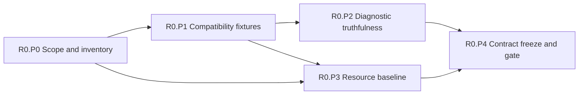

# R0 Phase Plan — Truthful System

Status: **Proposed**
Plan version: **0.3**
Parent contract: [R0 — Truthful System](../r0-truthful-system.md)
Authority result: **No new runtime authority**
Expected agent goals: **6–8**

## Phase Outcome

R0 is divided into characterization, fixture, diagnostic, measurement, and
decision phases. Behavioral evidence is captured before selected failure
semantics change. No phase introduces a scheduler, shared IR executor, durable
store, or external plugin loader.

## Current-Code Anchors

- [`compile_program()`](../../../../crates/open-mainframe/src/lib.rs) reads source
  freshly, collects scanner errors without gating executable output, parses, and
  lowers directly to `SimpleProgram`.
- [`lower.rs`](../../../../crates/open-mainframe/src/lower.rs) declares its
  transformation lossy and contains silent `None` paths.
- Existing compatibility starting points include
  [`open-mainframe-gym`](../../../../crates/open-mainframe-gym/src/lib.rs),
  [`test-carddemo-full.sh`](../../../../scripts/test-carddemo-full.sh), and
  [`test-zowe-full.sh`](../../../../scripts/test-zowe-full.sh).
- `open-mainframe-tui` owns protocol-neutral session state used by headless and
  server flows; DRDA is wired into z/OSMF by default; wiki/assessment tooling is
  pulled through the broad integration package. These are planning boundaries,
  not immediate deletion targets.

## Deliverable Mapping

| Parent deliverable | Owning phase |
|---|---|
| D0.1 Semantic coverage inventory | R0.P0 |
| D0.2 Explicit unsupported diagnostics | R0.P2 |
| D0.3 Compatibility fixture set | R0.P1 |
| D0.4 Performance and resource baseline | R0.P3 |
| D0.5 Contract decision pack | R0.P4 |
| D0.6 Support profile and component decision pack | R0.P0, R0.P4 |
| D0.7 Workspace fitness baseline | R0.P0, R0.P3, R0.P4 |

### Workspace convergence thread

- **R0.P0** generates the all-crate ownership/profile/dependency/public-surface,
  mock/stub, authority, test-maturity, and retirement inventories.
- **R0.P3** records build/test/binary/resource baselines per accepted product
  profile rather than only aggregate workspace totals.
- **R0.P4** freezes the initial portfolio/profile manifests and assigns every
  finding to a named later wave; no leaf is removed based only on consumer count.

## Sequence

## R0.P0 — Baseline Scope and Inventory

Authority transition: **None**
Goal budget: **1 goal**

### Entry

- The workspace revision and supported test environment are recorded.
- CardDemo and representative JCL/z/OSMF selectors are named.

### Deliverables

- Define a machine-readable semantic coverage schema and stable construct IDs.
- Inventory every COBOL `Statement` variant and each CICS operation exercised by
  the selected CardDemo transaction path.
- Inventory current concrete, symbolic, and LLVM/native routes, string dispatch
  points, private registries, and known silent-success behavior.
- Record selected deployment profiles and process-local state authorities,
  including the mismatch between multi-replica manifests and local sessions.
- Inventory DRDA, TUI/session, assessment, wiki, and Gym selectors, defaults,
  dependency closures, public behavior, fixture coverage, and owners.
- Classify each as core, compatibility adapter, tooling, test infrastructure, or
  legacy implementation; propose retain/split/replace/deprecate/remove gates.
- Assign owners for coverage rows and fixture families.

### Exit Evidence

- All COBOL statement enum variants appear in the inventory.
- Every selected CICS operation and public selector has a stable identifier and
  current execution-path reference.
- Unknown and partial rows are visible; they are not inferred as unsupported or
  implemented.
- Every named component has an explicit provisional support profile and no
  mixed UI/runtime state boundary is hidden by the crate name.

### Rollback and Handoff

This phase adds inventory tooling and documentation only. R0.P1 consumes the
stable selector and construct IDs. R0.P2 cannot start production-path changes
until the affected fixture family exists.

## R0.P1 — Compatibility Fixture Harness

Authority transition: **None**
Goal budget: **2 goals**

### Entry

- R0.P0 selector IDs and coverage schema are accepted.
- The environment needed by CardDemo, JCL, z/OSMF, and symbolic fixtures is
  reproducible or explicitly classified as optional.

### Deliverables

- Formalize deterministic golden fixtures for COBOL storage/decimal/CALL
  semantics and selected JCL step/spool behavior.
- Formalize CardDemo terminal cycles, EIB responses, file/browse effects, and
  LINK/XCTL/RETURN/ABEND behavior.
- Add selected z/OSMF/Zowe response fixtures and symbolic completeness states.
- Make Gym/test-harness roots, clock/random/environment inputs, normalization,
  and cleanup explicit so repeated fixtures are reproducible.
- Freeze accepted assessment report fields as oracle fixtures when assessment
  remains in the product profile; record wiki outputs only when that tool keeps
  an owner and compatibility promise.
- Define normalization rules that preserve observable values and ordering.
- Emit fixture manifests containing source revision, inputs, configuration,
  expected effects, and ownership.

### Exit Evidence

- Fixtures repeat with byte-identical or explicitly normalized results.
- Normal, condition/failure, and cancellation cases are represented for every
  selector R0.P2 will change.
- Existing ambiguous behavior is classified rather than silently blessed.

### Rollback and Handoff

Fixtures do not change production routing. R0.P2 uses them as the regression
boundary; R0.P3 reuses the same workload manifests for measurement.

## R0.P2 — Diagnostic Truthfulness

Authority transition: **Selected executable-compilation failure gates only**
Goal budget: **1–2 goals**

### Entry

- R0.P1 fixtures characterize every selected path whose failure behavior will
  change.
- Diagnostic envelopes and stable phase/source identifiers are accepted.

### Deliverables

- Gate selected executable output on scanner and semantic errors.
- Replace selected lossy-lowering `None`, ignored executable operation, and
  generic-success cases with structured, source-located diagnostics.
- Separate analyze-mode recovery from executable-mode acceptance.
- Add negative fixtures for invalid syntax, unsupported semantics, and partial
  lowering.

### Exit Evidence

- Selected executable paths have zero known silent unsupported omissions.
- Invalid selected programs cannot publish an executable artifact/result.
- Diagnostic code, phase, primary source span, and provenance are stable in
  repeated runs.

### Rollback and Handoff

The previous behavior may remain available only through an explicitly named
analysis/compatibility selector. Rollback cannot restore silent success in the
normal executable selector. R0.P4 consumes the finalized diagnostic envelope.

## R0.P3 — Performance and Resource Baseline

Authority transition: **None**
Goal budget: **1–2 goals**

### Entry

- R0.P1 provides stable representative workloads.
- Measurement environment, warm-up policy, sampling, and variance policy are
  recorded.

### Deliverables

- Capture p50/p95/p99 latency, throughput, CPU, blocking, memory high-water,
  threads/tasks, queue behavior, output size, compile time, and transaction time.
- Measure active and idle CICS sessions, JCL/batch, compiler, and representative
  stateless API traffic.
- Exercise at least 2x accepted offered load and record bounded or failing
  behavior without masking overload.
- Store raw measurements and environment metadata as reproducible artifacts.

### Exit Evidence

- Reports can be regenerated from a documented command or CI job.
- Idle-session thread growth and process-local state limitations are explicit.
- No optimization is accepted into the baseline run itself.

### Rollback and Handoff

Instrumentation can be disabled without changing workload behavior. R1 and R3
use these reports as their resource and performance comparison baseline.

## R0.P4 — Contract Freeze and Wave Gate

Authority transition: **None**
Goal budget: **1 goal**

### Entry

- R0.P0 through R0.P3 evidence is complete.
- Every exception has an owner, selector, and remediation decision.

### Deliverables

- Accept minimum execution identity, invocation, outcome, event, artifact,
  diagnostic, plugin descriptor, IR operation, legality, and provenance
  contracts.
- Freeze the R1/R2 input versions and record unresolved decisions as blockers.
- Publish the signed R0 evidence pack, ownership map, and compatibility policy.
- Accept the D0.6 component matrix, including selected profiles, dependency/state
  boundaries, compatibility windows, and removal or retention gates.
- Confirm the deployment safety hold for stateful multi-replica execution.

### Exit Evidence

- Every exit criterion in the parent R0 contract passes.
- R1.P0 and R2.P0 can reference exact accepted contract versions.
- No runtime authority has moved during R0.
- R1, R2, and R3 can reference exact component transition obligations without
  treating a crate name as an architectural boundary.

### Rollback and Handoff

Contract changes after this gate require a versioned revision. R1 and R2 may
start in parallel; neither may weaken the captured compatibility evidence.

## Wave Promotion Rule

R0 completes only at R0.P4. Completing inventory or fixture phases alone does
not authorize execution or IR migration. Diagnostic gaps in an unselected path
may be deferred only when the path remains explicitly non-authoritative.
