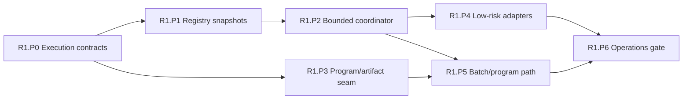

# R1 Phase Plan — One Execution Spine

Status: **Proposed**
Plan version: **0.3**
Parent contract: [R1 — One Execution Spine](../r1-one-execution-spine.md)
Authority result: **Representative selectors use the bounded execution spine**
Expected agent goals: **9–13**

## Phase Outcome

R1 separates contract definition, lifecycle discovery, bounded scheduling,
program/artifact resolution, and selector migration. Existing engines stay
behind adapters. A low-risk selector is promoted before a COBOL or JCL program
path is allowed to move.

## Current-Code Anchors

- [`UtilityRegistry`](../../../../crates/open-mainframe-utilities/src/lib.rs),
  [`SimpleProgramRegistry`](../../../../crates/open-mainframe-runtime/src/interpreter.rs),
  and CICS [`ProgramRegistry`](../../../../crates/open-mainframe-cics/src/runtime/commands.rs)
  are separate authorities.
- [`JobExecutor`](../../../../crates/open-mainframe-jcl/src/executor/mod.rs) owns
  utility dispatch and external process execution details.
- [`compile_program()`](../../../../crates/open-mainframe/src/lib.rs) is the
  current program source-to-executable seam.
- [`AppState`](../../../../crates/open-mainframe-zosmf/src/state.rs) directly owns
  subsystem instances used by handlers.
- The `open-mainframe` package mixes reusable integration code with TUI/wiki CLI
  dependencies, and z/OSMF pulls that broad package into the server closure.

## Deliverable Mapping

| Parent deliverable | Owning phase |
|---|---|
| D1.1 Execution API | R1.P0 |
| D1.2 Registry and lifecycle snapshot | R1.P1 |
| D1.3 Bounded single-node coordinator | R1.P2 |
| D1.4 Program and artifact service | R1.P3, R1.P5 |
| D1.5 Migration adapters | R1.P4, R1.P5 |
| D1.6 Observability and operations | R1.P2, R1.P6 |
| D1.7 Package and optional-adapter boundaries | R1.P0, R1.P1, R1.P6 |
| D1.8 Workspace dependency convergence | R1.P0, R1.P1, R1.P6 |

### Workspace convergence thread

- **R1.P0** accepts dependency layers, profile closure rules, and exception
  metadata alongside the execution contracts.
- **R1.P1** proves capability discovery without retaining competing global
  registry authorities or core-to-implementation reverse edges.
- **R1.P6** mechanically verifies suspicious edges, profile build/package
  closures, leaf-component decisions, and zero expired dependency exceptions.

## Sequence

## R1.P0 — Execution Contract Package

Authority transition: **None**
Goal budget: **1 goal**

### Entry

- R0.P4 accepted the minimum identity, outcome, artifact, and diagnostic
  envelopes.
- Dependency rules for new API crates are approved.

### Deliverables

- Introduce dependency-light execution API types for execution/run-unit,
  principal, invocation, limits, cancellation, outcome, event, capability,
  generation, and instance scope.
- Define versioning, serialization, bounded payload/output, and compatibility
  rules.
- Add dependency fitness checks preventing COBOL, CICS, JCL, z/OSMF, or mutable
  subsystem dependencies from entering the execution API.
- Define package tiers for core runtime/server, optional compatibility adapters,
  CLI/tooling, and deterministic test support; forbid reverse dependencies from
  core tiers into standalone portfolio tools.
- Provide an adapter test kit using fake capabilities only.

### Exit Evidence

- Contract round-trip, invalid-input, compatibility, and size-bound tests pass.
- The API crate builds independently from language and subsystem crates.
- No current selector routes through the new contract.

### Rollback and Handoff

Removal of the unused API package restores the prior build without data repair.
R1.P1 and R1.P3 consume the accepted version.

## R1.P1 — Registry and Generation Snapshots

Authority transition: **Introspection only; no execution selection**
Goal budget: **1 goal**

### Entry

- R1.P0 capability, generation, readiness, and instance-scope types are stable.

### Deliverables

- Register built-in descriptors through adapters without removing private
  registries.
- Validate duplicate exclusive capabilities, incompatible versions, and
  dependency requirements.
- Publish immutable ready snapshots atomically.
- Model installing, ready, unhealthy, draining, and retired generation states.
- Generate capability introspection from snapshot data.
- Record support profile and readiness for optional DRDA/TUI adapters without
  registering absent features as installed capabilities.

### Exit Evidence

- Snapshot determinism and concurrent-read tests pass.
- Duplicate/version-conflict fixtures fail explicitly.
- Registry introspection matches the built-in adapter inventory.

### Rollback and Handoff

Existing registries remain execution authorities. R1.P2 reads a frozen snapshot
per admitted execution; R1.P4 may expose introspection through a selected API.

## R1.P2 — Bounded Coordinator Kernel

Authority transition: **Synthetic/fake workloads only**
Goal budget: **2 goals**

### Entry

- R1.P0 contracts and R1.P1 snapshot semantics are accepted.
- Queue, output, timeout, and concurrency limits are configured for the test
  profile.

### Deliverables

- Implement admission, bounded request/batch/interactive/blocking lanes,
  cancellation, deadline propagation, instance leasing, and structured events.
- Contain panic/failure at invocation or run-unit boundaries where possible.
- Release queue, worker, output, and instance permits on every terminal path.
- Use fake executors and deterministic host services before real adapters.

### Exit Evidence

- State-machine, cancellation-race, panic, overload, and bounded-output tests
  pass.
- At 2x offered load, memory and task counts remain within configured limits.
- No public production selector is authoritative through the coordinator.

### Rollback and Handoff

The kernel is inactive until selector adapters opt in. R1.P4 and R1.P5 consume
the same admission/event path.

## R1.P3 — Program and Artifact Seam

Authority transition: **Shadow resolution only**
Goal budget: **2 goals**

### Entry

- R1.P0 identity and artifact envelopes are stable.
- R0 source/copybook freshness fixtures pass.

### Deliverables

- Implement `ProgramSelector`, `ProgramResolver`, source artifact, executable
  artifact, compiler capability, and executor capability boundaries.
- Wrap current `compile_program()` and `SimpleProgram` without changing their
  production authority.
- Compute immutable artifact identity from source bytes, resolved dependency
  hashes, canonical options, compiler generation, contract version, and target.
- Re-resolve source and dependencies on every program load; reuse only after
  unchanged content identity is proven.

### Exit Evidence

- Source and copybook edits change the next artifact key.
- Unchanged inputs produce deterministic identities and may reuse immutable
  artifacts.
- Shadow resolution selects the same source/program as the legacy path.

### Rollback and Handoff

Disable shadow resolution and discard cache artifacts. No artifact is
authoritative state. R1.P5 activates one selector path; R2.P6 later consumes the
same executable-artifact boundary.

## R1.P4 — Low-Risk Selector Adapters

Authority transition: **One utility selector and one stateless API selector**
Goal budget: **1–2 goals**

### Entry

- R1.P2 coordinator passes overload/cancellation tests.
- R0 fixtures exist for the selected utility and API operation.
- Selector routing and immediate legacy fallback are observable.

### Deliverables

- Adapt one `UtilityProgram` selector through the coordinator while preserving
  condition code, output, DD effects, and public entry point.
- Adapt one stateless z/OSMF operation through the same invocation/outcome path.
- Route canary traffic by explicit selector/configuration, not global default.
- Record execution, generation, queue, deadline, and result identity.

### Exit Evidence

- Legacy-versus-adapter fixture parity passes.
- Canary rollback restores both selectors without data repair.
- Overload and cancellation do not leak permits or output buffers.

### Rollback and Handoff

Private registries remain behind the adapters. R1.P5 reuses the proven kernel
for a stateful program/artifact path rather than widening R1.P4 scope.

## R1.P5 — Batch and COBOL Program Path

Authority transition: **One JCL program/utility and one COBOL batch selector**
Goal budget: **1–2 goals**

### Entry

- R1.P2 and R1.P3 gates pass.
- R1.P4 demonstrates safe selector canary and rollback mechanics.
- Selected JCL/COBOL fixture families include failure and cancellation paths.

### Deliverables

- Resolve source/artifact/compiler/executor through the canonical program path.
- Route one JCL step selector and one COBOL batch/direct selector through the
  coordinator.
- Preserve DD bindings, stdout/stderr, return/condition code, side effects, and
  on-demand source freshness.
- Expose parent/child run-unit and artifact/executor selection events.

### Exit Evidence

- Selected fixtures have observable parity with the legacy path.
- Artifact freshness, cancellation, timeout, failure, and rollback tests pass.
- Unselected COBOL/JCL programs remain on the legacy authority.

### Rollback and Handoff

Route selected program selectors back to legacy execution; immutable artifacts
may be discarded. R2 consumes the executor/artifact interface, not the legacy
`SimpleProgram` representation.

## R1.P6 — Operations and Wave Gate

Authority transition: **Promote only the named R1 selector set**
Goal budget: **1–2 goals**

### Entry

- R1.P4 and R1.P5 canaries pass their fixture and rollback gates.
- Queue, worker, event, artifact, and selector metrics are operator-visible.

### Deliverables

- Run mixed representative load, 2x overload, cancellation, panic, and shutdown
  exercises.
- Publish capacity configuration and rollback runbooks.
- Inventory remaining private registries/adapters with owners and removal gates.
- Split CLI/tooling dependencies from reusable server/runtime dependencies:
  exclude wiki/legacy-assessment tooling from the core server closure, expose
  DRDA through an explicit profile feature, and record the mixed TUI/session
  dependency as a time-bounded R3 exception rather than pretending the frontend
  is already separable.
- Decouple Gym from CLI-only/tooling dependencies and verify deterministic
  fixtures through public router/execution test seams.
- Add feature-matrix build checks and dependency fitness tests for core,
  compatibility, tool, and test-support profiles.
- Freeze the R1 program/artifact/executor contract versions consumed by R2/R3.

### Exit Evidence

- Every parent R1 exit criterion passes for the named selectors.
- Production routing and rollback decisions are reconstructible from events.
- No unbounded queue, task, output, or artifact accumulation is observed.
- The core-server profile excludes standalone wiki/legacy-assessment tooling;
  absent optional adapters are not advertised; the mixed TUI exception is
  explicit; every retained tool/adapter has an owner and removal/retention gate.

### Rollback and Handoff

R1 selectors can return to legacy routing independently. R2 may add a new IR
artifact/executor behind the frozen seam; R3 may build host/session behavior on
the bounded execution context.

## Wave Promotion Rule

R1 completion does not authorize removal of `UtilityRegistry`,
`SimpleProgramRegistry`, CICS `ProgramRegistry`, or direct handlers. Those
remain migration adapters until their selector families pass later contracts.
