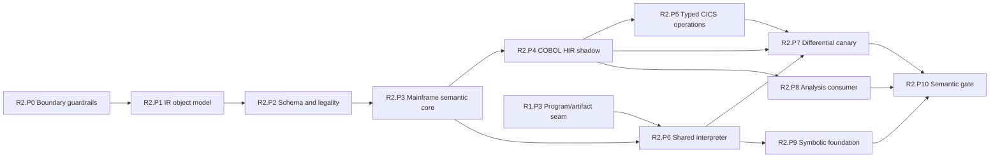

# R2 Phase Plan — One Semantic Spine

Status: **Proposed**
Plan version: **0.3**
Parent contract: [R2 — One Semantic Spine](../r2-one-semantic-spine.md)
Authority result: **Selected COBOL/CICS programs may execute through shared MIR**
Expected agent goals: **13–20**

## Phase Outcome

R2 builds the shared semantic spine without turning the entire compiler into a
single migration event. The IR container and legality machinery are proven on
synthetic modules first. Mainframe semantics, COBOL HIR, typed CICS effects, and
the shared interpreter are then joined in shadow mode. An analysis consumer
proves assessment reuse before the symbolic foundation converges. Only one
differential canary phase may move execution authority.

## Current-Code Anchors

- The current assembly path lowers COBOL AST directly through the intentionally
  lossy [`lower.rs`](../../../../crates/open-mainframe/src/lower.rs).
- [`SimpleProgram`](../../../../crates/open-mainframe-runtime/src/interpreter.rs)
  combines executable statements, storage metadata, control flow, and runtime
  integration but has no full-legality gate or source-provenance model.
- CICS operations cross a string command boundary in
  [`CicsCommandHandler`](../../../../crates/open-mainframe-runtime/src/interpreter.rs)
  and [`bridge.rs`](../../../../crates/open-mainframe/src/bridge.rs).
- [`open-mainframe-cobol`](../../../../crates/open-mainframe-cobol/Cargo.toml)
  currently declares a runtime dependency even though source use is absent;
  the new frontend route must depend on compiler/IR APIs, not a backend.
- [`open-mainframe-symbolic`](../../../../crates/open-mainframe-symbolic/src/lib.rs)
  has an independent `FlatStatement` model and direct COBOL dependency.
- [`open-mainframe-assess`](../../../../crates/open-mainframe-assess/src/lib.rs)
  computes useful report fields through a separate COBOL-specific analyzer; it
  is an R0 compatibility oracle, not the target semantic authority.

## Deliverable Mapping

| Parent deliverable | Owning phase |
|---|---|
| D2.1 IR and compiler foundation | R2.P0–R2.P2 |
| D2.2 Mainframe semantic core | R2.P3 |
| D2.3 COBOL HIR vertical slice | R2.P4 |
| D2.4 Typed CICS service operations | R2.P5 |
| D2.5 Shadow lowering and differential harness | R2.P4, R2.P7 |
| D2.6 Shared concrete interpreter | R2.P6, R2.P7 |
| D2.7 Assessment and inspection convergence | R2.P8 |
| D2.8 Symbolic convergence foundation | R2.P9 |
| D2.9 Language and analysis adoption matrix | R2.P0, R2.P10 |

### Workspace convergence thread

- **R2.P0** defines the adoption-record schema and prevents compiler/IR
  foundations from depending on any language, backend, gateway, or mutable
  subsystem implementation.
- **R2.P10** accepts an adoption, plugin/tool, independent-semantic-model, or
  retirement decision for every language and analysis crate. This is a complete
  decision matrix, not a claim that the vertical slice migrated every language.

## Sequence

## R2.P0 — IR Boundary and Dependency Guardrails

Authority transition: **None**
Goal budget: **1 goal**

### Entry

- R0.P4 accepted operation identity, diagnostic, phase, legality, and
  provenance contracts.
- Proposed crate dependency directions are reviewed.

### Deliverables

- Freeze logical boundaries for compiler API, IR core, schema generation,
  mainframe semantic types, frontend adapters, and executors.
- Add dependency fitness checks: IR/compiler APIs cannot depend on COBOL, CICS,
  z/OSMF, LLVM, or mutable providers; frontends cannot depend on executors.
- Remove or explicitly justify unused reverse dependencies such as the current
  COBOL-to-runtime declaration.
- Define stable operation/type identity, version policy, compiler mode, and
  phase envelope before concrete IR structures are exposed.
- Scaffold empty/new crates only after the dependency graph is accepted.

### Exit Evidence

- Dependency tests reject representative forbidden edges.
- New foundational crates build without subsystem/backend dependencies.
- Existing compilation and runtime behavior is unchanged.

### Rollback and Handoff

Remove unused scaffolding and workspace entries. R2.P1 implements only the
accepted object model; no dialect semantics enter the generic IR core.

## R2.P1 — IR Object Model and Text Form

Authority transition: **Synthetic analysis modules only**
Goal budget: **1 goal**

### Entry

- R2.P0 dependency and identity contracts pass review.

### Deliverables

- Implement arenas/IDs for operation, region, block, value, type, attribute,
  location, and provenance.
- Support namespaced/versioned operation and dialect identity without a giant
  universal Rust enum.
- Define SSA/CFG reference integrity and explicit storage-reference values.
- Implement deterministic textual dump and parse/restore for the initial core
  representation.
- Bound nesting, collection sizes, text input, and parse diagnostics.

### Exit Evidence

- Synthetic modules round-trip deterministically.
- Malformed references, excessive nesting, duplicate IDs, and oversized input
  fail with structured diagnostics.
- No COBOL or CICS types are hard-coded in generic container enums.

### Rollback and Handoff

The object model is unused by production compilers. R2.P2 adds registered
schemas and verification without introducing frontend authority.

## R2.P2 — Schema, Verification, and Legality

Authority transition: **Synthetic analysis and test passes only**
Goal budget: **2 goals**

### Entry

- R2.P1 round-trip and malformed-input gates pass.

### Deliverables

- Add declarative operation/type schemas and generated typed builders/wrappers.
- Add immutable dialect/pass registry snapshots with duplicate/version checks.
- Implement structural, declarative, and custom verifier dispatch.
- Implement deterministic pass planning, analysis invalidation, conversion
  descriptors, legality profiles, and full-legalization failure reports.
- Define `--emit-ir` and `--explain-pipeline` data contracts for later hosts.

### Exit Evidence

- Initial `om.core`, control-flow, memory, and decimal test schemas generate
  typed wrappers and documentation.
- Invalid operations and illegal post-pass modules are rejected with operation,
  source location, attempted route, and missing capability.
- Pass ordering and registry snapshots are deterministic across repeated runs.

### Rollback and Handoff

Only synthetic tools depend on these APIs. R2.P3 may register mainframe semantic
types; R6 may observe the logical contracts but cannot declare them public
stable yet.

## R2.P3 — Mainframe Semantic Core

Authority transition: **Analysis-only semantic authority for new IR modules**
Goal budget: **1 goal**

### Entry

- R2.P2 schema, verifier, and legality machinery passes its synthetic gate.
- R0 decimal/storage/CALL fixtures are available.

### Deliverables

- Define reusable control-flow, call, return, condition, transfer, suspension,
  and ABEND outcomes.
- Define storage regions, offsets, extents, aliases, group layout, and reference
  identity.
- Define packed, zoned, display, and binary decimal precision, scale, rounding,
  overflow, and condition semantics.
- Define string/byte length, encoding, and collation attributes.
- Define parameter modes, shared storage identity, and typed service effects.

### Exit Evidence

- Semantic types and operations pass focused edge fixtures and verifier tests.
- Alias, decimal, encoding, condition, and effect information survives text
  round-trip and canonicalization.
- COBOL-specific rules remain in a COBOL dialect when reuse is not proven.

### Rollback and Handoff

These semantics are not yet an executable production authority. R2.P4 and
R2.P6 consume the exact registered versions.

## R2.P4 — COBOL HIR Shadow Slice

Authority transition: **Shadow lowering only; `SimpleProgram` remains authoritative**
Goal budget: **2 goals**

### Entry

- R2.P3 semantic contracts pass fixtures.
- One complete CardDemo transaction and supporting COBOL constructs are frozen
  as the vertical-slice selector.

### Deliverables

- Define COBOL HIR for selected data layout, values/references, MOVE,
  arithmetic, IF/EVALUATE as required, PERFORM/control flow, CALL/parameter
  modes, and encountered CICS statements.
- Preserve source and COPY/precompiler provenance through HIR and Core MIR.
- Run AST-to-HIR-to-MIR lowering beside legacy AST-to-`SimpleProgram` lowering.
- Emit explicit diagnostics for every encountered non-slice operation.
- Compare symbols, layouts, control flow, and declared effects without executing
  duplicate external mutations.

### Exit Evidence

- Selected fixtures produce verified, fully legal MIR with no unknown
  executable operations.
- Layout/control-flow differences are either eliminated or recorded as
  deliberate compatibility decisions.
- `compile_program()` still returns the legacy artifact for normal selectors.

### Rollback and Handoff

Disable shadow lowering by configuration/feature and discard derived IR.
R2.P5 replaces selected stringly CICS semantics in the shadow path; R2.P7 owns
production canary authority.

## R2.P5 — Typed CICS Operations

Authority transition: **Typed shadow effects; existing CICS bridge remains effect authority**
Goal budget: **1 goal**

### Entry

- R2.P4 identifies the exact CICS operation set for the selected transaction.
- R0 CICS condition, EIB, terminal, program-control, and file fixtures pass.

### Deliverables

- Define typed operations for SEND/RECEIVE, selected file access, LINK/XCTL,
  RETURN, ABEND, and other operations required by the slice.
- Declare operands/results, storage aliasing, EIBRESP/EIBRESP2 mapping, effects,
  conditions, suspension/transfer behavior, and provider requirements.
- Add a typed adapter over the existing bridge/runtime without exposing
  `AppState`, raw locks, or arbitrary command strings to compiler passes.
- Add an effect-trace model suitable for shadow comparison.

### Exit Evidence

- Every selected CICS command maps to a registered, verified typed operation.
- Normal and condition paths match legacy option and EIB semantics in shadow
  traces.
- Unknown service operations fail legality or provider resolution explicitly.

### Rollback and Handoff

The legacy bridge remains effect authority. R2.P6 invokes typed operations only
through the accepted adapter; broad host-service extraction waits for R3.

## R2.P6 — Shared MIR Interpreter

Authority transition: **Inactive executor capability, then shadow execution**
Goal budget: **2 goals**

### Entry

- R2.P3 core semantics and R2.P2 full-legality gates pass.
- R1.P3 artifact/executor seam is stable.
- Typed service operations needed by shadow execution have adapters or explicit
  unsupported outcomes.

### Deliverables

- Execute Core MIR storage, decimal, control-flow, call, condition, and selected
  typed service operations.
- Enforce step, call-depth, memory/storage, output, and time/cancellation limits.
- Preserve completion, condition, suspension, transfer, ABEND, cancellation,
  and infrastructure failure as explicit outcomes.
- Publish immutable IR executable artifacts with dialect/import/generation
  requirements through the R1 artifact boundary.
- Emit compiler/runtime events tied to R1 execution identity.

### Exit Evidence

- Synthetic and selected COBOL fixtures execute deterministically within
  resource bounds.
- Illegal or missing-import modules cannot execute.
- Panic, limit, cancellation, and provider failure release all executor
  resources.

### Rollback and Handoff

The executor capability remains unselected or shadow-only. Disable its selector
and discard artifacts. R2.P7 is the only phase permitted to make it a canary.

## R2.P7 — Differential Canary Promotion

Authority transition: **One named CardDemo transaction/program selector set**
Goal budget: **2–3 goals**

### Entry

- R2.P4, R2.P5, and R2.P6 gates pass.
- R1.P6 coordinator, selector routing, artifact, event, and rollback contracts
  are production-ready.
- Duplicate external effects can be suppressed or isolated in differential runs.

### Deliverables

- Differentially compare storage, terminal screens/fields, file/effect sequence,
  EIB conditions, return codes, diagnostics, and program-control outcomes.
- Cover normal, condition, unsupported, cancellation, and failure paths.
- Route an explicit canary selector/generation to the MIR interpreter.
- Publish selection, artifact, dialect/import, pass, and fallback explanations.

### Exit Evidence

- The complete selected transaction matches accepted observable behavior.
- No unknown executable operation or silent runtime fallback is present.
- Canary rollback returns to `SimpleProgram` without persistent-data repair.
- Performance/resource deltas are measured but do not override correctness.

### Rollback and Handoff

Route all canary selectors back to the legacy executor. Retain IR artifacts only
as non-authoritative cache entries. R3 may build selected interactive/session
work on the MIR outcome contract after promotion.

## R2.P8 — Assessment and Inspection Consumer

Authority transition: **One named assessment report selector after parity**
Goal budget: **1–2 goals**

### Entry

- R2.P4 produces verified HIR/IR with source provenance for the constructs used
  by the selected assessment corpus.
- R0 froze the accepted legacy assessment report fields, fixtures, and known
  heuristic limitations.

### Deliverables

- Define a versioned analysis result envelope with source revision, IR/dialect
  versions, diagnostics, semantic coverage, completeness, and approximation.
- Implement IR/HIR analyses for the accepted metrics, features, dependencies,
  call relationships, and migration indicators selected by R0.
- Compare the new analysis result with the standalone assessment oracle; approve
  intentional differences instead of normalizing them away.
- Route one explicit assessment selector/report to the new consumer while
  retaining rollback to the legacy analyzer.
- Inventory residual text/AST heuristics as retained adapters or duplicate
  semantic logic with a removal gate.

### Exit Evidence

- Repeated reports are deterministic for source, options, registry snapshot,
  and IR versions.
- Every accepted report field has parity, an approved versioned difference, or
  an explicit unsupported/partial result.
- Analyze-mode recovery cannot publish an executable artifact or claim complete
  semantic coverage.
- Selector rollback restores the legacy report without modifying source data.

### Rollback and Handoff

Route the named report selector to `open-mainframe-assess` and keep the IR
analysis result as non-authoritative evidence. R2.P10 decides whether the
standalone analyzer remains an adapter, is independently packaged, or enters a
deprecation window.

## R2.P9 — Symbolic Convergence Foundation

Authority transition: **Selected symbolic operations only**
Goal budget: **1–2 goals**

### Entry

- R2.P6 Core MIR covers the arithmetic, comparison, storage, branch, and call
  operations selected for symbolic migration.
- Concrete semantics have deterministic fixtures.

### Deliverables

- Define symbolic interfaces over shared IR rather than frontend AST types.
- Migrate selected operations from the COBOL-specific flat model.
- Define sound abstractions or explicit approximation/unsupported results for
  selected services and aliases.
- Compare concrete and symbolic results on bounded generated cases.

### Exit Evidence

- Migrated operations consume shared MIR.
- Proof results distinguish proved, disproved, bounded, approximated, and
  unsupported states.
- Encountering an unsupported effect cannot yield a complete proof claim.

### Rollback and Handoff

Select the legacy symbolic adapter for unmigrated operations. Shared MIR
generation remains independent of symbolic authority.

## R2.P10 — Semantic Wave Gate

Authority transition: **Promote only the accepted R2 selector set**
Goal budget: **1 goal**

### Entry

- R2.P7 canary and rollback evidence passes.
- R2.P8 assessment parity/completeness rules pass for the named report selector.
- R2.P9 proof-completeness rules pass for the migrated symbolic subset.

### Deliverables

- Freeze the initial IR/dialect/import/artifact compatibility matrix.
- Publish coverage, legality, differential, resource, and rollback evidence.
- Inventory every legacy lowering/runtime adapter and its removal condition.
- Record the standalone assessment analyzer disposition and residual heuristic
  adapters; removal is authorized only for report fields promoted through P8.
- Confirm LLVM/native, broad language migration, and external plugins remain
  deferred.

### Exit Evidence

- Every parent R2 exit criterion passes for the named selector set.
- Production IR selection is deterministic and observable.
- Non-promoted selectors remain on the legacy path without semantic ambiguity.

### Rollback and Handoff

The complete R2 selector set can return to the legacy executor independently.
R3 consumes typed execution context, outcomes, service imports, and explicit
suspension semantics; it does not reach into frontend AST internals.

## Wave Promotion Rule

The existence of verified IR is not sufficient for R2 promotion. Only R2.P7
may move execution authority, and R2 completes only after R2.P10 records a
reproducible differential and rollback gate.
