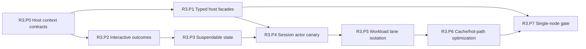

# R3 Phase Plan — Strong Single Node

Status: **Proposed**
Plan version: **0.3**
Parent contract: [R3 — Strong Single Node](../r3-strong-single-node.md)
Authority result: **Selected sessions and host calls use bounded typed paths**
Expected agent goals: **9–13**

## Phase Outcome

R3 first separates execution context and program-control outcomes from mutable
session internals. It then extracts suspendable state, promotes one CICS session
actor, proves workload-lane isolation, and only afterward adds measured caches
or hot-path optimizations. This order prevents performance work from freezing
the current one-thread-per-session design.

## Current-Code Anchors

- [`CicsSessionRunner`](../../../../crates/open-mainframe-zosmf/src/cics_runner.rs)
  creates one OS thread and one current-thread Tokio runtime per session.
- [`BridgeHandler`](../../../../crates/open-mainframe/src/lib.rs) and
  [`CicsBridge`](../../../../crates/open-mainframe/src/bridge.rs) share
  `Rc<RefCell<_>>` state and string-based CICS calls.
- [`Session`](../../../../crates/open-mainframe-tui/src/session.rs) contains
  protocol-neutral screen/field/session state but is packaged with
  Ratatui/Crossterm rendering and input code.
- [`AppState`](../../../../crates/open-mainframe-zosmf/src/state.rs) exposes
  mutable subsystem objects and session maps directly to handlers.
- The R0 resource baseline captures the thread, memory, compile, transaction,
  and overload behavior this wave must improve without breaking compatibility.

## Deliverable Mapping

| Parent deliverable | Owning phase |
|---|---|
| D3.1 Host-service facade set | R3.P0, R3.P1 |
| D3.2 Interactive outcome model | R3.P2 |
| D3.3 Session actor, terminal boundary, and worker model | R3.P3, R3.P4, R3.P7 |
| D3.4 Vertical performance program | R3.P5, R3.P6 |
| D3.5 Operational hardening | R3.P7 |
| D3.6 Host, protocol, and configuration convergence catalog | R3.P0, R3.P3, R3.P7 |

### Workspace convergence thread

- **R3.P0** freezes scoped provider/configuration contracts and the logical
  capability-resolution authority; broad `AppState` is not a plugin API.
- **R3.P3** extracts terminal/session state and converges TN3270 protocol state
  while keeping networking, z/OSMF, and TUI as adapters.
- **R3.P7** proves profile-specific protocol/config/registry uniqueness, typed
  DRDA-to-DB2 behavior when retained, and zero supported mock-success paths.

## Sequence

## R3.P0 — Host Context and Service Contracts

Authority transition: **None**
Goal budget: **1 goal**

### Entry

- R1.P6 execution identity, limits, cancellation, and event contracts are
  frozen.
- R2.P7 explicit condition, suspension, transfer, and ABEND outcomes are
  available for the promoted semantic selector.

### Deliverables

- Define cloneable/scoped execution and run-unit contexts carrying principal,
  granted capabilities, deadline, cancellation, limits, trace, session, and
  idempotency identity.
- Define typed host-result separation between domain condition/status and
  infrastructure failure.
- Define transaction ownership, concurrency, audit, and SMF/tracing obligations.
- Define a host-service registry/factory contract that does not expose broad
  `AppState` or raw subsystem locks.
- Add dependency rules separating service contracts from provider
  implementations.

### Exit Evidence

- Fake-service authorization, deadline, cancellation, condition, and audit
  contract tests pass.
- Service-contract crates have no z/OSMF handler or mutable provider dependency.
- No production host call has moved.

### Rollback and Handoff

Remove inactive contracts/adapters. R3.P1 adapts only services required by the
selected R2/R3 workload.

## R3.P1 — Selected Typed Host Facades

Authority transition: **Selected host calls behind reversible adapters**
Goal budget: **1–2 goals**

### Entry

- R3.P0 contracts are accepted.
- Selected CardDemo/COBOL paths enumerate terminal, program, file/dataset,
  identity/clock, and other required service calls.
- R2.P10 is complete for any promoted R2 selector included in this phase;
  otherwise its new facade remains shadow-only.

### Deliverables

- Implement typed facades and existing-provider adapters for the minimum
  selected service set.
- Enforce principal/capability, deadline/cancellation, transaction, condition,
  audit, and concurrency rules at each boundary.
- Migrate one read-only/low-risk service first, followed by the selected
  terminal/program/file family as separate goal scopes.
- Preserve CICS EIB and file-condition behavior through typed results.

### Exit Evidence

- Direct and facade paths pass differential fixtures.
- Permission denial and infrastructure failure cannot be confused with domain
  conditions.
- Provider concurrency is bounded and observable.

### Rollback and Handoff

Route each service independently to its legacy adapter. R3.P4 uses only facades
that passed this gate; broad subsystem convergence remains later work.

## R3.P2 — Explicit Interactive Outcomes

Authority transition: **Outcome representation for selected execution paths**
Goal budget: **1 goal**

### Entry

- R1 run-unit identity and R2 program-control outcomes are stable.
- Fixtures cover nested CALL, LINK, XCTL, RETURN, ABEND, terminal input, and
  cancellation.

### Deliverables

- Define explicit call/return frames and run-unit ownership.
- Represent terminal/timer/provider wait as suspension data rather than a
  blocked stack.
- Define resume tokens/input, transfer, condition propagation, cancellation
  while running/suspended, and EIB mapping.
- Adapt legacy bridge actions to the outcome model in shadow/differential mode.

### Exit Evidence

- State-machine tests cover normal, nested, transfer, suspension, cancellation,
  and ABEND paths.
- Normal program control does not rely on generic infrastructure errors.
- Legacy outcome translation has fixture parity.

### Rollback and Handoff

Keep the legacy loop authoritative and disable outcome-based routing. R3.P3
extracts the state required to materialize these outcomes.

## R3.P3 — Suspendable Session State

Authority transition: **In-memory state envelope; legacy session loop remains authoritative**
Goal budget: **1–2 goals**

### Entry

- R3.P2 suspension/resume and frame contracts pass.
- The selected session's mutable state and non-`Send` ownership are inventoried.

### Deliverables

- Separate serializable/cloneable run-unit and session state from CPU worker
  stack, terminal wait, and provider handles.
- Define in-memory save/restore safe points for running boundaries, suspended
  input, transfer, and completion.
- Isolate remaining `Rc<RefCell<_>>` state behind a bounded affine adapter with
  explicit capacity if immediate removal is unsafe.
- Move protocol-neutral screen, field, AID, terminal-model, and session state to
  a runtime-facing terminal/session boundary; leave Ratatui/Crossterm rendering
  and keyboard input in an optional frontend adapter.
- Make headless CLI and z/OSMF CICS runner depend on the neutral boundary rather
  than the frontend crate.
- Add state size/lifetime bounds and generation/artifact references.

### Exit Evidence

- Selected sessions can suspend, release their CPU permit, and resume from the
  in-memory envelope with fixture parity.
- State contains no unbounded output or hidden process-global authority.
- Non-movable legacy members are explicitly cataloged.
- Core headless/server builds do not require Ratatui/Crossterm; the optional TUI
  frontend passes the same accepted terminal-cycle fixtures through the boundary.

### Rollback and Handoff

Return selected routing to the current dedicated session loop. R3.P4 activates
an actor only after save/restore equivalence passes. Durable persistence is
deferred to R4.

## R3.P4 — Session Actor Canary

Authority transition: **One named CICS application/session selector**
Goal budget: **1–2 goals**

### Entry

- R3.P1 selected host facades and R3.P3 suspendable state pass.
- Canary routing and legacy session fallback are explicit.
- R2.P10 is complete when the canary uses the shared-MIR executor.

### Deliverables

- Implement a session actor that serializes only ordered session mutations.
- Admit active CPU work through the bounded interactive lane.
- Release CPU workers and avoid dedicated OS threads during terminal wait.
- Route one application/session selector to the actor and retain the legacy
  affine adapter for unselected sessions.
- Bound mailbox depth, pending replies, screen/output buffers, and idle lifetime.

### Exit Evidence

- Promoted idle sessions use zero dedicated OS threads per session.
- Concurrent sessions progress independently and preserve terminal/CICS
  fixtures.
- Actor panic, cancellation, disconnect, and idle timeout release all handles.
- Selector rollback needs no persistent-state repair.

### Rollback and Handoff

Drain or terminate canary sessions by declared policy, then route new sessions
to `CicsSessionRunner`. R3.P5 evaluates actor workload alongside other lanes.

## R3.P5 — Workload Lanes and Isolation

Authority transition: **Named workload-class admission policies**
Goal budget: **1–2 goals**

### Entry

- R1 bounded coordinator is authoritative for representative selectors.
- R3.P4 actor canary passes functional and resource tests.

### Deliverables

- Configure bounded request, interactive, batch, compiler, and blocking/legacy
  lanes from measured workload classes.
- Partition blocking provider work from latency-sensitive execution.
- Enforce provider-specific and principal/service-class concurrency limits.
- Add mixed-load fairness, starvation, overload, and cancellation tests.

### Exit Evidence

- 2x overload produces bounded queueing or explicit rejection.
- Blocking/batch saturation remains within the accepted interactive p95 budget.
- Permit/task/thread counts return to baseline after cancellation and load end.

### Rollback and Handoff

Revert named selectors to prior lane configuration without removing the kernel.
R3.P6 optimizes only measured bottlenecks after isolation is stable.

## R3.P6 — Cache and Hot-Path Optimization

Authority transition: **Selected cache/optimization policies**
Goal budget: **1–2 goals**

### Entry

- R3.P5 provides stable mixed-load profiles and named bottlenecks.
- Source/dependency freshness and artifact identity tests pass.

### Deliverables

- Add bounded content-addressed source/preprocessed/IR/executable caches with
  eviction, hit/miss reason, size, and generation observability.
- Optimize proven cloning, string dispatch, conversion, lock, or allocation hot
  paths without changing semantic contracts.
- Pool only resources with reset/isolation tests.
- Prototype native/JIT acceleration only when a measured CPU-bound subset and
  differential suite justify it; do not make it default in this phase.

### Exit Evidence

- Cache hits materially improve the accepted repeated workload.
- Source/copybook edits affect the next load immediately.
- Cache/pooled resources stay bounded and do not cross principal/session state.
- Claimed performance changes include raw and comparative measurements.

### Rollback and Handoff

Disable each cache/optimization independently and fall back to uncached
artifact resolution/execution. R3.P7 validates the optimized configuration
under failure and long-duration load.

## R3.P7 — Resilience and Single-Node Gate

Authority transition: **Promote only the accepted R3 selectors and limits**
Goal budget: **1 goal**

### Entry

- R3.P1 through R3.P6 selected paths pass rollback tests.
- Operator dashboards and runbooks expose lane, session, provider, cache, and
  artifact state.

### Deliverables

- Run long-duration mixed load, idle-session, leak, provider fault, panic,
  timeout, cancellation, and slow-service tests.
- Publish supported capacity, configured limits, overload policy, and reduced
  capacity for remaining affine legacy paths.
- Freeze state classification inputs required by R4.
- Publish the TUI frontend disposition: retained optional profile or deprecated
  selector with owner, compatibility window, and removal gate.
- Verify dependency checks prevent UI renderer/input libraries from re-entering
  core headless/server profiles.

### Exit Evidence

- Every parent R3 exit criterion passes.
- Supported idle sessions improve by at least 2x without proportional thread
  growth.
- No permit, task, thread, session, artifact, or provider-handle leak remains in
  the accepted scenario.
- Rollback restores legacy interactive routing without data repair.
- The core terminal/session path remains functional when the optional TUI
  frontend is disabled, and any frontend deprecation follows the R0 decision.

### Rollback and Handoff

Return named selectors to legacy routing and prior optimization configuration.
R4 consumes the accepted session envelope, state catalog, execution identity,
host effect boundaries, and single-node failure/resource baselines.

## Wave Promotion Rule

R3 does not authorize cross-node session mobility or distributed leases. A
session actor is a single-node concurrency improvement until R4 proves durable
ownership and restore semantics.
