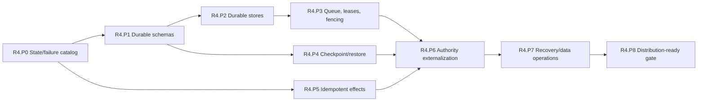

# R4 Phase Plan — Distribution-Ready State

Status: **Proposed**
Plan version: **0.3**
Parent contract: [R4 — Distribution-Ready State](../r4-distribution-ready-state.md)
Authority result: **Durable interfaces are authoritative on one active worker pool**
Expected agent goals: **10–15**

## Phase Outcome

R4 makes ownership and recovery explicit while deliberately keeping one active
worker pool. State schemas and stores are proven before work leases; checkpoints
are proven before session authority moves; mutating effects are classified
before retries are enabled. Multi-node execution is forbidden throughout this
wave except in non-authoritative failure laboratories.

## Current-Code Anchors

- [`AppState`](../../../../crates/open-mainframe-zosmf/src/state.rs) owns RACF,
  JES2, catalogs, workflows, provisioning, TSO, and CICS session authority in
  process-local maps and locks.
- [`CicsSessionRunner`](../../../../crates/open-mainframe-zosmf/src/cics_runner.rs)
  owns live session execution and has no durable ownership/checkpoint contract.
- Some subsystems have private snapshot/checkpoint concepts, such as
  [`JES2 checkpoint`](../../../../crates/open-mainframe-jes2/src/checkpoint.rs),
  but they are not a shared execution/session durability contract.
- Current [Helm values](../../../../deploy/helm/open-mainframe/values.yaml) and
  [Kubernetes deployment](../../../../deploy/kubernetes/deployment.yaml) request
  multiple replicas despite node-local state; this is an operational safety
  constraint, not evidence of horizontal correctness.

## Deliverable Mapping

| Parent deliverable | Owning phase |
|---|---|
| D4.1 State catalog | R4.P0 |
| D4.2 Durable store contracts | R4.P1, R4.P2 |
| D4.3 Lease and ownership protocol | R4.P3 |
| D4.4 Checkpoint and session schemas | R4.P4 |
| D4.5 Idempotent and transactional effects | R4.P5 |
| D4.6 Stateless gateway/coordinator migration | R4.P6 |
| D4.7 Recovery and operations | R4.P7, R4.P8 |
| D4.8 Supported-profile state coverage | R4.P0, R4.P8 |

### Workspace convergence thread

- **R4.P0** classifies authoritative state and non-movable limits for every
  capability advertised by the promoted distribution-ready profile.
- **R4.P8** verifies complete selected-profile state coverage and explicit
  absence for unselected packs; workspace membership grants no durability claim.

## Sequence

## R4.P0 — State/Failure Catalog and Deployment Hold

Authority transition: **Operational topology restriction only**
Goal budget: **1 goal**

### Entry

- R3.P7 provides bounded single-node execution, suspendable state, and host
  effect boundaries.
- Current supported deployment profiles are enumerated.

### Deliverables

- Catalog invocation, run-unit, session, region, singleton, artifact, token,
  workflow, job, and subsystem state by owner, mutability, bounds, durability,
  safe points, retry, schema, security class, and mobility.
- Define failure timing for queued, running, suspended, checkpointing,
  effect-in-progress, completing, and completed work.
- Classify every workload as movable, checkpoint-restartable, restart-only, or
  node-affine.
- Enforce/document a single execution-authority profile for stateful routes
  until R5; multi-replica gateways may exist only when they do not own state.
- Record consistency, recovery-window, and data-loss objectives by workload.

### Exit Evidence

- Every selected R4 state class has one authoritative owner and declared
  recovery behavior.
- No multi-replica claim relies on process-local maps or sticky routing for
  correctness.
- Unknown-effect and non-retryable cases are explicit.

### Rollback and Handoff

This phase may narrow unsafe deployment claims but does not migrate data.
R4.P1 uses the catalog to define schemas; R4.P5 uses the effect classification.

## R4.P1 — Durable Schemas and Store Interfaces

Authority transition: **None; contract-only**
Goal budget: **1–2 goals**

### Entry

- R4.P0 state scopes, security classes, and failure semantics are accepted.
- R1/R2/R3 identity, artifact, generation, session, and outcome versions are
  frozen for the selected profile.

### Deliverables

- Define versioned envelopes and interfaces for execution records, lifecycle
  events, work items, dead letters, sessions, checkpoints, immutable artifacts,
  plugin generations, and idempotency/effect records.
- Define optimistic concurrency/fencing tokens, atomicity boundaries, indexes,
  retention, pagination, and bounded payloads.
- Define schema compatibility, migration, downgrade, backup, encryption, and
  sensitive-field handling.
- Provide contract test suites independent of a concrete database/queue.

### Exit Evidence

- Round-trip, version upgrade, incompatible rejection, concurrent-write,
  size-bound, and authorization tests pass against a model implementation.
- Schemas preserve execution, run-unit, attempt, lease, generation, artifact,
  and principal identity end to end.
- No production state authority has moved.

### Rollback and Handoff

Remove inactive interfaces/schemas. R4.P2 implements selected stores; R4.P4
uses the checkpoint envelope without redefining identity.

## R4.P2 — Durable Execution, Event, and Artifact Stores

Authority transition: **Shadow writes, then selected metadata authority on one pool**
Goal budget: **1–2 goals**

### Entry

- R4.P1 contract suite and migration policy pass.
- A production-capable backing technology has an operational owner and failure
  budget; technology choice is outside the logical contract.

### Deliverables

- Provide bounded in-memory development implementations and production-capable
  durable execution/event/artifact/generation stores.
- Shadow-write selected execution lifecycle and compare against in-memory event
  authority before cutover.
- Verify immutable content identity, retention/GC, artifact generation
  compatibility, and bounded streaming.
- Add store saturation, timeout, partial-failure, schema migration, and
  reconnect behavior.

### Exit Evidence

- Selected execution records/events survive coordinator restart.
- Artifact bytes and metadata validate against content identity.
- Store saturation creates explicit backpressure without unbounded application
  memory.
- Rollback to one-pool in-memory execution remains possible before work-queue
  authority moves.

### Rollback and Handoff

Disable durable metadata authority and retain/export records for audit. R4.P3
uses the durable identity/event/store contracts; it does not infer effect safety
from record presence.

## R4.P3 — Work Queue, Leases, and Fencing

Authority transition: **Durable work ownership on one active worker pool**
Goal budget: **1–2 goals**

### Entry

- R4.P2 durable execution/event stores pass restart and saturation tests.
- R4.P0 declares retry behavior for selected work.

### Deliverables

- Implement durable work, claim, heartbeat, expiry, retry, poison, cancellation,
  and dead-letter records.
- Carry immutable input/artifact references, capability/target/generation
  constraints, deadline, attempt, checkpoint policy, and effect identity.
- Use monotonically increasing attempt and fenced ownership epochs.
- Prevent two live owners from committing completion for the same epoch.
- Model lease expiry as unknown ownership/effect state, not proof of no effect.

### Exit Evidence

- Claim race, delayed heartbeat, clock skew, lease expiry, cancellation, poison,
  and stale-owner commit tests pass.
- Queue saturation produces bounded admission/backpressure.
- One active worker pool can claim and complete selected work entirely through
  the durable protocol.

### Rollback and Handoff

Stop admission, drain/resolve durable work, and return selectors to the prior
single-node coordinator. R4.P6 cannot move mutating workload authority until
R4.P5 completes.

## R4.P4 — Checkpoint and Restore

Authority transition: **Shadow checkpointing, then selected suspended-state authority**
Goal budget: **1–2 goals**

### Entry

- R4.P1 checkpoint envelope is accepted.
- R3 suspendable state has deterministic in-memory save/restore safe points.

### Deliverables

- Version run-unit/session/plugin state envelopes and compatible restore ranges.
- Define safe points for suspension, transfer, retry boundaries, and completion.
- Validate artifact, dialect/import, plugin generation, capability, and
  principal requirements before restore.
- Bound and measure checkpoint size, creation, storage, encryption, and restore.
- Add upgrade and explicit incompatible-rejection behavior.

### Exit Evidence

- Selected sessions/work restore after process restart with fixture parity.
- Missing/incompatible artifacts or generations fail explicitly.
- Oversized, corrupt, unauthorized, and stale checkpoints are rejected.

### Rollback and Handoff

Return new sessions to in-memory-only state and drain/reject stored checkpoints
by documented compatibility policy. R4.P6 may externalize only state classes
that pass this gate.

## R4.P5 — Idempotent Effect Protocols

Authority transition: **Selected mutating host-operation retry policy**
Goal budget: **2–3 goals**

### Entry

- R4.P0 identifies selected mutating effects and unknown-outcome windows.
- R3 typed host facades carry execution/run-unit/idempotency identity.

### Deliverables

- Define idempotency key, transaction, compare-and-set, effect journal, or
  explicit non-retryable policy for each selected operation family.
- Separate business/domain conditions from infrastructure retry decisions.
- Test crash before, during, after, and after-commit-before-ack for each selected
  effect family.
- Record effect sequence and reconciliation instructions where atomic coupling
  is unavailable.

### Exit Evidence

- Selected crash/retry fixtures produce zero unaccounted duplicate effects.
- Unknown outcomes become operator-visible reconciliation states rather than
  automatic blind retries.
- Non-idempotent operations cannot be admitted as freely retryable work.

### Rollback and Handoff

Disable retries for an affected effect family and route it to node-affine or
manual recovery policy. R4.P6 moves only operations with an accepted policy.

## R4.P6 — Authority Externalization

Authority transition: **Selected execution/session authority moves out of local maps**
Goal budget: **1–2 goals**

### Entry

- R4.P3 lease, R4.P4 checkpoint, and R4.P5 effect gates pass for the selected
  workload.
- Dual-read/write migration and rollback rules are rehearsed.

### Deliverables

- Remove sole authoritative selected execution/session state from handler-local
  or coordinator-local maps.
- Make gateways authenticate/translate and use coordinator/store contracts.
- Apply the migration only to interfaces named by the accepted deployment
  profile; optional DRDA/3270 adapters must be explicit and absent adapters must
  not be started or advertised.
- Keep only bounded, reconstructible local caches.
- Verify gateway/coordinator restart does not lose queued or suspended work.
- Preserve node-affine routing for explicitly non-movable legacy workloads.

### Exit Evidence

- The selected workflow runs on one active pool entirely through durable
  queue/state/artifact interfaces.
- Restart during queued, running, suspended, and completing states yields the
  declared outcome.
- Rollback and data reconciliation complete within the accepted window.
- Every advertised interface in the selected profile passes restart/state-
  authority tests; excluded optional adapters are visible as unsupported.

### Rollback and Handoff

Stop new durable admission, drain/reconcile work, and route selectors to the
prior single-node authority using the rehearsed migration boundary. R4.P7 owns
automated recovery and data operations.

## R4.P7 — Recovery and Data Operations

Authority transition: **Automated recovery for selected durable work**
Goal budget: **1–2 goals**

### Entry

- R4.P6 selected authority survives controlled restart tests.
- Recovery, poison, dead-letter, and manual reconciliation roles are assigned.

### Deliverables

- Implement recovery control for expired claims, orphaned work, incompatible
  checkpoints, and poison retries.
- Expose operator actions and audit events for retry, cancel, quarantine,
  reconcile, and dead-letter resolution.
- Add store/queue health, saturation, lease age, checkpoint, recovery-window,
  and effect reconciliation metrics.
- Exercise backup/restore, schema forward migration, supported downgrade or
  explicit no-downgrade behavior, and disaster runbooks.

### Exit Evidence

- Recovery meets the accepted workload-specific window.
- Backup/restore and schema migration preserve authoritative identity/history.
- Operator actions are authorized, idempotent where required, and auditable.

### Rollback and Handoff

Disable automated retry/recovery and enter controlled manual recovery without
losing work records. R4.P8 freezes the interfaces R5 workers will consume.

## R4.P8 — Distribution-Ready Gate

Authority transition: **Promote durable interfaces on one active worker pool**
Goal budget: **1 goal**

### Entry

- R4.P2 through R4.P7 evidence and rollback exercises pass.
- Deployment still enforces one active execution worker pool.

### Deliverables

- Run the full queued/running/suspended/checkpointing/effect/completing failure
  matrix.
- Freeze durable schemas, lease/fencing protocol, checkpoint compatibility, and
  effect retry classifications consumed by R5.
- Publish node-affine workload inventory and reduced-availability policy.
- Freeze the promoted deployment-profile matrix, including which optional
  gateways are durable, node-affine, disabled, deprecated, or absent.
- Verify the deployment can roll back to the R3 single-node selector profile.

### Exit Evidence

- Every parent R4 exit criterion passes.
- No selected gateway/coordinator local map is sole authority.
- Zero unaccounted duplicate effects remain in the accepted failure matrix.
- Multi-active worker execution has not yet become production authority.

### Rollback and Handoff

Return to one-node/local execution after draining/reconciling durable work as
documented. R5 may add workers only through the frozen lease, state, checkpoint,
generation, and effect contracts.

## Wave Promotion Rule

R4 is a durability gate, not a horizontal-scale launch. Adding a second active
worker before R4.P8 passes is a stop-the-line violation even if the deployment
platform can start more replicas.
