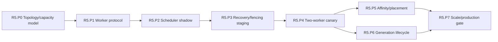

# R5 Phase Plan — Horizontal Platform

Status: **Proposed**
Plan version: **0.3**
Parent contract: [R5 — Horizontal Platform](../r5-horizontal-platform.md)
Authority result: **Multiple active workers become a supported execution authority**
Expected agent goals: **8–12**

## Phase Outcome

R5 separates worker discovery, global admission, recovery/fencing, first
multi-worker authority, placement/affinity, and generation lifecycle. Stateless
or restart-safe work is promoted before movable sessions. Four-worker scale is
the final gate, not the first experiment.

## Current-Code Anchors

- Deployment templates already include multiple replicas and CPU/memory HPA in
  [`deploy/helm`](../../../../deploy/helm/open-mainframe), but they do not supply
  shared execution ownership, compatible-capability placement, or session
  recovery.
- z/OSMF currently constructs one process-local
  [`AppState`](../../../../crates/open-mainframe-zosmf/src/lib.rs) per router.
- R4 durable queue, lease, checkpoint, artifact, generation, and idempotent
  effect contracts are mandatory inputs; R5 does not invent replacements for
  them.

## Deliverable Mapping

| Parent deliverable | Owning phase |
|---|---|
| D5.1 Worker and capability protocol | R5.P0, R5.P1 |
| D5.2 Global admission and scheduling | R5.P2 |
| D5.3 Placement and affinity | R5.P5 |
| D5.4 Recovery and retry | R5.P3, R5.P4 |
| D5.5 Generation lifecycle | R5.P6 |
| D5.6 Multi-node observability | R5.P2, R5.P7 |
| D5.7 Horizontal validation suite | R5.P3, R5.P4, R5.P7 |
| D5.8 Complete profile topology and conformance | R5.P0, R5.P7 |

### Workspace convergence thread

- **R5.P0** freezes the full dependency/capability/configuration/state/placement
  manifest for every advertised horizontal product profile.
- **R5.P7** exercises all selected capabilities through public boundaries and
  proves unselected implementations are absent from deployed package closures.

## Sequence

## R5.P0 — Topology and Capacity Model

Authority transition: **None**
Goal budget: **1 goal**

### Entry

- R4.P8 durable contracts and node-affine workload inventory are frozen.
- Supported deployment zones, failure domains, and store/queue/provider
  dependencies are named.

### Deliverables

- Separate stateless gateways, control/coordinator services, worker classes,
  durable stores/queues, artifact storage, and external providers.
- Define stable node/worker identity, zones, capabilities, targets, resource
  classes, isolation tiers, and maintenance/draining state.
- Build a capacity model using service class, compatible workers, provider
  limits, queue/store limits, and node-affine capacity rather than CPU alone.
- Define consistency, partition, stale-heartbeat, and control-plane degradation
  policies.
- Align deployment profiles so multi-replica gateways and active workers are
  not conflated.

### Exit Evidence

- Every selected workload maps to compatible worker and state/effect contracts.
- Failure-domain and unavailable-capability scenarios have explicit admission
  outcomes.
- Existing replica/HPA settings are classified as configuration, not scaling
  proof.

### Rollback and Handoff

No execution routing changes. R5.P1 implements the worker side of the accepted
model.

## R5.P1 — Worker Capability Protocol

Authority transition: **Staging workers only**
Goal budget: **1 goal**

### Entry

- R5.P0 topology, identity, resource, and health model is accepted.
- R4 generation/artifact/lease compatibility contracts are available.

### Deliverables

- Publish worker identity, zone, supported capability/plugin generations,
  targets, isolation adapters, capacities, readiness, heartbeat, and draining
  state.
- Authenticate worker identity and reject incompatible protocol versions.
- Treat artifact/cache locality as a hint, never authoritative state.
- Remove stale/unready workers from placement eligibility.
- Bound registration, heartbeat, capability payload, and update frequency.

### Exit Evidence

- Duplicate identity, stale heartbeat, incompatible version, capability change,
  drain, and reconnect tests pass.
- Staging workers cannot claim production work.
- Protocol state is observable and reconstructible.

### Rollback and Handoff

Disable staging worker registration. R5.P2 consumes immutable compatible-worker
snapshots for shadow scheduling.

## R5.P2 — Global Admission and Scheduler Shadow

Authority transition: **Shadow placement decisions; one active worker remains authoritative**
Goal budget: **1–2 goals**

### Entry

- R5.P1 worker snapshots pass health/staleness tests.
- R3/R4 capacity and global resource limits are known.

### Deliverables

- Enforce global, principal/tenant, service-class, plugin, generation, and
  provider admission bounds.
- Translate WLM goals into priority/fairness without starvation.
- Select only workers matching capability, version, target, isolation, and
  resource constraints.
- Preserve deadline/cancellation and record no-placement reasons.
- Compare shadow placement with the existing one-pool execution decision.

### Exit Evidence

- Deterministic scheduling fixtures cover fairness, starvation, no-capacity,
  deadline, cancellation, and stale worker cases.
- Shadow scheduler never selects an incompatible worker.
- Global admission prevents aggregate workers from bypassing provider/store
  limits.

### Rollback and Handoff

Disable shadow decisions; the R4 one-pool coordinator remains authoritative.
R5.P3 exercises actual claims only in a controlled failure environment.

## R5.P3 — Recovery and Fencing Staging

Authority transition: **Non-production multi-worker failure laboratory**
Goal budget: **1–2 goals**

### Entry

- R5.P2 shadow placement is correct for selected test workloads.
- R4 lease, fencing, checkpoint, idempotency, and dead-letter contracts pass on
  one active pool.

### Deliverables

- Run two staging workers against the durable claim protocol.
- Exercise crash/partition during queued, running, suspended, effect, and
  completing states.
- Prove stale ownership epochs cannot commit after takeover.
- Restore only on compatible artifact/plugin generations.
- Preserve retryable, unknown-effect, non-retryable, poisoned, and cancelled
  distinctions across nodes.

### Exit Evidence

- No two live workers commit the same fenced attempt.
- Eligible work recovers within the accepted staging window.
- Effect accounting and reconciliation remain complete during partitions.
- Store/queue throttling creates visible bounded backpressure.

### Rollback and Handoff

Stop the second staging worker and return to one active pool. R5.P4 may promote
only workload families proven in this matrix.

## R5.P4 — Two-Worker Canary

Authority transition: **Selected stateless and restart-safe batch workloads**
Goal budget: **1–2 goals**

### Entry

- R5.P3 recovery/fencing staging gate passes.
- Canary workloads are idempotent, transactional, or explicitly restart-safe.
- One-pool fallback is rehearsed.

### Deliverables

- Admit an explicit canary selector set to two active compatible workers.
- Exercise normal load, worker loss, scale down, gateway/coordinator restart,
  artifact cold start, and store/queue throttling.
- Emit placement, claim, attempt, recovery, and effect identity end to end.
- Keep node-affine and unproven session workloads on compatible single-node
  authority.

### Exit Evidence

- Canary parity, recovery window, duplicate-effect accounting, and boundedness
  gates pass.
- Adding the second worker increases useful throughput for a non-store-bound
  workload.
- Return to one active worker requires no schema rollback.

### Rollback and Handoff

Stop new multi-worker admission, drain/reconcile claims, and route selectors to
one active pool. R5.P5 may add session affinity only at proven safe points;
R5.P6 may add mixed generations independently.

## R5.P5 — Affinity and Placement

Authority transition: **Selected movable session/run-unit placement**
Goal budget: **1–2 goals**

### Entry

- R5.P4 two-worker authority is stable.
- Selected session/run-unit checkpoints and takeover safe points passed R4.

### Deliverables

- Prefer artifact/data locality when measured cost justifies it.
- Maintain lease-based session/run-unit affinity while useful and support
  takeover only at declared safe points.
- Route node-affine legacy work exclusively to compatible capacity with reduced
  availability made visible.
- Bound artifact prefetch and cold-start concurrency.
- Ensure gateway stickiness is an optimization, not correctness authority.

### Exit Evidence

- Movable session takeover matches declared state/effect semantics.
- Node-affine workloads wait/fail according to policy when capacity disappears.
- Locality decisions do not violate capability, generation, or fairness rules.

### Rollback and Handoff

Pin selected workloads to one compatible worker pool and disable takeover.
R5.P7 includes affinity paths in mixed-load and failure validation.

## R5.P6 — Generation Lifecycle

Authority transition: **Canary and draining worker/plugin generations**
Goal budget: **1–2 goals**

### Entry

- R5.P4 multi-worker canary is stable.
- Artifact/checkpoint/plugin compatibility rules from R4 are frozen.

### Deliverables

- Admit explicit selectors to a new worker/plugin generation.
- Stop new admission to draining generations while compatible work finishes or
  checkpoints at safe points.
- Reject incompatible restore/artifact combinations explicitly.
- Roll selectors back without restarting unrelated workers/generations.
- Bound concurrent cold starts, drains, and generation residency.

### Exit Evidence

- Canary, mixed generation, drain, compatible checkpoint transfer, incompatible
  rejection, rollback, and retirement tests pass.
- No in-place mutation changes behavior for an already admitted execution.
- Unrelated generations continue through rollback.

### Rollback and Handoff

Return selectors to the previous generation, drain/reconcile new work, and
retain compatibility records. R6 uses this internal lifecycle as input to an
external plugin promise.

## R5.P7 — Scale Validation and Production Gate

Authority transition: **Promote the accepted multi-worker deployment profile**
Goal budget: **1–2 goals**

### Entry

- R5.P4, R5.P5, and R5.P6 gates pass.
- Global/worker/store/queue/provider/generation dashboards and runbooks exist.

### Deliverables

- Test one, two, and four workers with non-store-bound request/batch workloads
  and mixed request/interactive/batch/blocking traffic.
- Exercise worker/gateway/coordinator loss, partition/delay, store/queue
  throttling, artifact cold start/cache loss, generation rollout, and scale
  up/down.
- Tune HPA/worker scaling from compatible capacity, queue, latency, and provider
  saturation signals rather than CPU/memory alone.
- Publish one-pool fallback and node-affine capacity policy.
- Publish the exact interface/profile matrix under test; include optional DRDA
  or 3270 traffic only when that adapter passed the R4 gateway gate.

### Exit Evidence

- Every parent R5 exit criterion passes, including at least 70% one-to-four
  worker efficiency on the accepted non-store-bound benchmark.
- Worker loss meets service-class recovery targets with no untracked duplicate
  effect.
- Mixed workload fairness and latency isolation pass.
- The platform returns to one active worker pool without schema rollback.
- No excluded optional adapter is advertised as horizontally supported.

### Rollback and Handoff

Drain/reconcile multi-worker claims and use the accepted one-pool deployment
profile. R6 may rely on worker placement, generation, drain, rollback, and
compatibility semantics only after this gate.

## Wave Promotion Rule

Two running processes are not proof of R5. Production horizontal authority
begins only at R5.P4 for an explicit canary and becomes a supported deployment
profile only after R5.P7.
