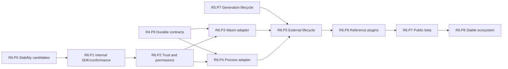

# R6 Phase Plan — Long-Lived Plugin Ecosystem

Status: **Proposed**
Plan version: **0.3**
Parent contract: [R6 — Long-Lived Plugin Ecosystem](../r6-long-lived-ecosystem.md)
Authority result: **Governed external plugin contracts become supportable**
Expected agent goals: **10–16**

## Phase Outcome

R6 converts proven internal contracts into an external ecosystem promise. It
does not equate a loader with a plugin platform. Stability candidates,
conformance tooling, trust policy, isolation adapters, lifecycle behavior,
independent implementations, beta operation, and stable release are distinct
phases. Governance begins early; untrusted plugin authority begins late.

## Current-Code Anchors

- Existing extension points are statically composed Rust traits and private
  registries, including [`UtilityProgram`](../../../../crates/open-mainframe-utilities/src/lib.rs),
  runtime [`ProgramRegistry`](../../../../crates/open-mainframe-runtime/src/interpreter.rs),
  and CICS [`ProgramRegistry`](../../../../crates/open-mainframe-cics/src/runtime/commands.rs).
- The workspace has no accepted public plugin ABI, Wasm component host, or
  supervised plugin-worker protocol.
- R1/R2 establish logical execution/compiler contracts; R4/R5 establish durable
  identity, generation, placement, draining, and rollback. R6 must reuse those
  contracts rather than creating an external-only parallel platform.
- The R2 analysis consumer, not the legacy standalone assessment analyzer, is
  the candidate foundation for public assessment/inspection extensions. The
  portfolio wiki is not a substitute for registry/schema documentation.

## Deliverable Mapping

| Parent deliverable | Owning phase |
|---|---|
| D6.1 Public plugin SDK | R6.P1, R6.P7, R6.P8 |
| D6.2 WebAssembly component boundary | R6.P3 |
| D6.3 Supervised process boundary | R6.P4 |
| D6.4 Trust and security policy | R6.P2 |
| D6.5 Lifecycle and compatibility | R6.P5 |
| D6.6 Maintenance governance | R6.P0, R6.P8 |
| D6.7 Independent reference plugins | R6.P6 |
| D6.8 Sustainable expansion | R6.P8 |
| D6.9 Portfolio pluginization and retirement | R6.P0, R6.P6, R6.P8 |

### Workspace convergence thread

- **R6.P0** decides which optional/leaf components are stability candidates,
  internal experiments, independent tools, or approved retirement targets.
- **R6.P6** proves retained languages, subsystems, analyzers, and providers use
  public contracts rather than reaching into composition-root state.
- **R6.P8** completes approved retirements and hands R7 only a finite, owned
  long-term-adapter and exception ledger.

## Sequence

## R6.P0 — Stability Candidate Review

Authority transition: **None**
Goal budget: **1 goal**

### Entry

- Internal R1 execution and R2 compiler/IR contract families have named owners
  and at least one production implementation.
- Candidate external use cases and support expectations are documented.

### Deliverables

- Inventory candidate public manifest, capability, invocation, phase,
  diagnostic, IR exchange, host-service, artifact, event, lifecycle, and
  checkpoint contracts.
- Classify each contract as internal experimental, internal stable candidate,
  external beta candidate, or explicitly non-public.
- Define semantic versioning, deprecation, upgrade-pass, ownership, and support
  requirements for each family.
- Reject native Rust dynamic-library ABI as a public compatibility boundary.
- Record contract gaps exposed by independent implementation attempts.
- Confirm that legacy component adapters and optional frontends are not
  accidentally included in the public SDK surface.

### Exit Evidence

- Every stability candidate has primary/backup owner and compatibility tests or
  a named blocker.
- No contract is declared stable solely because one in-tree implementation
  compiles.
- Public surface is smaller than the internal implementation surface.

### Rollback and Handoff

Candidates can return to internal experimental status without plugin migration.
R6.P1 exposes only accepted candidate contracts through an internal SDK.

## R6.P1 — Internal SDK and Conformance Kit

Authority transition: **Trusted in-tree development only**
Goal budget: **1–2 goals**

### Entry

- R6.P0 identifies exact candidate contract versions.
- R1/R2 registries can generate capability/operation metadata.

### Deliverables

- Generate manifest/capability, execution/compiler phase, diagnostic/event,
  artifact/IR, and host-capability bindings.
- Provide operation/type declaration generation and typed wrappers.
- Provide a deterministic test host, fixtures, conformance runner, packaging
  validator, and local development commands.
- Make SDK versioning independent from product version where needed.
- Build a trusted in-tree sample using only candidate SDK surfaces.

### Exit Evidence

- SDK artifacts are reproducible from registry/schema sources.
- Test-host and production-host contract fixtures agree.
- The sample does not import internal host/provider implementation crates.
- No untrusted code is installable or executable.

### Rollback and Handoff

Withdraw the internal SDK package/version without external compatibility
obligation. R6.P2 defines the permission and trust model before isolation
adapters accept external packages.

## R6.P2 — Trust, Permission, and Supply-Chain Contract

Authority transition: **None; security contract-only**
Goal budget: **1–2 goals**

### Entry

- R6.P1 enumerates all requested host imports and resource classes.
- Security, operations, and compatibility owners are assigned.

### Deliverables

- Define publisher identity, signing/provenance, package digest, validation,
  quarantine, revocation, and emergency-disable policy.
- Separate requested from deployment-granted capabilities.
- Define isolation tier, worker placement, secret-reference, host authorization,
  quota, audit, and tenant/principal propagation rules.
- Define denial behavior and safe defaults for filesystem, network, clock,
  randomness, environment, process, and raw credential access.
- Define vulnerability response and supported-version retirement workflow.

### Exit Evidence

- Threat model covers malicious package, confused deputy, capability escalation,
  resource exhaustion, supply-chain replacement, stale generation, and secret
  leakage.
- Permission matrices are machine-readable and deny by default.
- Revocation and quarantine actions have authorization and audit contracts.

### Rollback and Handoff

No external package is active. R6.P3 and R6.P4 must implement this contract;
they cannot invent broader ambient authority.

## R6.P3 — WebAssembly Component Adapter

Authority transition: **Trusted test components, then isolated beta candidates**
Goal budget: **1–2 goals**

### Entry

- R6.P1 SDK and R6.P2 trust/permission contracts pass.
- R4 durable identity/artifact/generation contracts are available.

### Deliverables

- Define approved WIT packages for exports, granted imports, values, typed
  resources, errors, conditions, outcomes, events, and bounded streams.
- Propagate cancellation, deadline, execution identity, principal grants, and
  resource limits.
- Enforce memory/table/instance/fuel-or-epoch, concurrency, output, and payload
  bounds.
- Deny ambient filesystem/network/clock/random access without explicit grants.
- Map traps, incompatibility, permission denial, and resource exhaustion to
  structured outcomes.

### Exit Evidence

- Trusted sample components pass normal, denial, trap, limit, cancellation,
  malformed payload, and version-negotiation tests.
- Host imports exactly match granted capabilities.
- Component failure is contained to its invocation or declared run unit.

### Rollback and Handoff

Disable the Wasm adapter/generation without invalidating built-in registry
snapshots. R6.P5 adds production lifecycle only after the host boundary passes.

## R6.P4 — Supervised Process Adapter

Authority transition: **Trusted test workers, then isolated beta candidates**
Goal budget: **1–2 goals**

### Entry

- R6.P1 SDK and R6.P2 trust/permission contracts pass.
- R4 execution, work, generation, checkpoint, and short-lived identity
  contracts are available.

### Deliverables

- Define an authenticated, versioned protocol for invocation, events,
  cancellation, health, checkpoint, and outcome.
- Use short-lived scoped capability tokens rather than raw persistent
  credentials.
- Bound transport messages, streams, concurrency, output, restart, and
  backpressure.
- Define worker crash/restart, generation, incompatibility, and orphaned-work
  behavior.
- Support native libraries/JVM/proprietary toolchains without exposing host
  process memory.

### Exit Evidence

- Trusted sample workers pass identity, cancellation, crash containment,
  restart, bounded transport, backpressure, and version-negotiation tests.
- A compromised/stale worker cannot reuse expired grants or commit a stale
  ownership epoch.
- Failure does not restart unrelated plugin generations.

### Rollback and Handoff

Disable the process adapter/worker class and route eligible selectors to built-in
or Wasm implementations. R6.P5 applies shared generation lifecycle rules.

## R6.P5 — External Lifecycle and Compatibility

Authority transition: **Explicit beta plugin generations only**
Goal budget: **1–2 goals**

### Entry

- R6.P3 and/or R6.P4 isolation adapter gates pass for the declared beta tier.
- R5.P7 generation, placement, drain, rollback, and mixed-version semantics are
  production-ready.

### Deliverables

- Install into a non-ready generation, validate, then publish an immutable ready
  snapshot.
- Canary new generations, stop admission to draining generations, finish or
  checkpoint compatible work, and reject incompatible restores.
- Roll selectors/generations back without restarting unrelated work.
- Generate host/plugin/dialect/runtime/artifact/checkpoint compatibility
  matrices.
- Define safe uninstall, dependent-artifact handling, orphan policy, and
  revocation behavior.

### Exit Evidence

- Install, validate, canary, mixed generation, drain, rollback, retire, and
  uninstall tests pass for each supported adapter tier.
- Incompatible packages/artifacts/checkpoints fail explicitly before execution.
- Emergency disable contains impact without registry corruption.

### Rollback and Handoff

Route selectors to the previous/built-in generation and quarantine the beta
generation. R6.P6 tests whether the contracts are implementable independently.

## R6.P6 — Independent Reference Plugins

Authority transition: **Reference/beta selectors only**
Goal budget: **2–3 goals**

### Entry

- R6.P5 lifecycle and compatibility tests pass.
- Public-candidate SDK surfaces are frozen for the reference implementation
  window.

### Deliverables

- Implement independent examples such as a frontend/dialect or analysis pass, a
  typed runtime provider, and an executor/backend or workflow adapter.
- When assessment/inspection is proposed as stable, implement its reference pass
  from public R2 IR analysis contracts without importing `open-mainframe-assess`
  internals.
- Include at least one Wasm component and one process worker when both tiers are
  proposed as supported.
- Use only candidate public contracts and the same conformance runner intended
  for third parties.
- Record every internal escape hatch or missing contract as a stability blocker.

### Exit Evidence

- At least two independent implementations pass conformance for each contract
  proposed as stable.
- Reference plugins install, run within limits, upgrade, drain, roll back, and
  uninstall without unrelated restarts.
- Generated capability/permission/support documentation matches runtime
  registry evidence.
- Reference implementations do not depend on deprecated wiki/assessment
  tooling, TUI renderer/input code, or concrete protocol listeners.

### Rollback and Handoff

Withdraw unstable candidates to internal/beta status. R6.P7 exposes only
contract families that survived independent implementation.

## R6.P7 — Public Beta

Authority transition: **Opt-in external beta support**
Goal budget: **1–2 goals**

### Entry

- R6.P2 through R6.P6 security, lifecycle, and conformance evidence passes.
- Beta support scope, response policy, telemetry, and revocation authority are
  staffed.

### Deliverables

- Publish beta SDK, schemas/WIT/protocols, examples, compatibility matrix,
  permissions, limits, support status, and known limitations.
- Operate opt-in install/canary/drain/rollback/revocation with real external
  feedback.
- Run cross-version, malicious-input, resource-exhaustion, trap/crash, and
  emergency-disable exercises.
- Collect contract friction without promising stable compatibility.

### Exit Evidence

- Beta plugins operate within declared isolation and resource limits.
- Security and lifecycle exercises meet response/recovery targets.
- Every breaking feedback item is resolved, versioned, or blocks stable release.

### Rollback and Handoff

Suspend beta installation, revoke affected generations, and keep built-in
contracts operational. R6.P8 decides stable contract families independently.

## R6.P8 — Stable Ecosystem and Ongoing Governance

Authority transition: **Named stable external contract families**
Goal budget: **1 goal for initial gate; ongoing release goals thereafter**

### Entry

- R6.P7 beta evidence and independent conformance history meet the accepted
  stability window.
- Every proposed stable family has primary/backup owners and deprecation
  authority.

### Deliverables

- Declare stable versions only for contract families meeting the parent wave
  gates; keep all others beta/experimental.
- Publish release train, support/LTS, compatibility CI, deprecation, major
  upgrade, canary, drain, rollback, vulnerability, and revocation policies.
- Demonstrate a major-version warning, coexistence, migration, and removal
  exercise.
- Require value, ownership, fixtures, explicit unsupported behavior, and public
  contract compliance before adding languages/backends/services.
- Continuously generate operation, capability, permission, compatibility, and
  support documentation from authoritative schemas/registries.
- Keep any separately retained portfolio wiki outside this evidence path and
  outside core host/plugin dependency closures.

### Exit Evidence

- Every parent R6 exit criterion passes for each declared stable family.
- Compatibility CI covers every supported host/plugin pair.
- Stable ecosystem operation survives upgrade, rollback, revocation, and owner
  handoff exercises.
- Unsupported or unowned extensions cannot be presented as supported.

### Rollback and Handoff

Stable versions follow published deprecation/security policy; they cannot be
silently withdrawn. Individual plugin generations can be quarantined or rolled
back without invalidating unrelated stable contracts. Governance continues as
an operating discipline rather than a terminal migration project.

## Wave Promotion Rule

R6 may complete incrementally by contract family. A Wasm/process loader or one
sample plugin is insufficient. Stable status requires independent
implementations, conformance, lifecycle, security, ownership, documentation,
and compatibility policy for the exact family declared stable.
